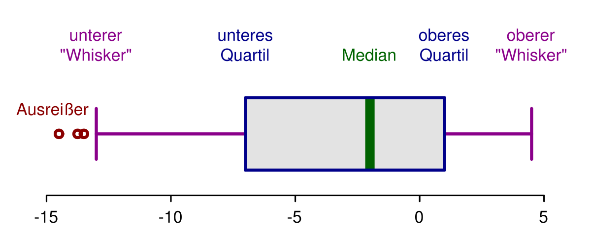

# Boxplot

| Beschreibung | Formelzeichen | Berechnung |
|--|--|--|
| unterer Whisker | | $$ \text{maximal, sonst Daten } Q_1 - 1.5 \bullet I_{QR} $$ |
| oberer Whisker | | $$ \text{maximal, sonst Daten } Q_3 + 1.5 \bullet I_{QR} $$ |
| 0.25 - Quantil | $$ Q_1 $$ | |
| 0.75 - Quantil | $$ Q_3 $$ | |
| Interquartilsabstand | $$ I_{QR} $$ | $$ Q_3 - Q_1 $$ |

## Quantil

$$

$$