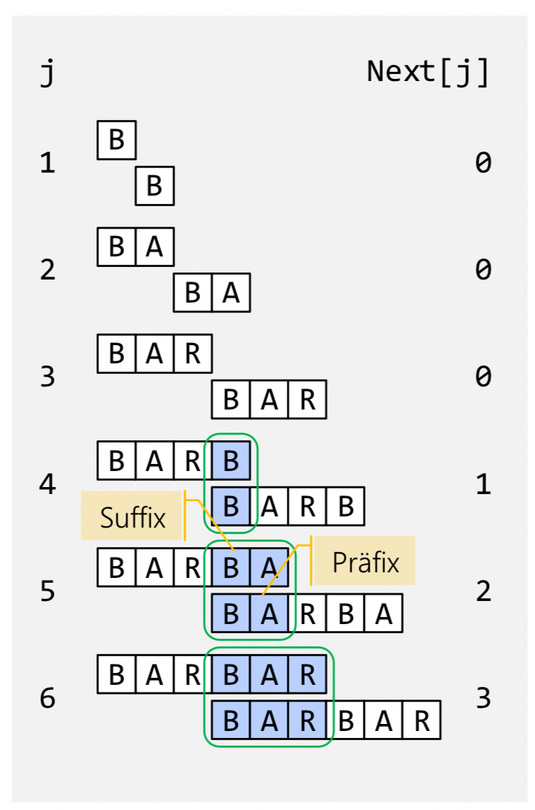

# Knuth-Morris-Pratt Algorithmus (KMP)

Der Knuth-Morris-Pratt Algorithmus wird verwendet, um sich wiederholende Patterns intelligent zu verschieben.

## Ablauf

1. Am Anfang wird im Pattern nach sich wiederholenden SubPattern gesucht. Diese werden in der **Next-Tabelle** gespeichert.

1. Text gemäss der Next-Tabelle durchsuchen

## Beispiel

1. Es werden mögliche Präfixe mit der Länge 1 bis n-1 gebildet.

Pattern: **BARBARA**

| Subpattern | Pattern |
|--|--|
| B | *B*arbara |
| BA | *BA*rbara |
| BAR | *BAR*bara |
| BARB | *BARB*ara |
| BARBA | *BARBA*ra |
| BARBAR | *BARBAR*a |

2. Danach wird jedes Subpattern von ganz links nach rechts verschoben, bis alle überlappenden Zeichen übereinstimmen, oder keine Überlappung gefunden wurde. Bei Übereinstummungen haben wir einen identischen Präfix und Suffix.

**next[j]**: Um wieviel darf ich das Pattern nach links verschoben ansetzen und die Suche fortsetzen, falls Buchstabe j + 1 abweicht. Oder anders ausgedrückt, wie lange ist der gemeinsame Präfix und Suffix für das Subpattern der Länge j. 