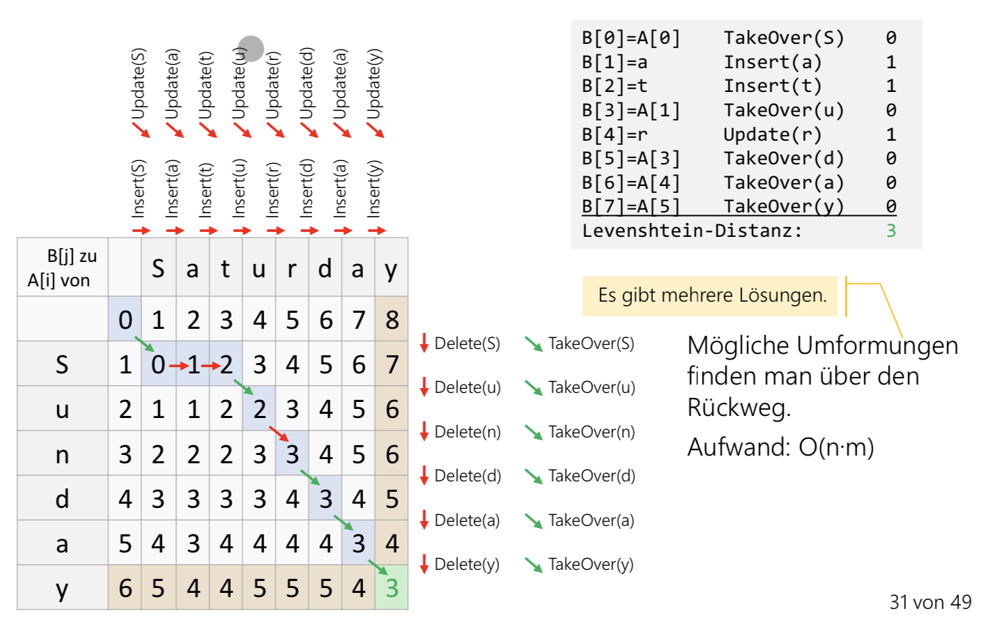
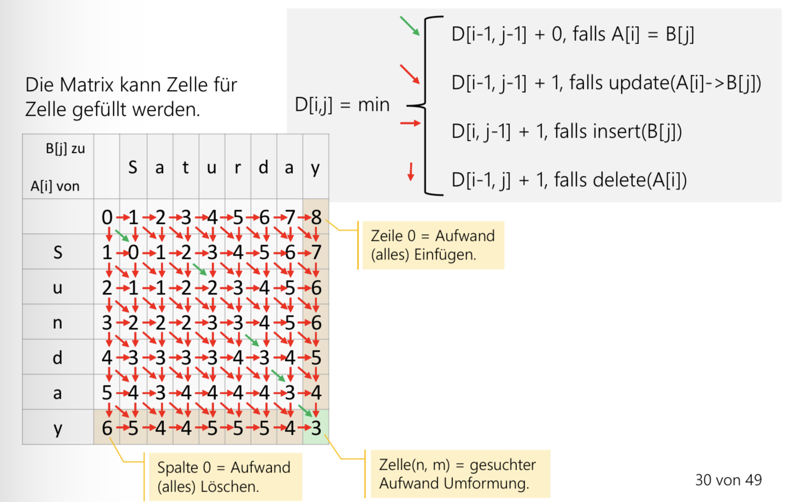

# Levenshtein-Distanz (Approximative Suche)

Minimale Anzahl Operation, um aus dem ersten Wort das zweite Wort zu machen.

## Anwendungen
- Finden von ähnlichen Wörtern
- Finden von Schreibfehlern

## Erlaubte "Operationen":

### Insert(c)
Buchstaben 'c' an einer Position im Wort einfügen

### Update (c -> d)
Buchstaben 'c' an einer Position im ersten Wort durch 'd' ersetzen

### Delete(c)
Buchstabe 'c' an einer Position im ersten Wort löschen.







### Algorithmus

```java
private static int minimum(int a, int b, int c) {
	return Math.min(Math.min(a, b), c)
}
```

```java
public static int computeLevenshteinDistance(String str1, String str2) {
	int[][] distance = new int[str1.length() + 1][str2.length() + 1];

	for (int i=0; i < str1.length(); i++) {
		distance[i][0] = i;
	}

	for (int j=0; j < str2.length(); j++) {
		distance[0][j] = j;
	}

	for (int i=1; j i < str1.length(); i++) {
		for (int j=1; j < str2.length(); j++) {
			int minEd = (str1.charAt(i - 1) == str2.charAt(j --1)) ? 1 : 0;

			distance[i][j] = minimum(
				distance[i - 1][j] + 1,
				distance[i][j + 1] + 1,
				distance[i - 1][j + 1] + minEd);
		}
	}

	return distance [str1.length()][str2.length()];

}

```