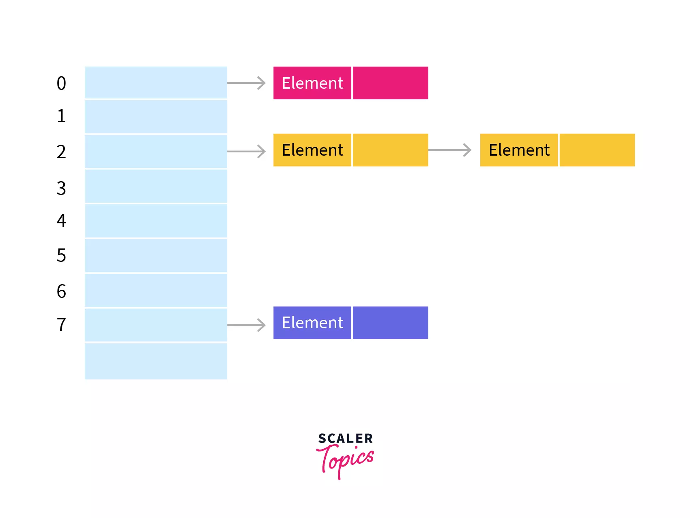

# Collisions

Collisions are the result, when multiple values have the same hashvalue.

## Seperate Chaining

Every slot of the hashtable is a linked list.


$ O(1+load factor) $

## Open adressing

Searches a different empty slot in the hashtable. Requires the load factor < ~ 0.8

### Linear probing

Sequential searching for empty cells
$$

F+1, 
F+2,
F+3, ...,
F+i

$$
 
```java
int find(Object x) {
	int currentPos = hash(x);

	while (array[currentPos] != null &&
	!array[currentPos].element.equals(x)) {
		currentPos = (currentPos + 1) % array.length;
	}

	return currentPos;
}
```

- Probleme vom Clustering, Array ist vorne immer gefüllt.
- Langes Suchen, wenn der Array gefüllt ist.

### Quadratic probing

Quadratic increase

$$


F+1,
F+4,
F+9,
...,
F+i^2
$$

```java
int find(Object x) {
	int collisionNum = 0;
	int currentPos = hash(x);

	while (array[currentPos] != null &&
	!array[currentPos].element.equals(x)) {
		currentPos += 2* ++collisionNum -1;
		currentPos = currentPos % array.length;
	}

	return currentPos;
}
```

## Deletion
Deletion is a bit complicated, as a true deletion would destroy the order of the escape cells.

- Once a cell has been deleted, the escape cells have to be rehashed.
- Marking the cell as deleted