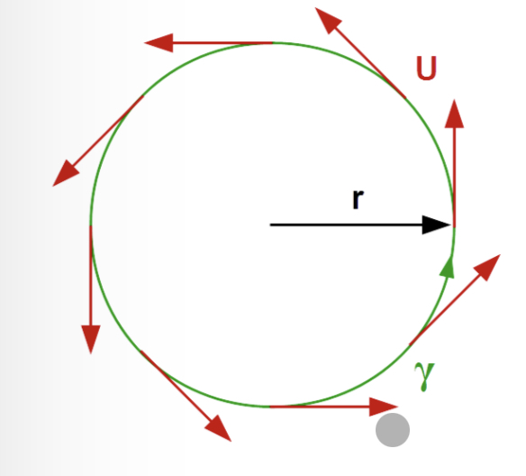

# Arbeitsintegrale

Ziehen wir ein Objekt mit einer konstanten Kraft $ \overrightarrow{F} $ über eine kurze Wegstrecke $ d \overrightarrow{r} $, leisten wir die Arbeit.

$$
dW = \overrightarrow{F}
\cdot
d \overrightarrow{r}
$$


$$
W = \int_{\gamma} \overrightarrow{F} \cdot d \overrightarrow{\gamma}
$$

## Pfad $ \gamma $
Pfad $ \gamma $ als Kurve im Raum mit Parameter s
$$
\overrightarrow{r}(s) = \overrightarrow{\gamma}(s) = 
\begin{pmatrix}
\gamma_x (s)\\
\gamma_y (s)\\
\gamma_z (s)
\end{pmatrix}


$$


**dW > 0***: Das Systen leistet Arbeit am Objekt

**dW < 0**: Das System bezieht Arbeit vom Objekt

# Linienintegral

Die Summe vieler kleiner Arbeitsintegrale gibt einenen Linienintegral

$$

W =
\int_{\gamma} \overrightarrow{F} \cdot d \overrightarrow{r}

\approx

\sum_{i=1}^4 \overrightarrow{F}(r_j) \cdot (\overrightarrow{r}_{i+1} - \overrightarrow{r}_i)

$$

## Spezialfall Kreis:



$$
\int_{\gamma} \overrightarrow{U} \cdot d \overrightarrow{\gamma}
=
2 \pi r |\overrightarrow{U}|
$$


```python,editable
import numpy as np
radius = 1

# X, Y, Z Vector
U = np.array([1,2,3])

kraft = 2 * pi * np.absolute(U) 
print (kraft)

```

