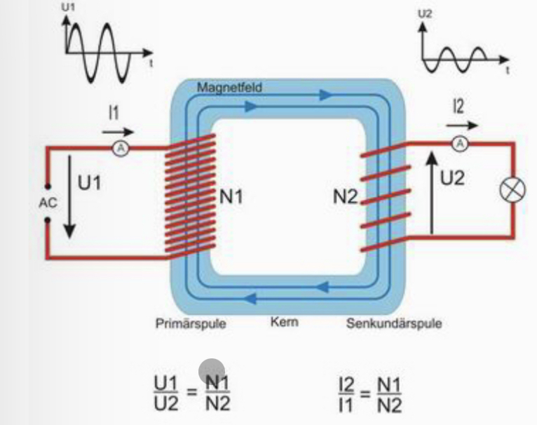

# Transformator

In der linken Spule erzeugt die Antriebsspannung $ U_1 $ einen Strom 
$ I $. Die Spule ist aus $ N_1 $ Schlaufen zusammengesetzt.
Jede Schlaufe erzegt eine Magnetfeld, die addiert werden können.

- Das Magnetfeld ist proportional zu $ N_1 $

| Beschreibung | Symbol | Einheit|
|--|--|--|
| Windungen | N | - |
| Spannung | U | V |
| Strom | I | A |

## Spannung

$$
\frac{U_1}{N_1} =
\frac{U_2}{N_2}
$$

$$
\frac{U_1}{U_2} =
\frac{N_1}{N_2}
$$

## Strom

$$
\frac{N_1}{N_2} =
\frac{I_2}{I_1}
$$
