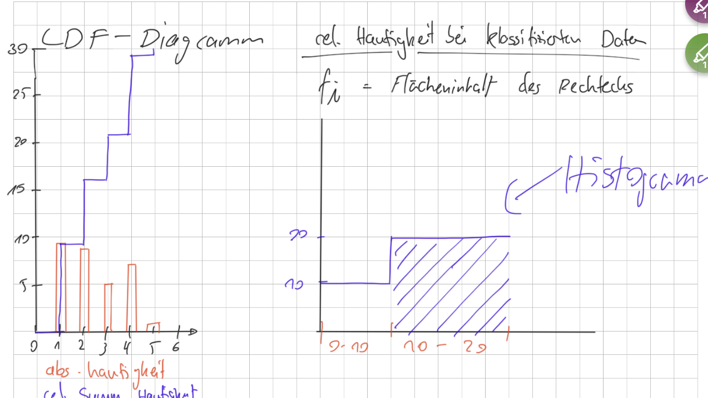

# Häufigkeiten

## Graphische Darstellung

**Kategoriel**: Säulendiagramm, Skalardiagramm

**Metrisch**: Säulendiagramm, Skalardiagramm, Histogramm bei Klassenbildung

| Beschreibung | Zeichen | Formel |
|--|---|--|
| Anzahl | \\(n \\) |
| Wert / Klasse | \\(a_i \\) | 
| Absolute Häufigkeit | \\(h_i \\) | Anzahl |
| Relative Häufigkeit (PMF) | \\(f_i \\)| \\(\frac{h_i}{n} \\) |
| Kummulative rel. Häufigkeit (CDF) | \\(F_i \\) | Summe aller vorgehenden \\(f_i \\) |
| Spaltenbreite | \\(d_i \\) |
| PDF-Wert | \\(f \\) | \\(\frac{f_i}{d_i} \\) |

Auswahl von Bereichen: \\( F(2 \leq 4) = F(4) - F(1) \\)

## Diagramme

