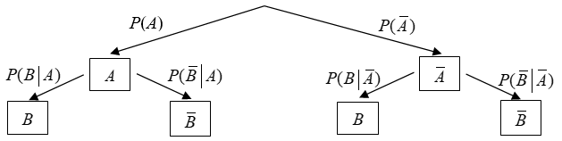

# Bedingte Wahrscheinlichkeiten

Seien $ (\Omega, P) $ ein diskreter Wahrscheinlichkeitsraum und $ A $ und $ B $ zwei Ereignisse.

Die Wahrscheinlichkeiten, dass $ A $ eintritt, unter der Annahme, dass Ereignis $ B $ eingetreten ist, nennt man die bedingte Wahrscheinlichkeit $ P(A | B) $ von $ A $ unter der Bedingung $ B $.

Falls $ P(B) > 0 $ gilt:

$$
P(A|B) = \frac{P(A \cap B)}{P(B)}
$$

## Multiplikationssatz

$$
P (A \cap B) = P(A | B) \cdot P(B)

=
P(B|A) \cdot P(A)
$$

## Satz von der Totalen Wahrscheinlichkeit

$$

P(A) = P(A|N)
\cdot P(B) + P(A| \overline{B})
\cdot P(\overilne{B})

$$

$$
\overline{B} = \Omega \\B
$$

## Satz von Bayes

$$
P(A|B) =
\frac{P(B|A)  \cdot P(A)}
{
	P(B)
}

$$

