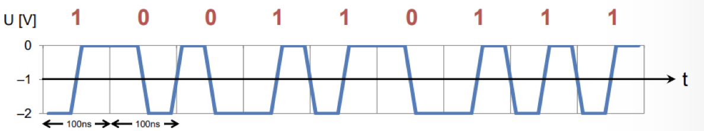
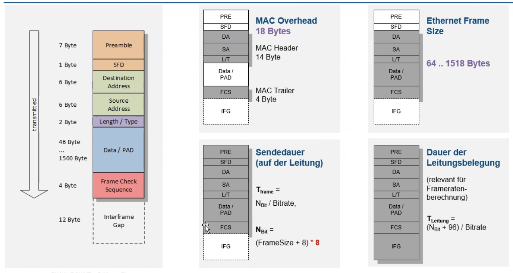

# Local Area Networks (LAN)

| Beschreibung | Symbol |Einheit | Formel |
|--|--|--|--|
| Framerate | $F_R$ |$\frac{\text{Frames}}{\text{s}}$|$F_R = \frac{B}{8 \cdot (F_L + IFG) \cdot 8}$|
| Bitrate | $B$ | | |
| Framelänge | $F_L$ |Bits| Data + Prä + SFD + FCS = Data + 7Bit + 1Bit + 4Byte |
| Nutzbitrate | $N$ | | $N = F_R \cdot P \cdot 8$|
| Payload | $P$ | | |

## Übertragungsarten

- **Unicast**: an einzelne Stationen
- **Broadcast**: an alle Stationen
- **Multicast**: an eine Gruppe von Stationen

## Leitungscode

Als **Leitungscode** wird ein Manchester eingesetzt

- 1 positive Flanke, 1 negative Flanken
- Erlaubt die Taktrückgewinnung auf einfache Weise
- Benötigt die doppelte Bandbreite des theoretischen Minimums 

## Kollosionen
Können durch die Überlagerungen von Signalen entstehen. Kollosionen müssen erkannt werden. 

### Kollosionserkennung

## Topologie

| Beschreibung | Symbol |Einheit | Formel |
|--|--|--|--|
| Nutzdaten | $N$ | Bits |
| Länge zwischen Switch und Knoten | $l$ | $m$ |
| Bandbreite | $B$ | $\frac{bits}{s}$
| Framedauer | $t_{\text{frame}}$ |s | $\frac{N + 8 \cdot (\text{Prä/SFD}) + 12 (\text{Macs}) + 2 (\text{Type} + 4 (\text{FCS})) }{B}$ |
| Transferdauer | $t_{\text{transfer}}$ | s | $\frac{l}{c_\text{Medium}}$

## Ethernet

## IEEE Mac Adressen

