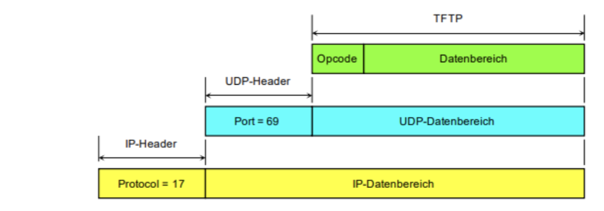
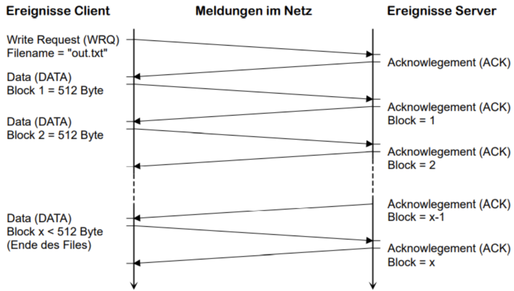

# Application Layer

## DNS (Domain Name Space)
- Leserliche Darstellung von IP-Adressen
- Hauptdömäne ist Root (.)

| Beschreibung | Domain |
|-|-|
| Fully Qualified Fomain Name | bob.sw.eng. |
| Root | . |
| TLD (Top Level Domain) | eng |
| SLD (Second Level Domain) | sw |

## TFTP (Trivial File Transfer Protocol)

Basiert auf UDP

## DHCP

1. Client sucht DHCP Server mittels Broadcast
2. DCHP Server antwortet (DHCP offer)
3. Der Client wählt einen Server und fordert eine Auswahl der angebotenen Paramter (DHCP Request)
4. Der Server bestätigt mit einer Message, welche die engültigen Parameter enthält
5. Vor Ablauf der Lease-Time erneuert der Client die Adresse.