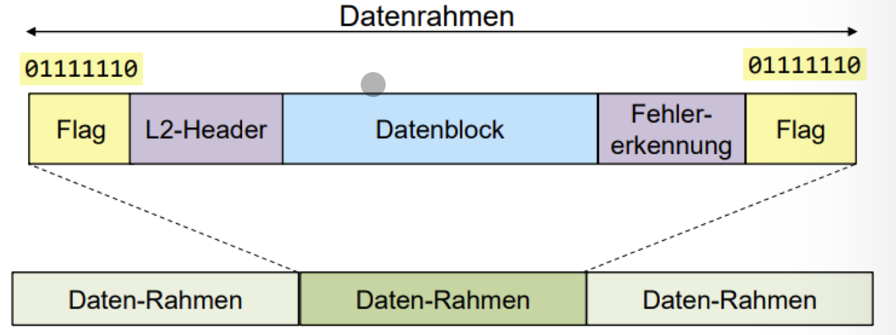

# Data Link Layer

## Framing

### Asynchron

Keine Daten -> Nichts wird gesendet

Zu Beginn eines Frames wird ein Start-Bit gesendet

### Synchron

- Frames werden ohne Unterbruch gesendet

## Fehlererkennung / Fehlerkorrektur

- **FER** (**F**rame **E**rror **R**atio)
- **RER** (**R**esidual **E**rror **R**atio)
- **BER** (**B**it **E**rror **R**atio)

## Parity
- **Even Parity**: Wenn die Anzahl Bits, die 1 sind, gerade ist, dann ist der Wert: 1
- **Odd Parity**: Wenn die Anzahl Bits, die 1 sind, ungerade ist, dann ist der Wert 1