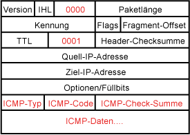
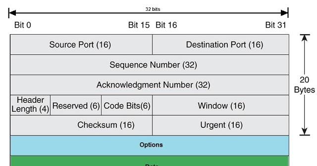
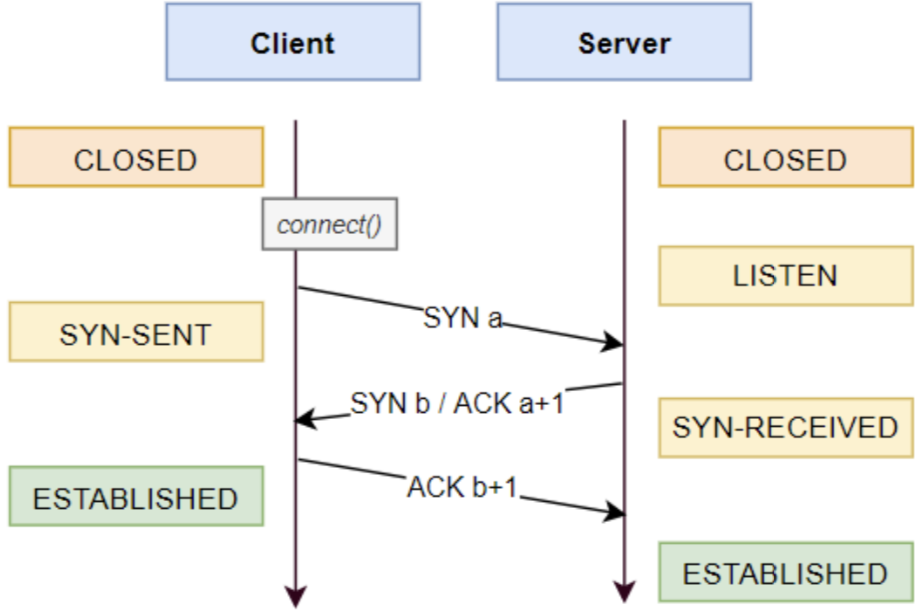
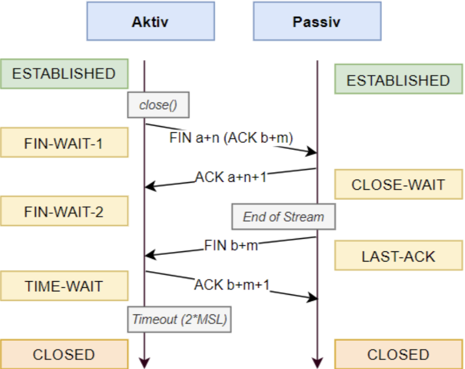
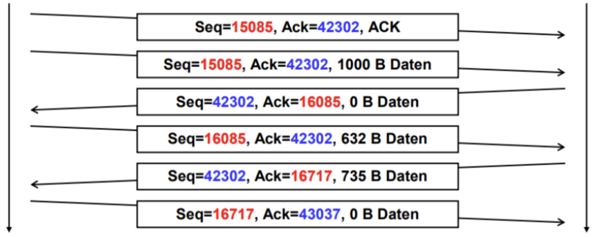

# Network Layer / Internet Layer

## Internet Protokoll Format (IP Header)

IP-Packet besteht aus einem Header (min. 20 Bytes) und Nutzdaten

| Feld | Beschreibung |
|-|-|
| Version | IPv4 / IPv6 |
| IHL | Header Length in 4-Byte (20 Byte -> 5) |
| TOS (Type of Service) | Erlaubt Priorisierung|
| Total Length | Länge des IP-Packets (Header + Nutzdaten) |
| Identification | Identifkiation des IP-Packets / Fragments |
| Flags | Kontroll-Flags für Fragmenteriung |
| Fragment Offset | Gibt an, wo ein Fragment hingehört (Position in buffer) |
| TTL (Time to Live) | Hop Counter, 0 -> Paket wird verworfen |
| Protocol | Übergeordnetes Protokoll |

## Internet Control Message Protocol (ICMP)

## Maximum Transfer Unit (MTU)

- Der Sender kennt die MTU der Netze nicht.
- Die MTU gibt die maximale Paketgrösse (Layer 3) an.

**Maximale Daten bei gegebener MTU** $\text{MTU} - \text{IP Header} - \text{ICMP Header}$
## TCP

