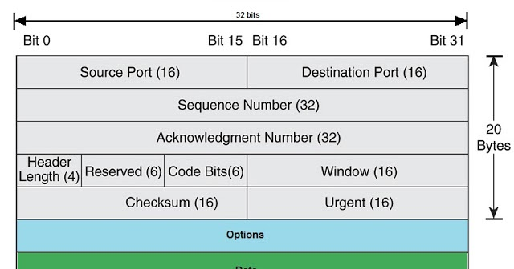
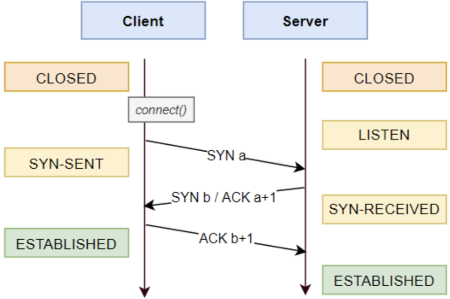
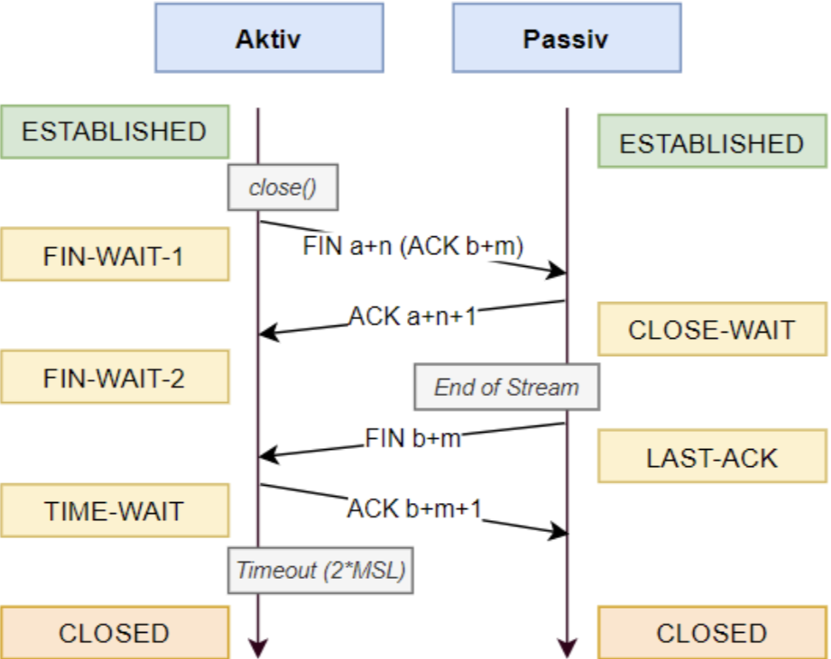
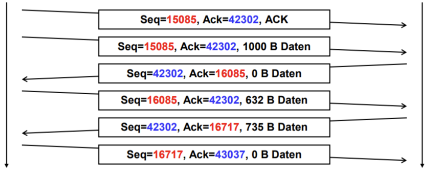

# Transport Layer

## User Datagramm Protocoll (UDP)
Daten werden an "Adresse" gesendet. Es wird auf **kein** ACK gewartet.

- Verbindungslos
- Unzuverlässig

## Transmission Controll Protocoll

| Feld | Beschreibung |
|-|-|
| Sequence Number | Nummer zur Ordnung der Segmente |
| Acknowledgment Number | Bisherige ACK No + Anzahl Daten |
| Window Size | Anzahl Bytes die empfangen werden können |

## Verbindungsaufbau & Abbau

## Fluss Steuerung

### Stop and Wait
- Verhindert den Datenüberlauf
- Ineffiziente Nutzung der Netzbandbreite

1. Paket senden
2. ACK antworten

### Sliding-Window
- Höhere Durchsatzrate
- Feste "Fenster-Grösse"

1. X Pakete senden
2. X ACK antworten

