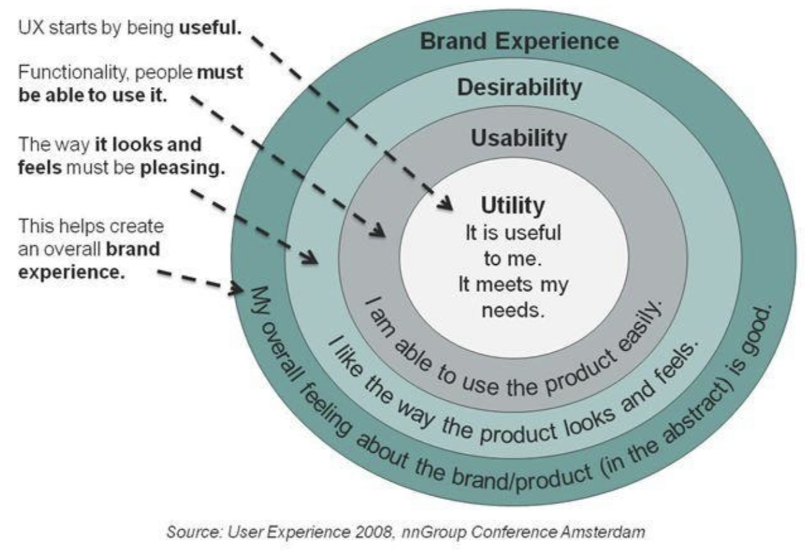

# Anforderungsanalyse

## Usability und User Experience (UX)

### Usability

Wie einfach kann eine SW-Applikation benutzt werden.

Aspekte:

- Benutzer
- Seine Ziele / Aufgaben
- Sine Kontext
- Softwaresystem (inkl. UI)

### Effektivität

- Der Benutzer kann all seine Aufgaben vollständig erfüllen
- Mit der gewünschten Genauigkeit

### Effizienz

- Der Benutzer kann seine Aufgaben mit minimalem / angemessemen Aufwand erledigen

	- Mental
	- Physisch
	- Zeit

### Zufriedenheit

- Mit dem System / der Interaktion

	- Minimum: Benutzer ist nicht verärgert
	- Normal: Benutzer ist zufrieden
	- Optimal: Benutzer ist erfreut