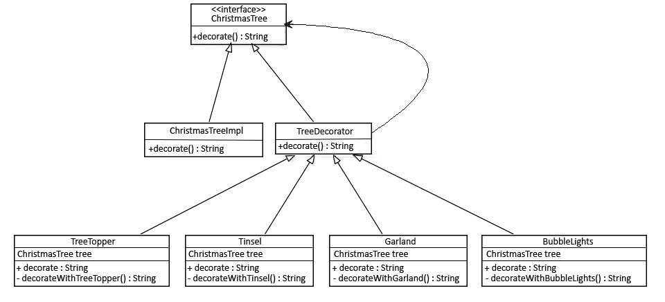

# Design Patterns

## Creational Patterns
### Abstract Factory

Creating multiple objects with variations.


```java
public interface Shape {
   void draw();
}

public class RoundedRectangle implements Shape {
   @Override
   public void draw() {
      System.out.println("Inside RoundedRectangle::draw() method.");
   }
}

public class RoundedSquare implements Shape {
   @Override
   public void draw() {
      System.out.println("Inside RoundedSquare::draw() method.");
   }
}

public class Rectangle implements Shape {
   @Override
   public void draw() {
      System.out.println("Inside Rectangle::draw() method.");
   }
}

// Abstract factory
public abstract class AbstractFactory {
   abstract Shape getShape(String shapeType) ;
}

public class ShapeFactory extends AbstractFactory {
   @Override
   public Shape getShape(String shapeType){    
      if(shapeType.equalsIgnoreCase("RECTANGLE")){
         return new Rectangle();         
      }else if(shapeType.equalsIgnoreCase("SQUARE")){
         return new Square();
      }	 
      return null;
   }
}

public class RoundedShapeFactory extends AbstractFactory {
   @Override
   public Shape getShape(String shapeType){    
      if(shapeType.equalsIgnoreCase("RECTANGLE")){
         return new RoundedRectangle();         
      }else if(shapeType.equalsIgnoreCase("SQUARE")){
         return new RoundedSquare();
      }	 
      return null;
   }
}
```


### Builder

Objekte werden Schritt für Schritt zusammengebaut. Der Konstruktor baut die "Grundstruktur" und für jeden weiteren Schritt ist eine Methode vorhanden.


```java
public class Computer {
	
	//required parameters
	private String HDD;
	private String RAM;
	
	//optional parameters
	private boolean isGraphicsCardEnabled;
	private boolean isBluetoothEnabled;
	

	public String getHDD() {
		return HDD;
	}

	public String getRAM() {
		return RAM;
	}

	public boolean isGraphicsCardEnabled() {
		return isGraphicsCardEnabled;
	}

	public boolean isBluetoothEnabled() {
		return isBluetoothEnabled;
	}
	
	private Computer(ComputerBuilder builder) {
		this.HDD=builder.HDD;
		this.RAM=builder.RAM;
		this.isGraphicsCardEnabled=builder.isGraphicsCardEnabled;
		this.isBluetoothEnabled=builder.isBluetoothEnabled;
	}
	
	//Builder Class
	public static class ComputerBuilder{

		// required parameters
		private String HDD;
		private String RAM;

		// optional parameters
		private boolean isGraphicsCardEnabled;
		private boolean isBluetoothEnabled;
		
		public ComputerBuilder(String hdd, String ram){
			this.HDD=hdd;
			this.RAM=ram;
		}

		public ComputerBuilder setGraphicsCardEnabled(boolean isGraphicsCardEnabled) {
			this.isGraphicsCardEnabled = isGraphicsCardEnabled;
			return this;
		}

		public ComputerBuilder setBluetoothEnabled(boolean isBluetoothEnabled) {
			this.isBluetoothEnabled = isBluetoothEnabled;
			return this;
		}
		
		public Computer build(){
			return new Computer(this);
		}

	}

}
```

### Factory Method

Ein Interface wird verwendet, um etwas zu beschreiben. Dieses wird von unterschiedlichen Implementationen implementiert.


```java
public interface Button {
    void render();
    void onClick();
}

public class HtmlButton implements Button {

    public void render() {
        System.out.println("<button>Test Button</button>");
        onClick();
    }

    public void onClick() {
        System.out.println("Click! Button says - 'Hello World!'");
    }
}

public class OtherButton implements Button {

    public void render() {
        ...
        onClick();
    }

    public void onClick() {
        ...
    }
}


Button x = new HtmlButton();
```

### Prototype

Wird verwendet, wenn Objekte **exakt** geklonnt werden sollen. Dabei werden nicht die einzelnen Felder kopiert, sondern das Klonen der Klasse überlassen.


```java
public abstract class Tree {
    
    // ...
    public abstract Tree copy();
}

public class PlasticTree extends Tree {

    // ...

    @Override
    public Tree copy() {
        PlasticTree plasticTreeClone = new PlasticTree(this.getMass(), this.getHeight());
        plasticTreeClone.setPosition(this.getPosition());
        return plasticTreeClone;
    }

}

public class PineTree extends Tree {
    // ...

    @Override
    public Tree copy() {
        PineTree pineTreeClone = new PineTree(this.getMass(), this.getHeight());
        pineTreeClone.setPosition(this.getPosition());
        return pineTreeClone;
    }
}

```

### Singleton

Wird verwendet, um von einer Klasse **genau** eine Instanz zu haben. Wird verwendet um Resourcen, z.B. Zugang zu einer Datenbank, Datei in genau einer Instanz zu halten.

```java
public final class ClassSingleton {

    private static ClassSingleton INSTANCE;
    private String info = "Initial info class";
    
    private ClassSingleton() {        
    }
    
    public static ClassSingleton getInstance() {
        if(INSTANCE == null) {
            INSTANCE = new ClassSingleton();
        }
        
        return INSTANCE;
    }

    // getters and setters
}
```

## Structural Patterns

### Adapter

Das Adapter Pattern erlaubt es, Anwendungen die mit unterschiedlichen Protokollen / Schnittstellen arbeiten, miteinander zu verknüpfen.


```java

public class Volt {

	private int volts;
	
	public Volt(int v){
		this.volts=v;
	}

	public int getVolts() {
		return volts;
	}

	public void setVolts(int volts) {
		this.volts = volts;
	}
	
}

public class Socket {

	public Volt getVolt(){
		return new Volt(120);
	}
}

public interface SocketAdapter {

	public Volt get120Volt();
		
	public Volt get12Volt();
	
	public Volt get3Volt();
}


```


### Bridge

Eine Klasse wird aus unterschiedlichen anderen Klassen zusammengesetzt 


```java
public interface Color {

	public void applyColor();
}

public abstract class Shape {
	//Composition - implementor
	protected Color color;
	
	//constructor with implementor as input argument
	public Shape(Color c){
		this.color=c;
	}
	
	abstract public void applyColor();
}

public class Triangle extends Shape{

	public Triangle(Color c) {
		super(c);
	}

	@Override
	public void applyColor() {
		System.out.print("Triangle filled with color ");
		color.applyColor();
	} 

```

### Composite

Macht nur Sinn, wenn die Anwendung als Baum aufgebaut ist.


```java
public interface Department {
    void printDepartmentName();
}

// LEAFS
public class FinancialDepartment implements Department {

    private Integer id;
    private String name;

    public void printDepartmentName() {
        System.out.println(getClass().getSimpleName());
    }

    // standard constructor, getters, setters
}

public class SalesDepartment implements Department {

    private Integer id;
    private String name;

    public void printDepartmentName() {
        System.out.println(getClass().getSimpleName());
    }

    // standard constructor, getters, setters
}

// COMPOSITE
public class HeadDepartment implements Department {
    private Integer id;
    private String name;

    private List<Department> childDepartments;

    public HeadDepartment(Integer id, String name) {
        this.id = id;
        this.name = name;
        this.childDepartments = new ArrayList<>();
    }

    public void printDepartmentName() {
        childDepartments.forEach(Department::printDepartmentName);
    }

    public void addDepartment(Department department) {
        childDepartments.add(department);
    }

    public void removeDepartment(Department department) {
        childDepartments.remove(department);
    }
}

```


### Decorator

Erlaubt es neues Verhalten zu Objeken hinzuzufügen.



```java
public interface ChristmasTree {
    String decorate();
}
public class ChristmasTreeImpl implements ChristmasTree {

    @Override
    public String decorate() {
        return "Christmas tree";
    }
}

public abstract class TreeDecorator implements ChristmasTree {
    private ChristmasTree tree;
    
    // standard constructors
    @Override
    public String decorate() {
        return tree.decorate();
    }
}

public class BubbleLights extends TreeDecorator {

    public BubbleLights(ChristmasTree tree) {
        super(tree);
    }
    
    public String decorate() {
        return super.decorate() + decorateWithBubbleLights();
    }
    
    private String decorateWithBubbleLights() {
        return " with Bubble Lights";
    }
}
```


### Facade

Bietet ein vereinfachtes Interface für eine Bibliothek, Framework oder Set an komplexen Klassen.


```java

public interface Shape {
   void draw();
}
public class Rectangle implements Shape {

   @Override
   public void draw() {
      System.out.println("Rectangle::draw()");
   }
}
public class Square implements Shape {

   @Override
   public void draw() {
      System.out.println("Square::draw()");
   }
}
public class Circle implements Shape {

   @Override
   public void draw() {
      System.out.println("Circle::draw()");
   }
}

// FACADE
public class ShapeMaker {
   private Shape circle;
   private Shape rectangle;
   private Shape square;

   public ShapeMaker() {
      circle = new Circle();
      rectangle = new Rectangle();
      square = new Square();
   }

   public void drawCircle(){
      circle.draw();
   }
   public void drawRectangle(){
      rectangle.draw();
   }
   public void drawSquare(){
      square.draw();
   }
}
```


### Flyweight

Erlaubt es eine grössere Anzahl an Objekten in die gleiche Grösse an Arbeitsspeicher zu packen. Es werden gemeinsame Daten in einer **gemeinsamen** Tabelle gespeichert.

```java
public class Tree {
    private int x;
    private int y;
    private TreeType type;

    public Tree(int x, int y, TreeType type) {
        this.x = x;
        this.y = y;
        this.type = type;
    }

    public void draw(Graphics g) {
        type.draw(g, x, y);
    }
}

public class TreeType {
    private String name;
    private Color color;
    private String otherTreeData;

    public TreeType(String name, Color color, String otherTreeData) {
        this.name = name;
        this.color = color;
        this.otherTreeData = otherTreeData;
    }

    public void draw(Graphics g, int x, int y) {
        g.setColor(Color.BLACK);
        g.fillRect(x - 1, y, 3, 5);
        g.setColor(color);
        g.fillOval(x - 5, y - 10, 10, 10);
    }
}

public class TreeFactory {
    static Map<String, TreeType> treeTypes = new HashMap<>();

    public static TreeType getTreeType(String name, Color color, String otherTreeData) {
        TreeType result = treeTypes.get(name);
        if (result == null) {
            result = new TreeType(name, color, otherTreeData);
            treeTypes.put(name, result);
        }
        return result;
    }
}

public class Forest {
    private List<Tree> trees = new ArrayList<>();

    public void plantTree(int x, int y, String name, Color color, String otherTreeData) {
        TreeType type = TreeFactory.getTreeType(name, color, otherTreeData);
        Tree tree = new Tree(x, y, type);
        trees.add(tree);
    }

    @Override
    public void paint(Graphics graphics) {
        for (Tree tree : trees) {
            tree.draw(graphics);
        }
    }
}
```

### Proxy

Übertragt die Steuerung eines Objektes in eine vorgelagertes Stellvertreterobjekt. Das Proxy dient als Schnittstelle zu seinem Subjekt.


```java
public interface ExpensiveObject {
    void process();
}
public class ExpensiveObjectImpl implements ExpensiveObject {

    public ExpensiveObjectImpl() {
        heavyInitialConfiguration();
    }
    
    @Override
    public void process() {
        LOG.info("processing complete.");
    }
    
    private void heavyInitialConfiguration() {
        LOG.info("Loading initial configuration...");
    }
    
}
public class ExpensiveObjectProxy implements ExpensiveObject {
    private static ExpensiveObject object;

    @Override
    public void process() {
        if (object == null) {
            object = new ExpensiveObjectImpl();
        }
        object.process();
    }
}
public static void main(String[] args) {
    ExpensiveObject object = new ExpensiveObjectProxy();
    object.process();
    object.process();
}
```

| Proxy Type | Beschreibung | Vorteile | Nachteile |
|-|-|-|-|
| Virtual Proxy | Objekt wird erst geladen, wenn benötigt (Lazy loading) | Spart Arbeitsspeicher | |
| Remot Proxy | Originales Objekt ist nicht im aktuellen Speicher präsent | | |
| Protection Proxy | Erlaubt es eine zusätzliche Sicherheitsschicht einem Objekt hinzuzufügen | Erlaubt Zugriffsrechte | |

## Behaviroal Patterns
- Chain of Responsibility
- Command
- Interpreter
- Iterator
- Mediator
- Memento
- Observer
- State
- Strategy
- Template Method
- Visitor

## Adapter
