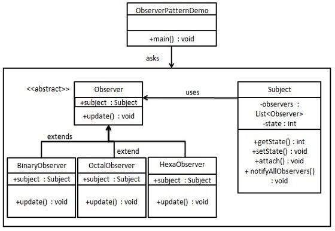

# Design Patterns

## Creational Patterns
### Abstract Factory

Creating multiple objects with variations.


```java
public interface Shape {
   void draw();
}

public class RoundedRectangle implements Shape {
   @Override
   public void draw() {
      System.out.println("Inside RoundedRectangle::draw() method.");
   }
}

public class RoundedSquare implements Shape {
   @Override
   public void draw() {
      System.out.println("Inside RoundedSquare::draw() method.");
   }
}

public class Rectangle implements Shape {
   @Override
   public void draw() {
      System.out.println("Inside Rectangle::draw() method.");
   }
}

// Abstract factory
public abstract class AbstractFactory {
   abstract Shape getShape(String shapeType) ;
}

public class ShapeFactory extends AbstractFactory {
   @Override
   public Shape getShape(String shapeType){    
      if(shapeType.equalsIgnoreCase("RECTANGLE")){
         return new Rectangle();         
      }else if(shapeType.equalsIgnoreCase("SQUARE")){
         return new Square();
      }	 
      return null;
   }
}

public class RoundedShapeFactory extends AbstractFactory {
   @Override
   public Shape getShape(String shapeType){    
      if(shapeType.equalsIgnoreCase("RECTANGLE")){
         return new RoundedRectangle();         
      }else if(shapeType.equalsIgnoreCase("SQUARE")){
         return new RoundedSquare();
      }	 
      return null;
   }
}
```


### Builder

Objekte werden Schritt für Schritt zusammengebaut. Der Konstruktor baut die "Grundstruktur" und für jeden weiteren Schritt ist eine Methode vorhanden.


```java
public class Computer {
	
	//required parameters
	private String HDD;
	private String RAM;
	
	//optional parameters
	private boolean isGraphicsCardEnabled;
	private boolean isBluetoothEnabled;
	

	public String getHDD() {
		return HDD;
	}

	public String getRAM() {
		return RAM;
	}

	public boolean isGraphicsCardEnabled() {
		return isGraphicsCardEnabled;
	}

	public boolean isBluetoothEnabled() {
		return isBluetoothEnabled;
	}
	
	private Computer(ComputerBuilder builder) {
		this.HDD=builder.HDD;
		this.RAM=builder.RAM;
		this.isGraphicsCardEnabled=builder.isGraphicsCardEnabled;
		this.isBluetoothEnabled=builder.isBluetoothEnabled;
	}
	
	//Builder Class
	public static class ComputerBuilder{

		// required parameters
		private String HDD;
		private String RAM;

		// optional parameters
		private boolean isGraphicsCardEnabled;
		private boolean isBluetoothEnabled;
		
		public ComputerBuilder(String hdd, String ram){
			this.HDD=hdd;
			this.RAM=ram;
		}

		public ComputerBuilder setGraphicsCardEnabled(boolean isGraphicsCardEnabled) {
			this.isGraphicsCardEnabled = isGraphicsCardEnabled;
			return this;
		}

		public ComputerBuilder setBluetoothEnabled(boolean isBluetoothEnabled) {
			this.isBluetoothEnabled = isBluetoothEnabled;
			return this;
		}
		
		public Computer build(){
			return new Computer(this);
		}

	}

}
```

### Factory Method

Ein Interface wird verwendet, um etwas zu beschreiben. Dieses wird von unterschiedlichen Implementationen implementiert.


```java
public interface Button {
    void render();
    void onClick();
}

public class HtmlButton implements Button {

    public void render() {
        System.out.println("<button>Test Button</button>");
        onClick();
    }

    public void onClick() {
        System.out.println("Click! Button says - 'Hello World!'");
    }
}

public class OtherButton implements Button {

    public void render() {
        ...
        onClick();
    }

    public void onClick() {
        ...
    }
}


Button x = new HtmlButton();
```

### Prototype

Wird verwendet, wenn Objekte **exakt** geklonnt werden sollen. Dabei werden nicht die einzelnen Felder kopiert, sondern das Klonen der Klasse überlassen.


```java
public abstract class Tree {
    
    // ...
    public abstract Tree copy();
}

public class PlasticTree extends Tree {

    // ...

    @Override
    public Tree copy() {
        PlasticTree plasticTreeClone = new PlasticTree(this.getMass(), this.getHeight());
        plasticTreeClone.setPosition(this.getPosition());
        return plasticTreeClone;
    }

}

public class PineTree extends Tree {
    // ...

    @Override
    public Tree copy() {
        PineTree pineTreeClone = new PineTree(this.getMass(), this.getHeight());
        pineTreeClone.setPosition(this.getPosition());
        return pineTreeClone;
    }
}

```

### Singleton

Wird verwendet, um von einer Klasse **genau** eine Instanz zu haben. Wird verwendet um Resourcen, z.B. Zugang zu einer Datenbank, Datei in genau einer Instanz zu halten.

```java
public final class ClassSingleton {

    private static ClassSingleton INSTANCE;
    private String info = "Initial info class";
    
    private ClassSingleton() {        
    }
    
    public static ClassSingleton getInstance() {
        if(INSTANCE == null) {
            INSTANCE = new ClassSingleton();
        }
        
        return INSTANCE;
    }

    // getters and setters
}
```

## Structural Patterns

### Adapter

Das Adapter Pattern erlaubt es, Anwendungen die mit unterschiedlichen Protokollen / Schnittstellen arbeiten, miteinander zu verknüpfen.


```java

public class Volt {

	private int volts;
	
	public Volt(int v){
		this.volts=v;
	}

	public int getVolts() {
		return volts;
	}

	public void setVolts(int volts) {
		this.volts = volts;
	}
	
}

public class Socket {

	public Volt getVolt(){
		return new Volt(120);
	}
}

public interface SocketAdapter {

	public Volt get120Volt();
		
	public Volt get12Volt();
	
	public Volt get3Volt();
}


```


### Bridge

Eine Klasse wird aus unterschiedlichen anderen Klassen zusammengesetzt 


```java
public interface Color {

	public void applyColor();
}

public abstract class Shape {
	//Composition - implementor
	protected Color color;
	
	//constructor with implementor as input argument
	public Shape(Color c){
		this.color=c;
	}
	
	abstract public void applyColor();
}

public class Triangle extends Shape{

	public Triangle(Color c) {
		super(c);
	}

	@Override
	public void applyColor() {
		System.out.print("Triangle filled with color ");
		color.applyColor();
	} 

```

### Composite

Macht nur Sinn, wenn die Anwendung als Baum aufgebaut ist.


```java
public interface Department {
    void printDepartmentName();
}

// LEAFS
public class FinancialDepartment implements Department {

    private Integer id;
    private String name;

    public void printDepartmentName() {
        System.out.println(getClass().getSimpleName());
    }

    // standard constructor, getters, setters
}

public class SalesDepartment implements Department {

    private Integer id;
    private String name;

    public void printDepartmentName() {
        System.out.println(getClass().getSimpleName());
    }

    // standard constructor, getters, setters
}

// COMPOSITE
public class HeadDepartment implements Department {
    private Integer id;
    private String name;

    private List<Department> childDepartments;

    public HeadDepartment(Integer id, String name) {
        this.id = id;
        this.name = name;
        this.childDepartments = new ArrayList<>();
    }

    public void printDepartmentName() {
        childDepartments.forEach(Department::printDepartmentName);
    }

    public void addDepartment(Department department) {
        childDepartments.add(department);
    }

    public void removeDepartment(Department department) {
        childDepartments.remove(department);
    }
}

```


### Decorator

Erlaubt es neues Verhalten zu Objeken hinzuzufügen.


```java
public interface ChristmasTree {
    String decorate();
}
public class ChristmasTreeImpl implements ChristmasTree {

    @Override
    public String decorate() {
        return "Christmas tree";
    }
}

public abstract class TreeDecorator implements ChristmasTree {
    private ChristmasTree tree;
    
    // standard constructors
    @Override
    public String decorate() {
        return tree.decorate();
    }
}

public class BubbleLights extends TreeDecorator {

    public BubbleLights(ChristmasTree tree) {
        super(tree);
    }
    
    public String decorate() {
        return super.decorate() + decorateWithBubbleLights();
    }
    
    private String decorateWithBubbleLights() {
        return " with Bubble Lights";
    }
}
```


### Facade

Bietet ein vereinfachtes Interface für eine Bibliothek, Framework oder Set an komplexen Klassen.


```java

public interface Shape {
   void draw();
}
public class Rectangle implements Shape {

   @Override
   public void draw() {
      System.out.println("Rectangle::draw()");
   }
}
public class Square implements Shape {

   @Override
   public void draw() {
      System.out.println("Square::draw()");
   }
}
public class Circle implements Shape {

   @Override
   public void draw() {
      System.out.println("Circle::draw()");
   }
}

// FACADE
public class ShapeMaker {
   private Shape circle;
   private Shape rectangle;
   private Shape square;

   public ShapeMaker() {
      circle = new Circle();
      rectangle = new Rectangle();
      square = new Square();
   }

   public void drawCircle(){
      circle.draw();
   }
   public void drawRectangle(){
      rectangle.draw();
   }
   public void drawSquare(){
      square.draw();
   }
}
```


### Flyweight

Erlaubt es eine grössere Anzahl an Objekten in die gleiche Grösse an Arbeitsspeicher zu packen. Es werden gemeinsame Daten in einer **gemeinsamen** Tabelle gespeichert.

```java
public class Tree {
    private int x;
    private int y;
    private TreeType type;

    public Tree(int x, int y, TreeType type) {
        this.x = x;
        this.y = y;
        this.type = type;
    }

    public void draw(Graphics g) {
        type.draw(g, x, y);
    }
}

public class TreeType {
    private String name;
    private Color color;
    private String otherTreeData;

    public TreeType(String name, Color color, String otherTreeData) {
        this.name = name;
        this.color = color;
        this.otherTreeData = otherTreeData;
    }

    public void draw(Graphics g, int x, int y) {
        g.setColor(Color.BLACK);
        g.fillRect(x - 1, y, 3, 5);
        g.setColor(color);
        g.fillOval(x - 5, y - 10, 10, 10);
    }
}

public class TreeFactory {
    static Map<String, TreeType> treeTypes = new HashMap<>();

    public static TreeType getTreeType(String name, Color color, String otherTreeData) {
        TreeType result = treeTypes.get(name);
        if (result == null) {
            result = new TreeType(name, color, otherTreeData);
            treeTypes.put(name, result);
        }
        return result;
    }
}

public class Forest {
    private List<Tree> trees = new ArrayList<>();

    public void plantTree(int x, int y, String name, Color color, String otherTreeData) {
        TreeType type = TreeFactory.getTreeType(name, color, otherTreeData);
        Tree tree = new Tree(x, y, type);
        trees.add(tree);
    }

    @Override
    public void paint(Graphics graphics) {
        for (Tree tree : trees) {
            tree.draw(graphics);
        }
    }
}
```

### Proxy

Übertragt die Steuerung eines Objektes in eine vorgelagertes Stellvertreterobjekt. Das Proxy dient als Schnittstelle zu seinem Subjekt.


```java
public interface ExpensiveObject {
    void process();
}
public class ExpensiveObjectImpl implements ExpensiveObject {

    public ExpensiveObjectImpl() {
        heavyInitialConfiguration();
    }
    
    @Override
    public void process() {
        LOG.info("processing complete.");
    }
    
    private void heavyInitialConfiguration() {
        LOG.info("Loading initial configuration...");
    }
    
}
public class ExpensiveObjectProxy implements ExpensiveObject {
    private static ExpensiveObject object;

    @Override
    public void process() {
        if (object == null) {
            object = new ExpensiveObjectImpl();
        }
        object.process();
    }
}
public static void main(String[] args) {
    ExpensiveObject object = new ExpensiveObjectProxy();
    object.process();
    object.process();
}
```

| Proxy Type | Beschreibung | Vorteile | Nachteile |
|-|-|-|-|
| Virtual Proxy | Objekt wird erst geladen, wenn benötigt (Lazy loading) | Spart Arbeitsspeicher | |
| Remot Proxy | Originales Objekt ist nicht im aktuellen Speicher präsent | | |
| Protection Proxy | Erlaubt es eine zusätzliche Sicherheitsschicht einem Objekt hinzuzufügen | Erlaubt Zugriffsrechte | |

## Behaviroal Patterns

### Chain of Responsibility

Anfragen werden entlang einer Kette weitergeleitet.


```java
public abstract class AbstractLogger {
   public static int INFO = 1;
   public static int DEBUG = 2;
   public static int ERROR = 3;

   protected int level;

   //next element in chain or responsibility
   protected AbstractLogger nextLogger;

   public void setNextLogger(AbstractLogger nextLogger){
      this.nextLogger = nextLogger;
   }

   public void logMessage(int level, String message){
      if(this.level <= level){
         write(message);
      }
      if(nextLogger !=null){
         nextLogger.logMessage(level, message);
      }
   }

   abstract protected void write(String message);
	
}
public class ConsoleLogger extends AbstractLogger {

   public ConsoleLogger(int level){
      this.level = level;
   }

   @Override
   protected void write(String message) {		
      System.out.println("Standard Console::Logger: " + message);
   }
}
public class ErrorLogger extends AbstractLogger {

   public ErrorLogger(int level){
      this.level = level;
   }

   @Override
   protected void write(String message) {		
      System.out.println("Error Console::Logger: " + message);
   }
}
public class FileLogger extends AbstractLogger {

   public FileLogger(int level){
      this.level = level;
   }

   @Override
   protected void write(String message) {		
      System.out.println("File::Logger: " + message);
   }
}

// DEMO
public class ChainPatternDemo {
	
   private static AbstractLogger getChainOfLoggers(){

      AbstractLogger errorLogger = new ErrorLogger(AbstractLogger.ERROR);
      AbstractLogger fileLogger = new FileLogger(AbstractLogger.DEBUG);
      AbstractLogger consoleLogger = new ConsoleLogger(AbstractLogger.INFO);

      errorLogger.setNextLogger(fileLogger);
      fileLogger.setNextLogger(consoleLogger);

      return errorLogger;	
   }

   public static void main(String[] args) {
      AbstractLogger loggerChain = getChainOfLoggers();

      loggerChain.logMessage(AbstractLogger.INFO, 
         "This is an information.");

      loggerChain.logMessage(AbstractLogger.DEBUG, 
         "This is an debug level information.");

      loggerChain.logMessage(AbstractLogger.ERROR, 
         "This is an error information.");
   }
}
```

### Command

Daten die zum Ausführen einer Aktion benötigt werden, werden in einer eigenen Klasse gespeichert / ausgeführt.

Diese Aktionen werden werden von einem Empfänger erhalten und ausgeführt.

```java
@FunctionalInterface
public interface TextFileOperation {
    String execute();
}

public class OpenTextFileOperation implements TextFileOperation {

    private TextFile textFile;
    
    // constructors
    
    @Override
    public String execute() {
        return textFile.open();
    }
}

public class SaveTextFileOperation implements TextFileOperation {
    
    // same field and constructor as above
        
    @Override
    public String execute() {
        return textFile.save();
    }
}

// RECEIVER
public class TextFile {
    
    private String name;
    
    // constructor
    
    public String open() {
        return "Opening file " + name;
    }
    
    public String save() {  
        return "Saving file " + name;
    }
    
    // additional text file methods (editing, writing, copying, pasting)
}


//SENDER
public class TextFileOperationExecutor {
    
    private final List<TextFileOperation> textFileOperations
     = new ArrayList<>();
    
    public String executeOperation(TextFileOperation textFileOperation) {
        textFileOperations.add(textFileOperation);
        return textFileOperation.execute();
    }
}

// VERWENDUNG
public static void main(String[] args) {
    TextFileOperationExecutor textFileOperationExecutor
      = new TextFileOperationExecutor();
    textFileOperationExecutor.executeOperation(
      new OpenTextFileOperation(new TextFile("file1.txt"))));
    textFileOperationExecutor.executeOperation(
      new SaveTextFileOperation(new TextFile("file2.txt"))));
}

```

### Interpreter

Definiert eine Repräsentation für die Grammatik einer Sprache und die Möglichkeit, Sätze dieser Sprache zu interpretieren.


```java


class Select implements Expression {

    private String column;
    private From from;

    // constructor

    @Override
    public List<String> interpret(Context ctx) {
        ctx.setColumn(column);
        return from.interpret(ctx);
    }
}

class From implements Expression {

    private String table;
    private Where where;

    // constructors

    @Override
    public List<String> interpret(Context ctx) {
        ctx.setTable(table);
        if (where == null) {
            return ctx.search();
        }
        return where.interpret(ctx);
    }
}

class Where implements Expression {

    private Predicate<String> filter;

    // constructor

    @Override
    public List<String> interpret(Context ctx) {
        ctx.setFilter(filter);
        return ctx.search();
    }
}

class Context {

    private static Map<String, List<Row>> tables = new HashMap<>();

    static {
        List<Row> list = new ArrayList<>();
        list.add(new Row("John", "Doe"));
        list.add(new Row("Jan", "Kowalski"));
        list.add(new Row("Dominic", "Doom"));

        tables.put("people", list);
    }

    private String table;
    private String column;
    private Predicate<String> whereFilter;

    // ... 

    List<String> search() {

        List<String> result = tables.entrySet()
          .stream()
          .filter(entry -> entry.getKey().equalsIgnoreCase(table))
          .flatMap(entry -> Stream.of(entry.getValue()))
          .flatMap(Collection::stream)
          .map(Row::toString)
          .flatMap(columnMapper)
          .filter(whereFilter)
          .collect(Collectors.toList());

        clear();

        return result;
    }
}
```

### Iterator

Erlaubt es Datenstrukturen jeglicher Art zu durchlaufen.

```java
public interface Iterator {
   public boolean hasNext();
   public Object next();
}

public interface Container {
   public Iterator getIterator();
}

public class NameRepository implements Container {
   public String names[] = {"Robert" , "John" ,"Julie" , "Lora"};

   @Override
   public Iterator getIterator() {
      return new NameIterator();
   }

   private class NameIterator implements Iterator {

      int index;

      @Override
      public boolean hasNext() {
      
         if(index < names.length){
            return true;
         }
         return false;
      }

      @Override
      public Object next() {
      
         if(this.hasNext()){
            return names[index++];
         }
         return null;
      }		
   }
}

public class IteratorPatternDemo {
	
   public static void main(String[] args) {
      NameRepository namesRepository = new NameRepository();

      for(Iterator iter = namesRepository.getIterator(); iter.hasNext();){
         String name = (String)iter.next();
         System.out.println("Name : " + name);
      } 	
   }
}

```

### Mediator

Wird benötigt, um einen "Kabelsalat" an Dependencies durch einen zentralen Zugang zu steuern.


```java
public class Button {
    private Fan fan;

    // constructor, getters and setters

    public void press(){
        if(fan.isOn()){
            fan.turnOff();
        } else {
            fan.turnOn();
        }
    }
}

public class Fan {
    private Button button;
    private PowerSupplier powerSupplier;
    private boolean isOn = false;

    // constructor, getters and setters

    public void turnOn() {
        powerSupplier.turnOn();
        isOn = true;
    }

    public void turnOff() {
        isOn = false;
        powerSupplier.turnOff();
    }
}

public class PowerSupplier {
    public void turnOn() {
        // implementation
    }

    public void turnOff() {
        // implementation
    }
}
```


**Umwandeln in**
```java
public class Button {
    private Mediator mediator;

    // constructor, getters and setters

    public void press() {
        mediator.press();
    }
}

public class Fan {
    private Mediator mediator;
    private boolean isOn = false;

    // constructor, getters and setters

    public void turnOn() {
        mediator.start();
        isOn = true;
    }

    public void turnOff() {
        isOn = false;
        mediator.stop();
    }
}

public class Mediator {
    private Button button;
    private Fan fan;
    private PowerSupplier powerSupplier;

    // constructor, getters and setters

    public void press() {
        if (fan.isOn()) {
            fan.turnOff();
        } else {
            fan.turnOn();
        }
    }

    public void start() {
        powerSupplier.turnOn();
    }

    public void stop() {
        powerSupplier.turnOff();
    }
}
``` 

### Memento

Erlaubt es Zustände zu speichern und wiederherzustellen.


```java
public class Memento {
   private String state;

   public Memento(String state){
      this.state = state;
   }

   public String getState(){
      return state;
   }	
}

public class Originator {
   private String state;

   public void setState(String state){
      this.state = state;
   }

   public String getState(){
      return state;
   }

   public Memento saveStateToMemento(){
      return new Memento(state);
   }

   public void getStateFromMemento(Memento memento){
      state = memento.getState();
   }
}

public class CareTaker {
   private List<Memento> mementoList = new ArrayList<Memento>();

   public void add(Memento state){
      mementoList.add(state);
   }

   public Memento get(int index){
      return mementoList.get(index);
   }
}

public class MementoPatternDemo {
   public static void main(String[] args) {
   
      Originator originator = new Originator();
      CareTaker careTaker = new CareTaker();
      
      originator.setState("State #1");
      originator.setState("State #2");
      careTaker.add(originator.saveStateToMemento());
      
      originator.setState("State #3");
      careTaker.add(originator.saveStateToMemento());
      
      originator.setState("State #4");
      System.out.println("Current State: " + originator.getState());		
      
      originator.getStateFromMemento(careTaker.get(0));
      System.out.println("First saved State: " + originator.getState());
      originator.getStateFromMemento(careTaker.get(1));
      System.out.println("Second saved State: " + originator.getState());
   }
}
```

### Observer

Definiert ein Mechanismus um mehrere Objekte zu informieren, wenn sich ein Objekt ändert.



```java
public class Subject {
	
   private List<Observer> observers = new ArrayList<Observer>();
   private int state;

   public int getState() {
      return state;
   }

   public void setState(int state) {
      this.state = state;
      notifyAllObservers();
   }

   public void attach(Observer observer){
      observers.add(observer);		
   }

   public void notifyAllObservers(){
      for (Observer observer : observers) {
         observer.update();
      }
   } 	
}

public abstract class Observer {
   protected Subject subject;
   public abstract void update();
}

public class BinaryObserver extends Observer{

   public BinaryObserver(Subject subject){
      this.subject = subject;
      this.subject.attach(this);
   }

   @Override
   public void update() {
      System.out.println( "Binary String: " + Integer.toBinaryString( subject.getState() ) ); 
   }
}

public class ObserverPatternDemo {
   public static void main(String[] args) {
      Subject subject = new Subject();

      new BinaryObserver(subject);

      System.out.println("First state change: 15");	
      subject.setState(15);
      System.out.println("Second state change: 10");	
      subject.setState(10);
   }
}
```

### State

Ein Objekt ändert sein Verhalten bestimmend nach seinen **internen Zuständen**.


```java

public class Package {

    private PackageState state = new OrderedState();

    // getter, setter

    public void previousState() {
        state.prev(this);
    }

    public void nextState() {
        state.next(this);
    }

    public void printStatus() {
        state.printStatus();
    }
}

public interface PackageState {

    void next(Package pkg);
    void prev(Package pkg);
    void printStatus();
}

public class OrderedState implements PackageState {

    @Override
    public void next(Package pkg) {
        pkg.setState(new DeliveredState());
    }

    @Override
    public void prev(Package pkg) {
        System.out.println("The package is in its root state.");
    }

    @Override
    public void printStatus() {
        System.out.println("Package ordered, not delivered to the office yet.");
    }
}
public class DeliveredState implements PackageState {

    @Override
    public void next(Package pkg) {
        pkg.setState(new ReceivedState());
    }

    @Override
    public void prev(Package pkg) {
        pkg.setState(new OrderedState());
    }

    @Override
    public void printStatus() {
        System.out.println("Package delivered to post office, not received yet.");
    }
}

public class ReceivedState implements PackageState {

    @Override
    public void next(Package pkg) {
        System.out.println("This package is already received by a client.");
    }

    @Override
    public void prev(Package pkg) {
        pkg.setState(new DeliveredState());
    }
}
```

### Strategy

Mehrere Algorithmen werden in separaten Klassen implementiert. Je nach Anwendung, kann zwischen diesen gewechselt werden.


```java
public interface Strategy {
   public int doOperation(int num1, int num2);
}

public class OperationAdd implements Strategy{
   @Override
   public int doOperation(int num1, int num2) {
      return num1 + num2;
   }
}

public class OperationSubstract implements Strategy{
   @Override
   public int doOperation(int num1, int num2) {
      return num1 - num2;
   }
}

public class OperationMultiply implements Strategy{
   @Override
   public int doOperation(int num1, int num2) {
      return num1 * num2;
   }
}

public class Context {
   private Strategy strategy;

   public Context(Strategy strategy){
      this.strategy = strategy;
   }

   public int executeStrategy(int num1, int num2){
      return strategy.doOperation(num1, num2);
   }
}

public class StrategyPatternDemo {
   public static void main(String[] args) {
      Context context = new Context(new OperationAdd());		
      System.out.println("10 + 5 = " + context.executeStrategy(10, 5));

      context = new Context(new OperationSubstract());		
      System.out.println("10 - 5 = " + context.executeStrategy(10, 5));

      context = new Context(new OperationMultiply());		
      System.out.println("10 * 5 = " + context.executeStrategy(10, 5));
   }
}

```


### Template Method

Das Skelet von Algorithmen wird in der Superklasse definiert. Subklassen implementieren die offen gelegten Methoden der Superklasse.


```java
public abstract class Game {
   abstract void initialize();
   abstract void startPlay();
   abstract void endPlay();

   //template method
   public final void play(){

      //initialize the game
      initialize();

      //start game
      startPlay();

      //end game
      endPlay();
   }
}

public class Cricket extends Game {

   @Override
   void endPlay() {
      System.out.println("Cricket Game Finished!");
   }

   @Override
   void initialize() {
      System.out.println("Cricket Game Initialized! Start playing.");
   }

   @Override
   void startPlay() {
      System.out.println("Cricket Game Started. Enjoy the game!");
   }
}

public class Football extends Game {

   @Override
   void endPlay() {
      System.out.println("Football Game Finished!");
   }

   @Override
   void initialize() {
      System.out.println("Football Game Initialized! Start playing.");
   }

   @Override
   void startPlay() {
      System.out.println("Football Game Started. Enjoy the game!");
   }
}

public class TemplatePatternDemo {
   public static void main(String[] args) {

      Game game = new Cricket();
      game.play();
      System.out.println();
      game = new Football();
      game.play();		
   }
}

```

### Visitor

Algorithmen werden vom Objekt getrennt, auf dem sie operieren.


```java
public class Document extends Element {

    List<Element> elements = new ArrayList<>();

    // ...

    @Override
    public void accept(Visitor v) {
        for (Element e : this.elements) {
            e.accept(v);
        }
    }
}

public class JsonElement extends Element {

    // ...

    public void accept(Visitor v) {
        v.visit(this);
    }
}

public class ElementVisitor implements Visitor {

    @Override
    public void visit(XmlElement xe) {
        System.out.println(
          "processing an XML element with uuid: " + xe.uuid);
    }

    @Override
    public void visit(JsonElement je) {
        System.out.println(
          "processing a JSON element with uuid: " + je.uuid);
    }
}
```