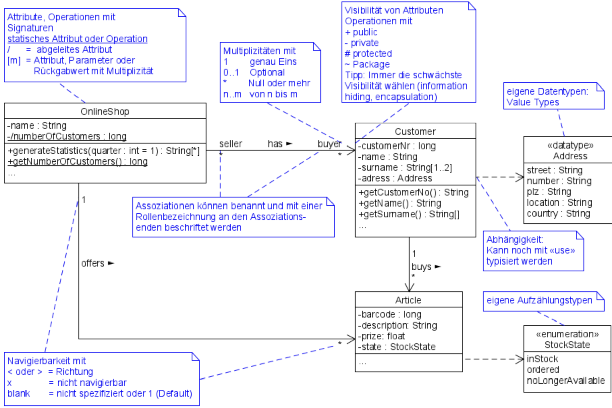

# UML

## Klassendiagramm
- Beschreibt die **statische Struktur** des zu entwerfenden oder abzubildenden Systems
	- Welche Klassen und Objekte existieren im System
	- Welche Attribute, Operationen und Beziehungen haben sie untereinander
	- Enthält alle relevanten Strukturzusammenhänge und Datentypen
- Bildet die **Brücke zwischen den dynamischen Diagrammen**

### Notationelemente

- Klasse
- Attribut
- Operation
- Sichtbar

