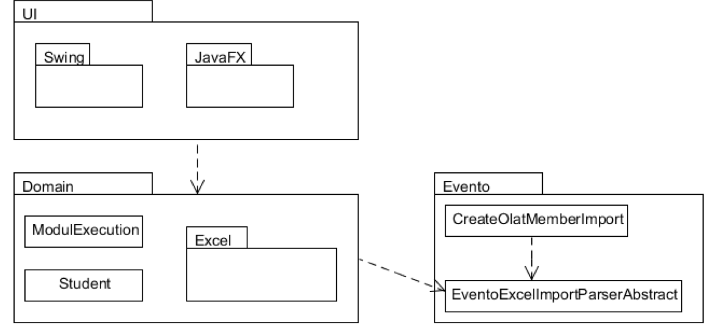

# Auslosetool

## Einflussfaktoren

### Usability 

- Graphische Benutzeroberfläche
- Presentation Layer

### Zuverlässigkeit

- Schnittstellen der Schichten verstänldihc und testbar gestalten
- Verfikation der Import Datei auf Korrektheit (Ausgabe einer verständlichen Fehlermeldung)

### Design Vorgaben

- Trennung der UI-Logik
- Schichten Architektur

### Supportability

- Wiederverwendbarkeit
- Modularisierung
- Support von verschiedenen Import-Dateiformaten (Abstraktionsschicht)

## Logische Architektur

