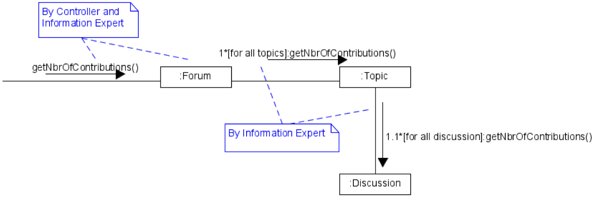
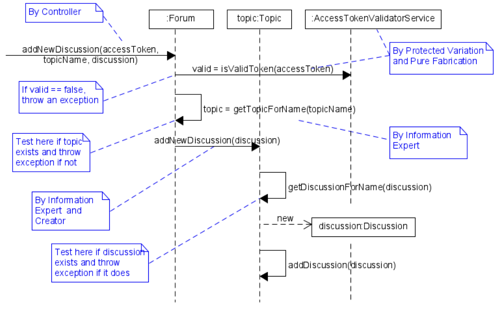

# Diskussionsforum

## Design-Klassendiagram (DCD)

## Use Cases

| Use Cas | Titel |
|-|-|
| UC01 | Sign In |
| UC02 | Sign Out |
| UC03 | Read a Discussion |
| UC04 | Post a Contribution |
| UC05 | Add a New Discussion |
| UC06 | Add a new Topic |
| UC07 | Show Statistics |

## Systemoperationen

### getNbrOfContributions

**UC**: UC07

**Signatur**: getNbrOfContributions()

Gibt die Anzahl Diskussionsbeitrage "Klasse Contribution" im gesamten Forum zurück.

- Die Systemoperation zur Berechnung der Anzahl Beiträge "Contributions" wird so realisiert, dass über alle Stufen der Zugehörigkeithierarchie "containment hierarch" iteriert wird und die jeweiligen Zwischenresultate aufsummiert werden.
- Alle oben aufgeführten Methoden müssen zusätzlich im DCD eingetragen werden. Beachten Sie die herarchische Nummerierung. Bezüglich Low Coupling .wird auf die Diskussion von getTotal() der Fallstudie verwiesen.
- Das Addieren der Zwischenresultate findet in den jeweiligen "getNumberOfContributions()" Methoden statt und wird hier gar nicht modelliert.
- Das Design direkt über User alle Contributions zu ermitteln, liefet eine falsche Anzahl, wennn Benutzer gelöscht werden!

### addNewDiscussion

**UC**: UC05

**Signatur**: addNewDiscussion(accessToken: byte[], userName: String, topicName: String, discussionName: String)

Es muss überprüft werden, ob so eine Diskussion bereits existiert und in diesem Fall muss eine Exception geworfen werden.

- Vom Fassaden-Controller aus wird zuerst das Access-Token validiert. Dann wird das richti- ge Thema («Topic») gewählt. Auf dem Topic wird die Diskussion («Discussion») erzeugt. Die Diskussion muss dann noch mit dem Topic verknüpft werden.
- Die Authentifizierung ist gemäss Aufgabenstellung ein Variationspunkt. Darum wird für die Validierung des Access-Tokens ein Interface «AccessTokenValidatorService» mit der Me- thode «isValidToken()» erstellt (analog für die Authentifzierung gemäss I in SOLID Interface Segregation). Zur Laufzeit kann dann eine konkrete Instanz eines AccessTokenValidator- Service dem Forum injiziert werden (Konstruktor).
- Das Sequenzdiagramm zeigt im Wesentlichen nur den Erfolgsfall. Die Fehlerbehandlung ist in den Kommentaren angegeben. Ihre Modellierung mittels UML würde das Diagramm nicht nur aufblasen, sondern auch sehr unleserlich machen.
- Alle oben aufgeführten Methoden müssen zusätzlich im DCD eingetragen werden (s. DCD auf der nächsten Seite). Die Zugriffe auf die Container Klassen wurden nicht explizit model- liert, dafür aber entsprechende Methoden auf der jeweiligen Domänenklasse angelegt (getXyzForName(...)). Diese können auch dafür verwendet werden, eine Exception zu wer- fen, wenn das Domänenobjekt mit dem gesuchten Namen nicht vorhanden ist. Werden die- se Tests explizit eingezeichnet, kann dies leicht zu einem unübersichtlichen Diagramm führen.
- Die Implementation folgt exakt den Diagrammen. Für die Erzeugung der aktuellen «Instant» wurde auf die abstrakte Klasse «java.time.Clock» zurückgegriffen. Man kann eine Variante davon erzeugen, die wirklich die aktuelle Systemzeit mit der eingestellten Zeitzone reprä- sentiert. Es gibt aber auch eine Variante, die immer dieselbe Zeit liefert. Diese ist primär für Testfälle gedacht. Die Erzeugung der aktuellen «Instant» wird der Controller Klasse zuge- ordnet, da dadurch nur eine Instanz von Clock notwendig ist, die bei der Instanziierung dem Controller «Forum» übergeben wird.

