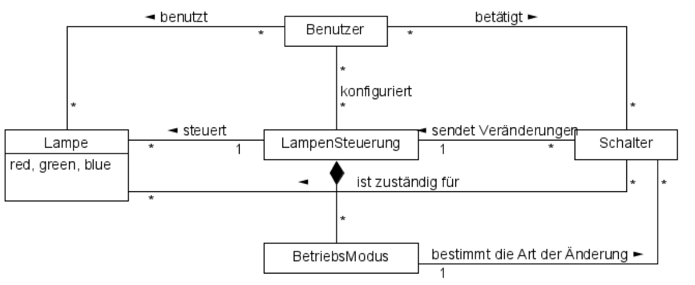

# Lampentool

Flexible einsetzbare Lampensteuerung. Die dafür vorgesehenden Lampen sind bezüglich den Farbkombonennten Rot, Grün und Blau jeweils zwischen 0 und 100% einstellbar. Wie sie vielleicht wissen, ist jeder Farbton eine Mischung dieser 3 Grundfarben während Weiss alle 3 Komnponenten mit gleicher Stärke hat.

Um das Licht zu steuern, kommen Schalter zum Einsatz, die sowohl gedreht wie auch gedrückt werden können. Allerdings kennen die Schalter ihre aktuelle absolute Position nicht. Sie können nur der Lampensteuerung melden, ob sie gedrückt und in welche Richtung sie gedreht wurden.

## Domänenmodell

- Die Lampensteuerung reagiert auf die Schalter-Ändeungen und verändert die Lampen, die dem Schalter zugeordnet sind.
- Die genaue Art der veränderung hängt vom gewählten Betriebsmodus ab.
- Ein Betriebsmodus ist fix einem Schalter zugeordnet.
- Die verfügbaren Lampen und Schalter, die Zuordnung der Lampen zu den Schaltern und der Betriebsmodus für einen Schalter werden beim Start der Lampensteuerung definiert und sind dann konstant.
- Es ist übrigens möglich, dass eine Lampe von mehr als einem Schalter angesteuert wird.

