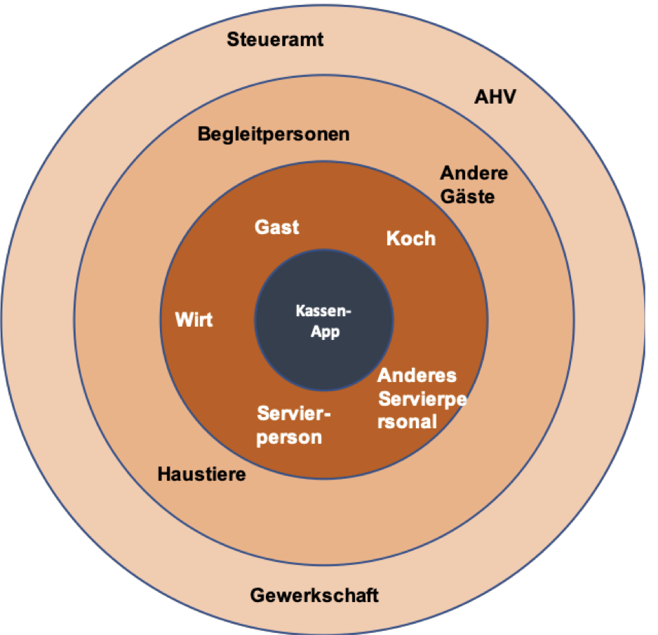
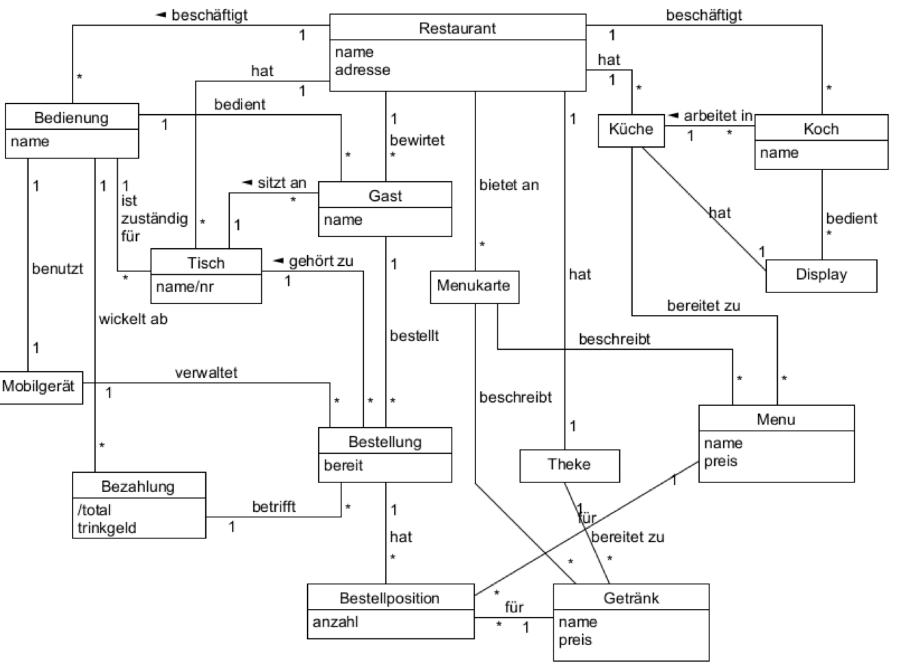

# Switfs 4 Restaurants

- Besteht aus Mobilgeräten für das Servierpersonal, mit dem sie Bestellungn aufnahmen können sowie Bezahlungen abwickeln können.
- Zentralkassensystem für die Theke
- Touchscreen für die Küche, wo die bestellten Waren erscheinen

## Stakeholder Map

## Domänenmodell

Jede Servierperson besitzt ein Mobilgerät, auf dem sie Ihre Bestellungen erfasst. Die Menus werden direkt auf das Display in der Küche geschickt, die sie zubereitet. Die Getränkebestellungen werden auf dem Zentralcomputer an der Theke angezeigt. Eine Servierperson kann eine laufende Bestellung von einer anderen Servierperson übernehmen, indem sie einfach die entsprechende Tischnummer eingibt auf dem Mobilgerät.
