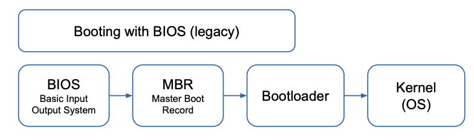
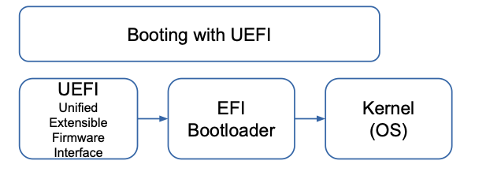
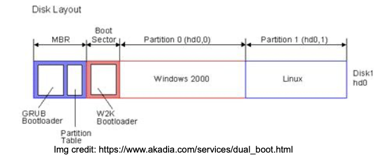
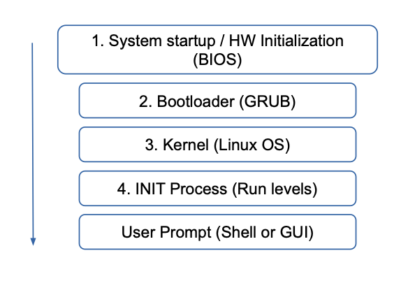

# Boot




## Boot order

### 1. BIOS (Basic Input Output System)

- Is loaded from a **ROM** on the motherboard
- Contains **Hardware Specific** low-level I/O software to interface with devices e.g. keyboard, screen disk

When Started:
- Performs ***Power-On-Self-Test (POST), device discovery** by scanning PCI buses, device initialization
- Chooses a boot device (e.g., usb, cd-rom, disk) from list in CMOS
- The first sector from the boot device (**MBR: master boot record**) is read into memory and executed


### 2. Bootloader


The MBR code selects and loads a bootloader (typically on the boot device) to be executed
- The bootloader (e.g. GRUB) needs to access the location of the OS (boot partition)
- It loads the OS into memory and executes it (sets registers, like PC, PSW)



### 3. Initialization of the OS and Environment

The OS:
- Queries (the BIOS/bus system) to get HW information
	– for each device -> loads (modular OS) and initializes driver
- Initializes OS Management Structures (e.g. process table)
- Creates System Services
- Spawns a (User) Interface (textual / graphical login, user oriented OSs)


## Booting in Linux



### 1. System startup / HW initialization (BIOS)

### 2. Bootloader (GRUB)

- needs file system access to read OS -> dev drivers + fs modules

### 3. OS-Startup

Initial code of the OS binary

#### 3.1 Architecture specific (e.g. ARM vs RISC) assembly code

Setup of OS memory map, identify CPU type, calculate total RAM, disable interrupts, enable MMU, initialize caches

#### 3.2 Launch C main() procdedure

- Initialize internal management structures
	– Process Tables
	– Interrupt / system-call tables
	– Virtual Memory
	– Page Cache
	– Resource Control
- Loading drivers
- Initialize OS services
	– System Calls
	– IPC
	– Signals


## BIOS Limitations

- Operates in 16 Bit Model (#1)
- Relies on MBR (#2)
	- max partition size (2 TB Max)
- not designed for extendability (#3)
- suffers from rootkit and bootkit attacks (#4)

## UEFI


- Replacement for BIOS
- Replaces MBR with GPT (GUID Partitioning Table) - solves #2
	- arbitrary number of partitions, addressable disk space of 2^64 bytes (i.e. exabytes), partitions addressed by unique UUID number, avoiding collisions
- modular design (solves #3)

## Architecture independent virtual machine

- Allows to execute any application, special binary files compiled for it (EFI binaries, *.efi)
	– e.g., device drivers, bootloaders, any applications or extensions to the UEFI standard
- EFI binaries are stored in the EFI System Partition (ESP)
	– FAT file system, can be reused in dual (or multi-) boot machine

### EFI Boot Manager

- EFI defines a tool (called Boot Manager) to configure and select which EFI binary to be executed by the VM (maybe boot loader, but also other applications)
- In order to boot an OS, EFI VM runs a EFI executable that can run a Boot Loader
- Each installed OS is responsible for providing a EFI Binary (bootloader) and a respective entry (target)

```shell
efibootmgr -v
```

### RAMDISK


The OS to be loaded needs access to the **hard drive and its file system** Extensions which are not compiled into the OS binary, are stored on the hard drive (loadable modules, e.g. SCSI driver, file system driver)

**Chicken-and-egg problem!**
The software needed to read the disk is stored on that disk itself
Solution: **initial RAM disk image** (initrd), file stored in same area as kernel. It contains kernel modules + basic device-special files (i.e., /dev/null and /dev/{stdin,-out,-err})
The bootloader uncompresses the kernel and the initial RAM disk image into RAM, the kernel mounts it as a file system, and uses the tools found there. Now it can find and mount the real file system in place of that initial image

## System Services (systemd)