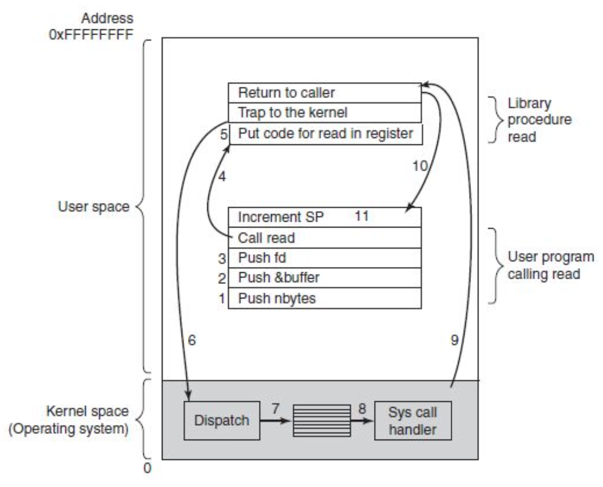

# OS

- control resource usage, granting resource requestst, accounting for usage, mediate conflicting requests.

## CPU - Central Processing Unit

- Fetch first instruction from memory into registers, decode it to determine its type and operands, execute it, and then fetch, decode and execute subsequent instructions.

## Hardware Review

### Hyperthreading / Parallel pipelines

- Innerhalb eines Intel Cores, werden mehrere Threads gleichzeitig ausgeführt.
- Optimierung der Aufgaben

### Caches

Der Cache ermöglicht einen deutlich schnelleren Zugriff auf Daten als im Memory, Speicher. Der Cache ist aber relativ teuer in der Produktion.

- a: quad-core chip with a shared L2 cache
- b: quad core chip with seperate L2 caches

## Memory

## Input Output

- Huge amount of I/O Devices, Hard Drives, Network Interfaces, Serial Board, Keyboard, Mouse, Graphics, Cameras, etc.
- Devices connected with CPU via a Bus System (SW) I/O Interfaces (SW) and I/O Controllers (HW)
- There are many different Bus Standars
	- PCI
	- PCIe
	- DMI
	- SATA
	- US

## Operating System Variants

- Mainframe Operating Systems
- Server Operating Systems
- Multiprocessor Operating Systems
- Personal Computer Operating Systems
- Handheld Computer Operating Systems
- Embedded Operating Systems
- Sensor Node Operating Systems
- Real-Time Operating Systems
- Smart Card Operating Systems

## Context switch

Der Zustand eines Prozesses wird durch die Inhalte der Register auf dem CPU bestimmt. 
- Der Dispatcher befüllt die Register in der CPU.
- Im Durchschnitt 6 Switches pro Sekunden

### File Reading 

- 11 Schritte

## TRAP / Software interrupt

Der einzige Weg, um von User Space in den Kernel Space zu gelangen