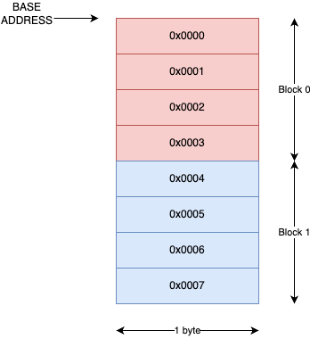
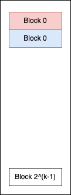

# Cache

- Blocks sind in diesem Beispiel 4 Byte lang, können aber auch grösser, bzwh. kleiner sein.

## Aufbau im Memory

- Gruppen von Blocks werden im Memory hintereinander gebilted.
- Die CPU kopiert gewisse Blocks mit deren ID in den Cache.

| Bezeichnung | Symbol |
|-------------|--------|
| Anzahl Bits für die Adressierung | t + i + o |
| Anzahl Bits für Offset | o |
| Anzahl Bits für Index | i |
| Anzahl Bits für Tag | t |

- **Grösse des RAM in Bytes (Memory Size)**: 2^(t+i+o)
- **Anzahl Zeilen im Cache**: 2^i
- **Grösse einer Cache-Zeile in Bytes (nur Nutzdaten)**: 2^o
- **Grösse des Cache in Bytes (Cache Size, nur Nutzdaten)**: 2^i * 2^o

## Dimensionen

