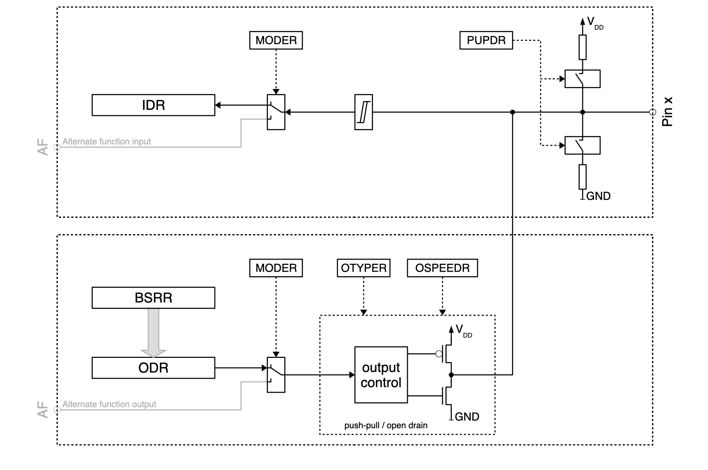
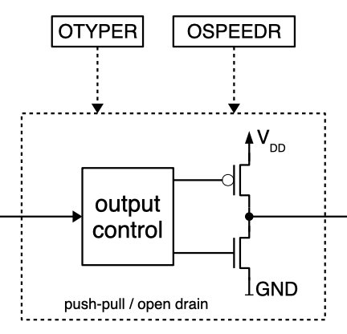
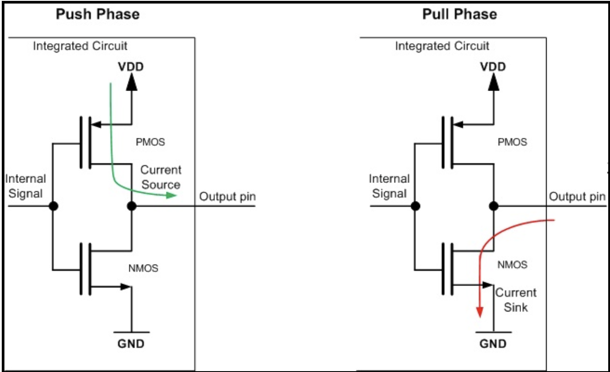
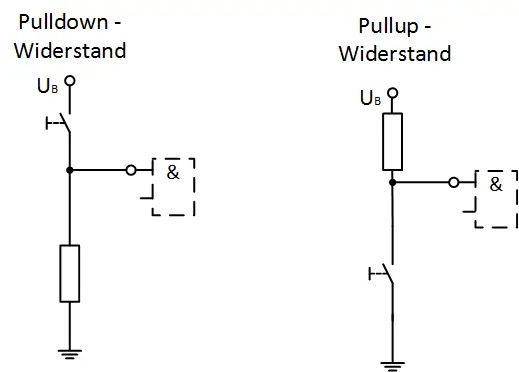
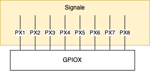
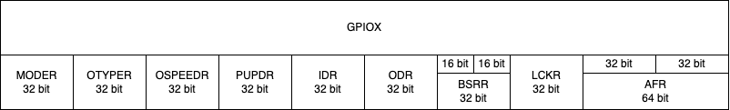

# GPIO (General Purpose Input/Output)

- GPIOS sind allgemeine Anbindungen. Mit ihnen lassen sich digitale und analoge Signale lesen bzwh. schreiben.
- Die Pins können mit Code / Software konfiguriert werden
- Die meisten GPIO Pins haben eine alternative digitale oder analoge Funktion. Man kann also auswählen, was man braucht.

Nachfolgend eine Tabelle mit den Abkürzungen, diese sind weit verbreitet, und in den meisten Schemas (die Skizeen mit den Strichen und Blöcken) auch so bezeichnet.

| Pin bezeichung | Beschreibung |
|----------------|--------------|
| GP | General purpose |
| PP | Push Pull |
| PU | Pull UP |
| PD | Pull Down |
| OD | Open Drain |
| AF | Alternate Function |


## Funktionsmodis

Wie bereits oben beschrieben, haben GPIOs **IMMER** mehrere Funktionen. Diese können konfiguriert werden.


- Mit den grauen Blöcken wird der Port jediglich konfiguriert.
- Pinke Signale sind dann aktiv, wenn die **alternativen Funktionen** aktiv sind.




## Konfiguration

Die Konfiguration von Pins wird in der echten Welt **selten** händisch gelöst. Dafür gibt es diverse IDE's die einem das Leben weitgehend vereinfachen. (z.B. STM32CubeIDE) Dies hat den Grund, da jede Konfiguration **herstellerabhängig** ist.

Die Registernamen haben ein *R* am Ende des Namens, was für Register steht. Bitte nenne es nicht MODER sonder MODE-REGISTER.

### Direction (MODER)

Die Richtung muss immer konfiguriert werden. Gelesen kann vom GPIO auch dann, wenn dieser als Output definiert ist.

| MODER\[1:0\] | Beschreibung |
|--------------|--------------|
| 00 | Input |
| 01 | General purpose output mode |
| 10 | Alternate function mode |
| 11 | Analog mode |

### Output Type (OTYPER)



| OTYPER | Beschreibung | 
|--------|--------------|
| 0 | Push - Pull (Reset State) |
| 1 | Open Drain |


#### Push Pull

Push Pull ist der Reset State. Bei diesem sind HIGH / LOW möglich. Der Pegel kann nach oben oder unten gezogen werden.



Ist Internal Signal
- LOW, so ist das Output Signal HIGH (links)
- HIGH, so ist das Output Signal LOW

### Open Drain

Open Drain wird dann verwendet, wenn du mehrere Geräte an diesem Port anschliessen wilst. Der Pin kann **NUR** nach LOW gezogen werden. 

Ist Internal Signal
- LOW, so ist das Output Signal floating
- HIGH, so ist das Output Signal LOW


### Pull-up / Pull-down / floating


- In der Elektronik haben wir das Problem, dass, wenn ein Signal nicht gesetzt wird, dann ist es schwebend (floating). Schwebend bedeutet dann, dass der Wert irgendetwas sein kann. Dies wollen wir soweit wie möglich vermeiden. Deshalb verbinden wir das Eingangssignal über einen Widerstand zu HIGH / LOW. Wird die Leitung nun von aussen gesetzt, so **muss** das Signal, entgegen des Widerstandes gezogen werden.
- HIGH aktive Signale haben normalerweise eine Pulldown-Koniguration
- LOW Aktive (invertierte / NOT) Signale normalerweise eine Pullup Konfiguration ()




### Speed

| OSPEEDR\[1:0\] | Beschreibung | Geschwindigkeit |
|----------------|--------------|-----------------|
| 00 | Low Speed (Reset State)| 2 MHz |
| 01 | Medium Speed | 10 MHz |
| 10 | High Speed | 50 MHz |
| 11 | Very high speed | 100 MHz |


## Code

Wie kann denn nun ein GPIO Pin konfiguriert werden. Wir können selten einen einzelnen GPIO über ein eigenes Register steuern. Wir müssen diesen über einen Port steuern. Denn ein Port ist der Zugang zum einzelnen GPIO Pin.




Ports liegen neben anderer Hardware direkt im Memory. Jeder Port hat eine **Basis Adresse**. Diese Adresse zeigt auf die wirklichen Register des Portes.


Der Port ist dann in unterschiedliche Sektionen aufgeteilt. Diese liegen **direkt nebeneinander** im Memory. Somit können wir ein Struct verwenden, um auf die Konfiguration zuzugreifen.




```c
typedef struct {
    volatile uint32_t MODER;    /**< Port mode register. */
    volatile uint32_t OTYPER;   /**< Output type register. */
    volatile uint32_t OSPEEDR;  /**< Output speed register. */
    volatile uint32_t PUPDR;    /**< Port pull-up/pull-down register. */
    volatile uint32_t IDR;      /**< Input data register. */
    volatile uint32_t ODR;      /**< output data register. */
    volatile uint16_t BSRR[2];  /**< [0]: Bit set register, 
                                     [1]: Bit reset register. */
    volatile uint32_t LCKR;     /**< Port lock register. */
    volatile uint32_t AFR[2];   /**< [0]: Alternate Function register pin 0..7, 
                                     [1]: Alternate Function register pin 8..15. */
} reg_gpio_t;

// Hier sagen wir wo der GPIOA im Memory liegt
// Indem wir einen Pointer (Zeiger) erstellen, der direkt auf die Adresse zeigt
#define GPIOA   ((reg_gpio_t *) 0x40020000)
```


## Continously read from address

```c
#define ADDRESS 0x43004000
volatile uint32_t* const registerAddress = (volatile uint32_t*) ADDRESS;
uint32_t value;

while(1) {
    value = *registerAddress;

    // Check if bit 6 is set
    if (value & (1 << 6)) {
        break;  // Exit the loop if bit 6 is 1
    }
}
```


### Continously write to address

```c
#define ADDRESS 0x43004000
volatile uint32_t* const registerAddress = (volatile uint32_t*) ADDRESS;
uint32_t value = 0x00;

while(1) {
    *registerAddress = value;
}
```