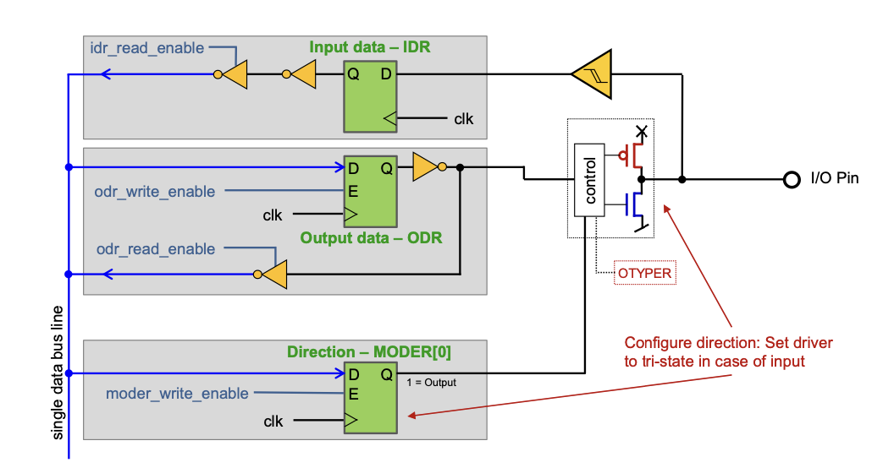
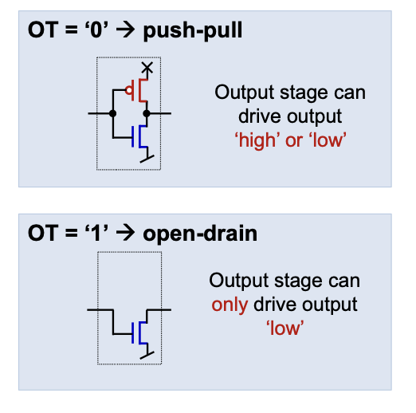

# GPIO (General Purpose Input/Output)

- GPIOS sind allgemeine Anbindungen. Mit ihnen lassen sich digitale und analoge Signale lesen bzwh. schreiben.
- Die Pins können mit Code / Software konfiguriert werden
- Die meisten GPIO Pins haben eine alternative digitale oder analoge Funktion. Man kann also auswählen, was man braucht.

| Pin bezeichung | Beschreibung |
|----------------|--------------|
| GP | General purpose |
| PP | Push Pull |
| PU | Pull UP |
| PD | Pull Down |
| OD | Open Drain |
| AF | Alternate Function |

## Wechsel zwischen INput und OUTput

Wie bereits oben beschrieben, kann ein Pin mehrere Funktionen haben. Diese werden durch digitale Schalter konfiguriert.

| MODER\[1:\0] | Beschreibung |
|--------------|--------------|
| 00 | Input |
| 01 | General purpose output mode |
| 10 | Alternate function mode |
| 11 | Analog mode |



## Output Typen

### PUSH PULL

Der output kann entweder HIGH oder LOW, nichts dazwischen.

Dabei wird der Output, wenn dieser näher bei HIGH liegt, nach oben gezogen, also auf das HIGH Signal (x). Alternativ, wird dieses nach unten (in den meisten fällen auf das GND ) gezogen.




### Open Drain

Das Signal wird auf ein anderes Signal, in den meisten Fällen, auf GND gezogen. Und **NUR** auf das eine Signal.

## Port Geschwindigkeiten

| OSPEEDR\[1:0\] | Beschreibung |
|----------------|--------------|
| 00 | Low Speed |
| 01 | Medium Speed |
| 10 | High Speed |
| 11 | Very high speed |


## Pull Up / Down

- In der Elektronik haben wir das Problem, dass, wenn ein Signal nicht gesetzt wird, dann ist es schwebend (floating). Schwebend bedeutet dann, dass der Wert schwankend ist. Dies wollen wir soweit wie möglich vermeiden. Deshalb verbinden wir das Eingangssignal über einen Widerstand zu HIGH / LOW. Wird die Leitung nun von aussen geschaltet, so wird das Signal, entgegen des Widerstandes gezogen.
- HIGH aktive Signale haben normalerweise eine Pulldown-Koniguration
- LOW Aktive (invertierte / NOT) Signale normalerweise eine Pullup Konfiguration ()


## Konfiguration

Wie kann denn nun ein Port konfiguriert werden. Wir können selten ein einzelnes Signal direkt steuern. Wir müssen diesen über einen Port steuern. Denn ein Port ist der Zugang zum einzelnen Signal.


Ports liegen neben anderer Hardware direkt im Memory. Jeder Port hat eine **Basis Adresse**. Diese Adresse zeigt auf die wirklichen Register des Portes.


Der Port ist dann in unterschiedliche Sektionen aufgeteilt. Diese liegen **direkt nebeneinander** im Memory. Somit können wir ein Struct verwenden, um auf die Konfiguration zuzugreifen.


```c
typedef struct {
    volatile uint32_t MODER;    /**< Port mode register. */
    volatile uint32_t OTYPER;   /**< Output type register. */
    volatile uint32_t OSPEEDR;  /**< Output speed register. */
    volatile uint32_t PUPDR;    /**< Port pull-up/pull-down register. */
    volatile uint32_t IDR;      /**< Input data register. */
    volatile uint32_t ODR;      /**< output data register. */
    volatile uint16_t BSRR[2];  /**< [0]: Bit set register, 
                                     [1]: Bit reset register. */
    volatile uint32_t LCKR;     /**< Port lock register. */
    volatile uint32_t AFR[2];   /**< [0]: Alternate Function register pin 0..7, 
                                     [1]: Alternate Function register pin 8..15. */
} reg_gpio_t;

// Hier sagen wir wo der GPIOA im Memory liegt
// Indem wir einen Pointer (Zeiger) erstellen, der direkt auf die Adresse zeigt
#define GPIOA   ((reg_gpio_t *) 0x40020000)
```

