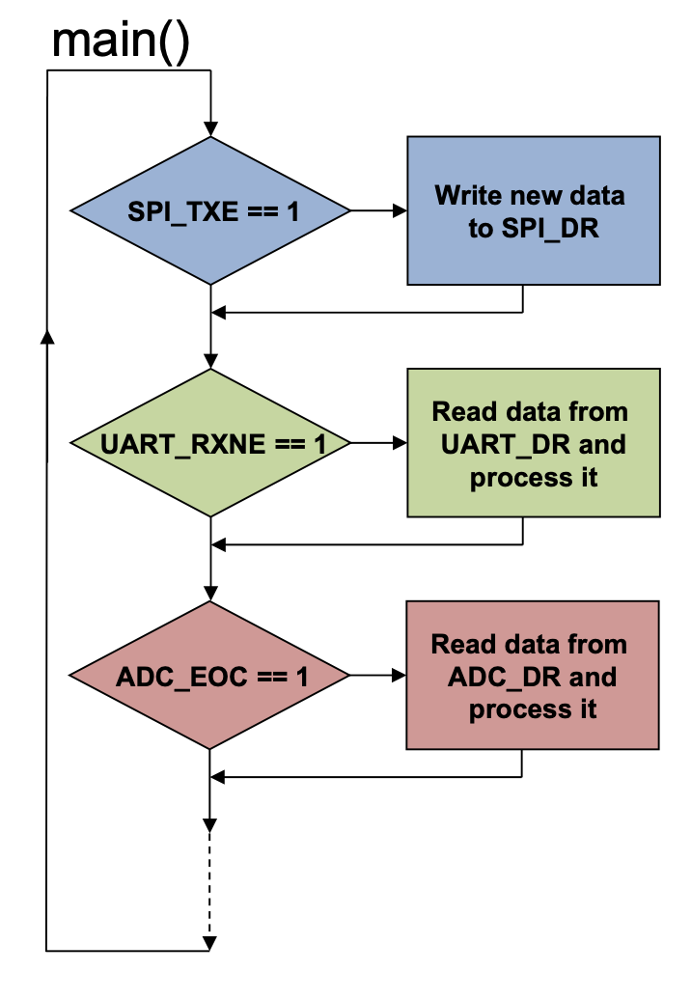

# Interrupt

## Periodic Query of Status Information (Polling)


- Synchronous with main programm
- Advantages
	- Simple and straightforward
	- Implicit synchronization
	- Deterministic
	- No additional interrupt logic required
- Disadvantages
	- Busy wait (wastes CPU time)
	- Reduced trhoughput
	- Long reaction times




```c
if (spi_is_txe_set()) {
	spi_write_data(...);
}

if (uar_is_rxne_set()) {
	uard_data = uart_read_data();
}

if (adc_is_eoc()) {
	adc+data = adc_read_data();
}
```

## Interrupt Driven I/O


## Interrupt Performance


- tISR > "Time between two interrupt events"
	- Some interrupt events will not be serviced (lost)
		- Data will be lost
	- fINT as well as tISR may vary over time
		- Average may be ok, but individual interrupt events may still be lost

### Impact on system performance

$$
\text{Impact} = \text{f}_{INT}
*
\text{t}_{ISR} * 100%
$$

#### Keyboard

[Unit Converter](https://www.convertunits.com/from/us/to/s)

tISR = 6 us = 0,000006s
fInt=20Hz = 20 1/s

Impact = 20 Hz * 6us * 100% = 0.012%


## Interrupt Priorities


## Code

```c

void TIM2_IRQHandler(void)
{
}

/**
 * \brief  Timer 3 ISR: Generating load
 */
void TIM3_IRQHandler(void)
{
    hal_timer_irq_clear(TIM3, HAL_TIMER_IRQ_UE);
    tim3_interrupt_counter++;
}
```