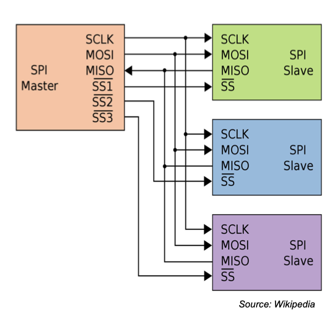
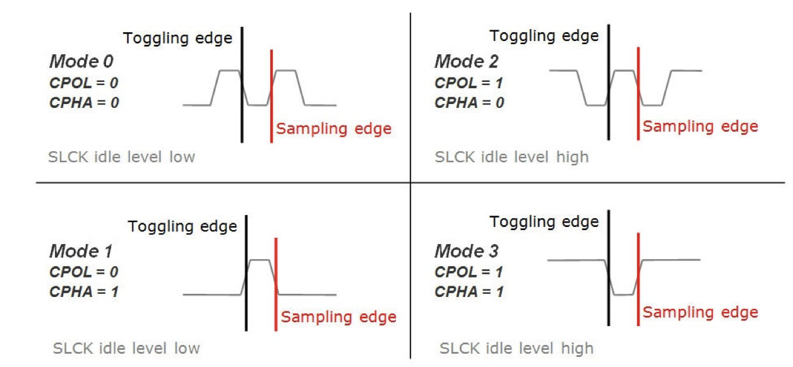
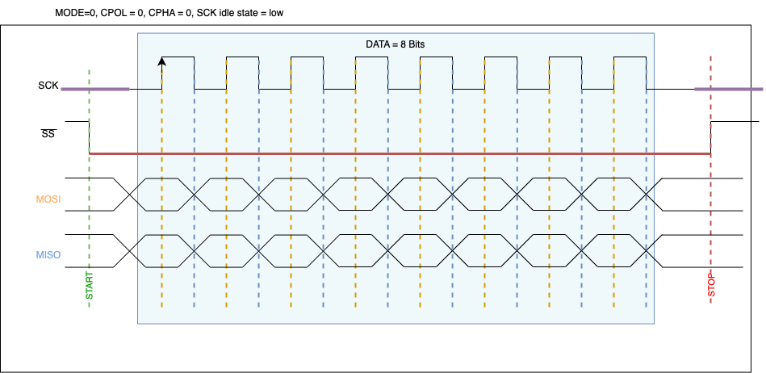
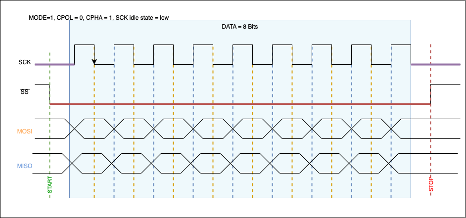
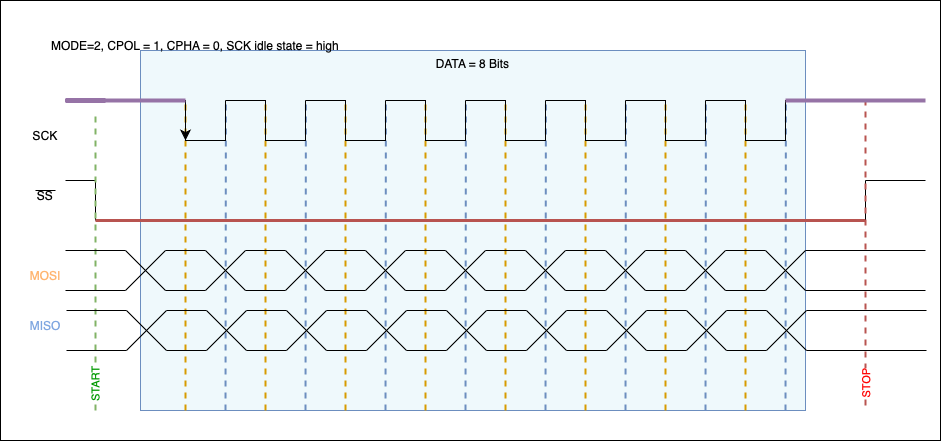
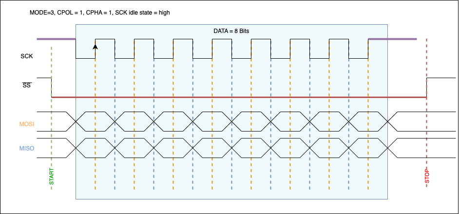

# SPI - Serial Peripheral Interface

SPI wird für die serielle Kommunikation zwischen einem Microcontroller und Peripheriegeräten verwendet. Das System ist vom Typ Master-Multiple Slave.

| Signal | Beschreibung |
|--------|--------------|
| SCLK | Serial Clock |
| MOSI | Master Out Slave In, to all slaves |
| MISO | Master In Slave Out, all slaves to one master |
| SSX | Slave Select X, Auswahl des Slaves |

Der Master, auch main genannt, ist dabei für die abstimmung der Kommunikation der einzelnen Slaves zuständig.

## Connection (wires)
- Serial data line(s)
- Optional control lines

| Communication Mode | Beschreibung |
|--------------------|--------------|
| Simplex | Unidirectional, one-way only |
| Half-duplex | Bidirectional, only one direction at a time |
| Full-Duplex | Bidirectional, both directions simultaneously |

| Timing | Beschreibung |
|--------|--------------|
| Synchron | Beide Anbindungen nutzen ein **geteiltes** CLK Signal |
| Asynchron | Jede Anbindung nutzt ein **eigenes** CLK Signal |

## Implementierung

Die Implementierung wird dabei mit Hilfe einse Schieberegisters implementiert. Das Schieberegister (Buffer) wird gefüllt und dann ausgelesen. Der Grund ist, dass die Kommunikation **unabhängig** der aktuellen Aufgaben der CPU ausgeführt werden können. 

## Timing Diagramm

Das Timing Diagram sieht zwar Komplex aus, ist es aber eigentlich gar nicht.

1. Der Master zieht das CS (SS) Signal des gewünschten Slaves nach unten. Der Strich oben auf dem Namen bezeichnet das Signal als Low Aktiv.
2. Nun werden die 8 Bit aus dem Schieberegister bidirektional gesendet. (Das MSB wird dabei normalerwise als erstes gesendet)
	1. Daten werden dabei auf dem toggling edge gesendet
	2. Während Daten auf dem samping edge gelesen werden. Dies wird dann gemacht, um Lesefehler aufgrund von Signalwechsel zu vermeiden. Es wird in der Mitte des Bites gelesen.
3. Nachdem 8 Bit gelesen wurden, wird das CS Signal wieder angehoben. Somit ist die Kommunikation beendet.

### SPI Modes (toggling / raising edge)

- TX: toggling edge
- RX: raising edge

## Synchronisierung

### TX

Sobald das Signal (TXE / TX Buffer Empty) HIGH ist, kann das nächste TX Byte auf das Register SPI_DR geschrieben werden

### RXNE

Ist dann aktiv, wenn Daten auf SPI_DR sind. Also können wir dann Daten von diesem Register lesen gehen.

## Modes

### MODE=0, CPOL = 0, CPHA = 0, SCK idle state = low

### MODE=1, CPOL = 0, CPHA = 1, SCK idle state = low

### MODE=2, CPOL = 1, CPHA = 0, SCK idle state = high

### MODE=3, CPOL = 1, CPHA = 1, SCK idle state = high

