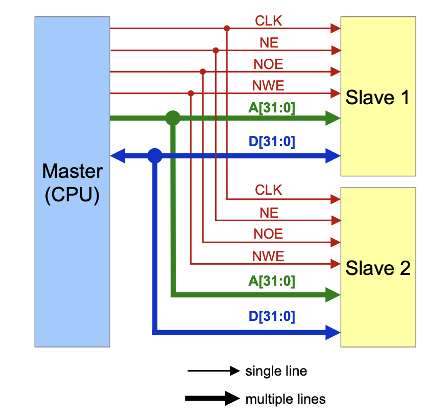
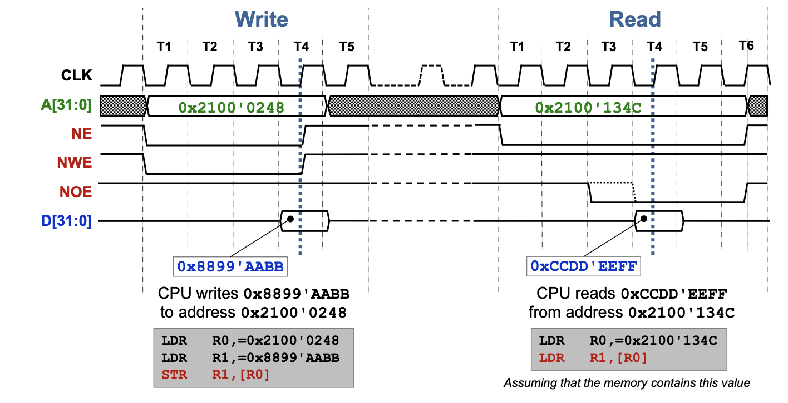

# Signale

- Es gibt unterschiedliche Signaltypen. Die meisten sind jedoch auf eine "CLK - Clock" angewiesen.
- Die meisten Signal sind auf eine Flanke angewiesen, dies ist besonders beim Bus Signal zu sehen.

## NOT

In vielen Schemas wird ein negiertes Signal, dass heist wenn Signal=0, dann aktiv, mit einem "N"\[Signalname\] bezeichnet.

## CLK - Clock

Die CLK ist ein (meistens) gleichbleibendes Signal.

### Synchronous Mode

- Master und Slave haben ein **geteiltes** CLK Signal

### Asynchroner Mode

- Master und Slave haben je ein **eigenes, voneinander unabhängiges** CLK Signal 

## Synchrones Bus Signal

Der bus des CT-Boardes wird durch eine **steigende Flanke** (rising edge)  des **CLK-Signals** getriggert.

Ein synchrones bus signal, besteht aus folgenden Komponenten:

- Address lines A\[31:0\]
- Data lines D\[31:0\]
- Control
	- CLK
	- NE: **NOT** Enable, bestimmt wann das Signal aktiv ist ist
	- NWE: **NOT** Write Enable, bestimmt wann geschrieben wird
	- NOE: **NOT** Output Enable, bestimmt wann gelesen wird

### Timing Diagram

#### NBL Signal - NOT Byte Line

Das NBL Signal zeigt, wann welche Bytes geschrieben werden sollen. Es ist invertiert, also 0=>aktiv

### CPU Schreibzeit

## GND - Ground

Das GND Signal wird als virtuellen Nullpunkt bezeichnet. Das GND Signal ist in einem System das meist verbreitete

## VCC - Voltage Common Collector

Das VCC Signal ist die Eingangsspannung des Gerätes. Es wird immer relativ zum GND Signal bemessen.