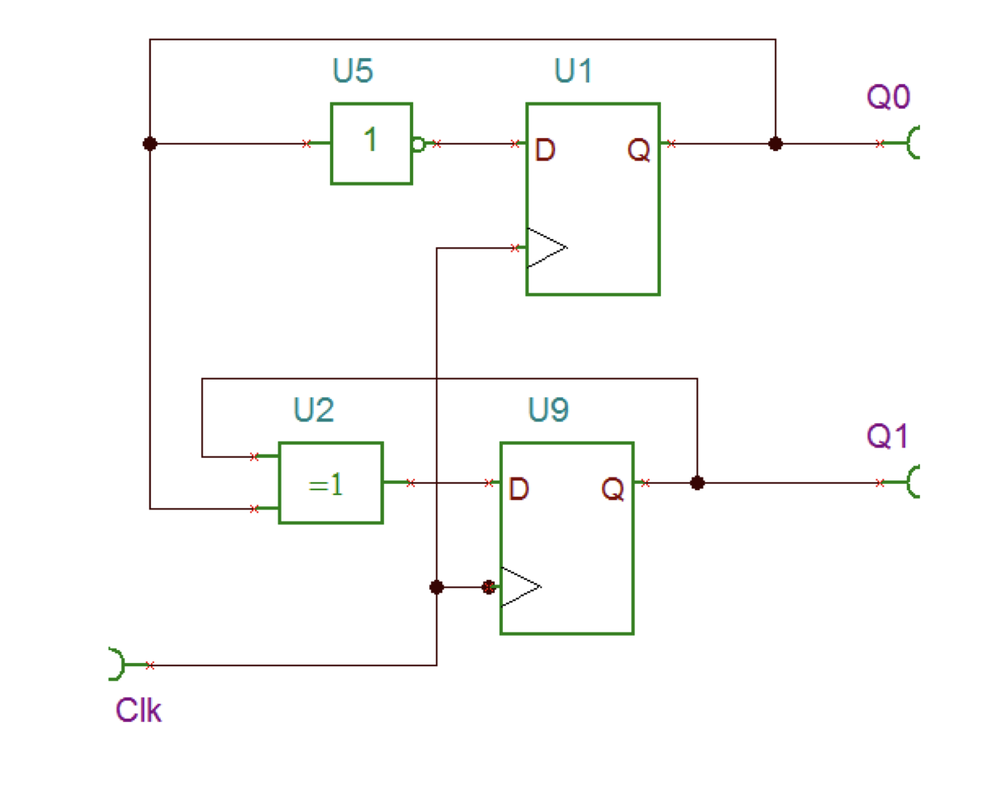
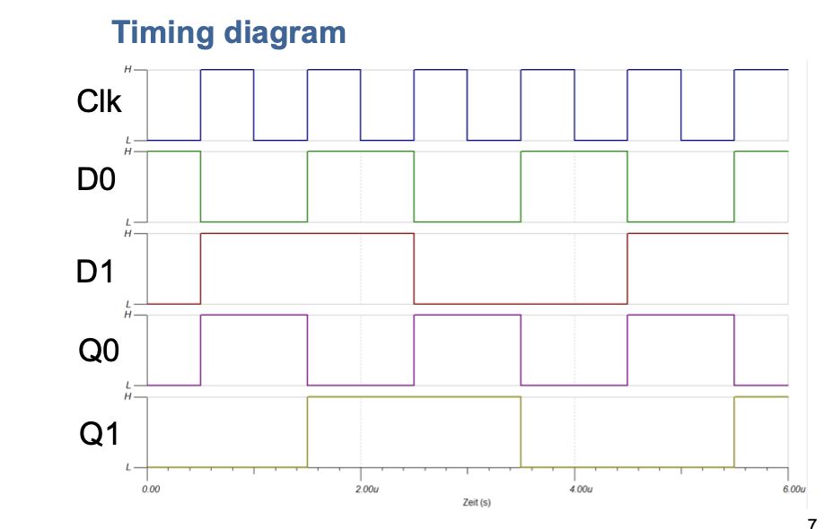
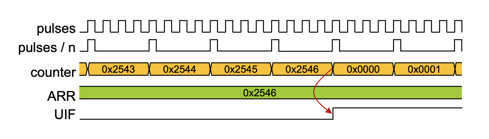
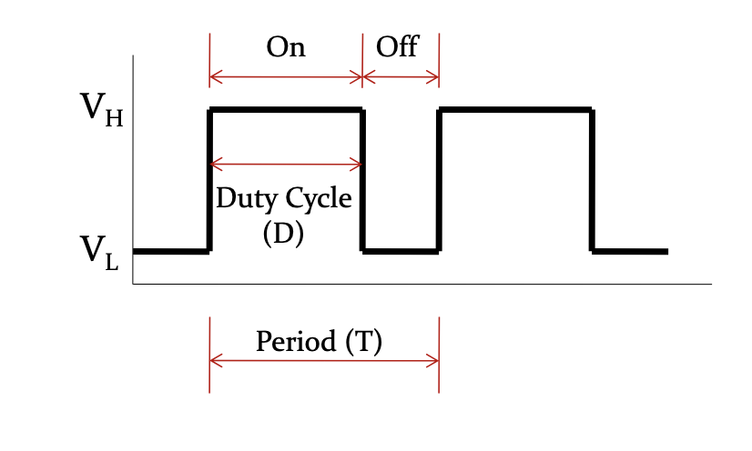

# Timer / Counter

Ein Timer, auch Eieruhr genannt, hat den Zweck, zu sich wiederholenden Zeiten ein Signal oder einen Interrupt auszuführen.


Um den Einstieg ein wenig zu vereinfachen, kann ein Timer auch im Code nachgebaut werden.

```c
while (1) {
	for (uint32_t arrs=0; arrs < ARRS; psc++) {
		for (uint32_t psc=0; psc < PSC; psc++) {
			// sleep for 1 CPU Cycle
			// increase psc by 1
		}
		// increase ARRS by 1
	}
	// ARRS OVERFLOW OCCURED
	// INTERRUPD CALLED
	UIF();
}
```


## Zähler

| Bits | Von | Bis |
|------|-----|-----|
| 16 bit | 0 | 2^16 |
| 32 bit | 0 | 2^32 |

Es gibt zwei Arten von Zählern:

### Up-Counter

- Zählt nach oben, beginnt bei 0, endet bei ARR
- Generiert einen Overflow, also wenn der Wert über ARR kommt

### Down-Counter

- Zählt nach unten, beginnt bei ARR bis 0
- Generiert einen Underflow, also wenn der Wert unter 0 kommt.


## 2 Bit Zähler






## Prescaler

Der Prescaler besimmt wie viele Impulse benötigt werden, damit der Counter erhöht / verringert wird.


## Timer berechnen

| Name | Symbol | Einheit | Beschreibung |
|--------------|--------|---------|--------------|
| Quelle | FCLK | Hz | Frequenz des Eingangssignales |
| Prescaler Wert | PSC | - |
| Auto Reload Register | ARR | - | Auf welchen Wert das Register gesetzt werden soll, wenn |
| Zeitinterval | tout | s | in welchem Abstand, der Timer ausgeführt werden soll |

$$
\text{tout} = \frac{(\text{ARR}+1)(\text{PSC}+1)}{\text{FCLK}}
$$


## Aufgaben

- Der ARR soll jede <span style="color: red">100us</span> erhöht werden
- Der Counter soll im Interval von <span style="color: blue">1s</span> ticken
- FCLK = 1 Mhz

dann folgt folgendes daraus für den Prescaler (PSC)

- FCLK = 1'000'000 Hz
- (PSC+1) = <span style="color: red">100us</span> * FCLK
	- (PSC+1) = <span style="color: red">0.000'100s</span> * FCLK
	- (PSC+1) = <span style="color: red">0.000'100s</span> * 1'000'000Hz
	- (PSC+1) = 4200
	- PSC = 4200 - 1 = 4199

Und für den ARR

- FCLK = 1'000'000 Hz
- CLK = <span style="color: red">100us</span>
- (ARR+1)= <span style="color: blue">1s</span> / <span style="color: red">100us</span>
	- (ARR+1)=100'000
	- ARR = 100'000 - 1 = 99'999




# PWM - Pulse Width Modulation

Mit PWM wird mit gan schnellem ein-und ausschalten ein Sinussignal nachgemacht.



## Duty cycle

Gibt in Prozent an, wie oft das Signal an ist. 

- 50% => 50%
- 0.5 => 50%

$$
\text{D}
=
\frac{\text {On}}{\text{Period}} x 100%
$$

## Average Signal
$$
V_\text{avg} = D * V_H + (1-D) * V_L
$$
