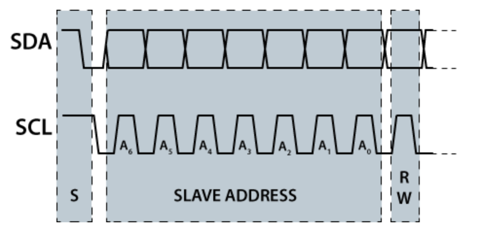

# U(S)ART (Universal Asynchronous Receiver Transmitter)

- UART wird für allgemeine serielle Kommunikation über eine serielle Schnittstelle verwendet. Dies wird häufig bei Microprozessoren verwendet.
- Die Kommunikation ist asynchron, dafür muss jedes Paket einzel durch den Identifikator (START Bit) synchronisiert werden.

- Im Gegensatz zu [SPI](SPI.md) hat UART nur zwei Leitungen.
- Die Sendefrequenz muss **vor** dem Verbindungsaufbau bekannt sein. Sender und Empfänger haben eine **eigene** CLK, die aber die gleiche Frequenz hat. 
- Paritymode (even / odd) muss ebenfalls **vor** dem Verbindungsaufbau bekannt sein.

## Protokoll

- IDLE Zustand: HIGH
- Bits werden auf der steigenden Flanke von CLK gelesen.

1. Leitung nach LOW ziehen
2. 5-8 Datenbits senden (LSB first)
3. Parity senden
	- Even / Gerade Parity: (Wenn Anzahl 1=gerade, dann parity = 0)
	- Odd / Ungerade Parity: (Wenn Anzahl 1=ungerade, dann parity = 1)
	- None => keine
	- mark => HIGH
	- space => LOW

## Eigenschaften

### Transmission Rate (Baud Rate)

Gibt an, wie viele Symbole pro Sekunde gesendet / empfangen werden sollen

$$
T = \frac{1}{B}s
$$

Typische Werte sind:

- 2400
- 4800
- **9600**
- 19200
- 38400
- 57600
- **115200** 

### Anzahl an Datenbits

- 5
- 6
- 7
- 8

### Anzahl an stop bits

- 1
- 1.5
- 2

### Parity

- none
- mark (logic HIGH)
- space (logic LOW)
- even
- odd

# RS-485

- Braucht 4 Leitungen, jeh zwei zum Senden / Empfangen
- Signale auf den 2 Leitungen sind gegenseitig gespiegelt, was weniger anfällig zu noice (Fremdspannungen) auf Leitungen ist.

# I2C

- Bidirektional 2 Wire
- Mit CLK (SCL)
- Daten werden auf SDA gesendet
- Synchron, half duplex
- Jedes Gerät auf dem Bus, hat eine **einzigartige** Adresse
- Multi Master möglich

## Protokoll 

### 1. START

1. SCL wird auf HIGH gezogen
2. SDA wird nach unten gezogen
3. 1 Bit=LOW wird auf SCL gesendet, damit wird der BUS in den BUSY Mode gesetzt.

### 2. Adresse + Richtung senden 

- 7 Bits für die Slave Adresse
- Richtung
	- 0: Write (Master -> Slave, Slave=Empfänger)
	- 1: Read (Slave -> Master, Master=Empfänger) 

- Nicht verwirren lassen, die Kästen auf SDA sagen jediglich, dass da ein Bit ist.

### 3. ACK von Slave

- Der Slave zieht die SDA Leitung zu LOW.
- Macht dies der Slave nicht, so wird die Kommunikation beendet (STOP)

### 4. Daten von Transmitter

1. Der Sender gibt 1 Byte auf den Bus aus
2. Der Empfänger sendet ein ACK Signal auf SDA
	- Der Sender kann erneut Daten senden
	- Sendet der Empfänger kein ACK, so schreibt der Sender auch keine weitere Daten mehr auf den SDA

### STOP 

1. Master zeiht SDA von LOW zu HIGH
