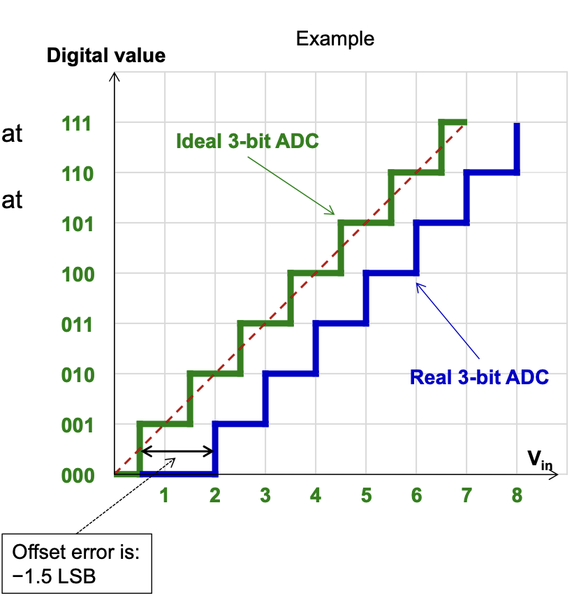
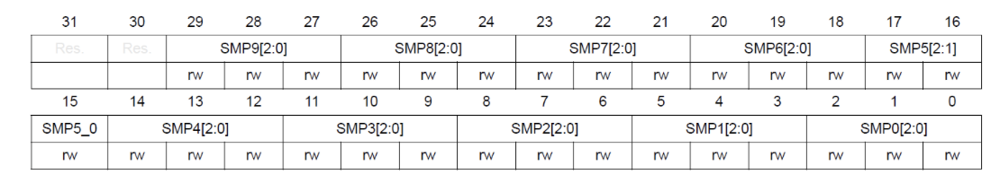
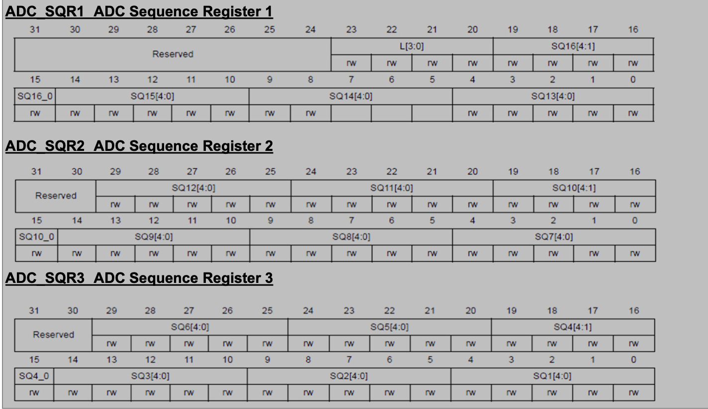

# ADC - Analog Digital Converter

Die Welt ist analog, dass heisst ein Wert kann von 0 - 1 alles mögliche sein, dass heisst auch 0.034566, oder 0.9999.

Um jetzt dieses analoge Signal auch in der digitalen Wert verwenden zu können, gibt es ADC's. Diese wandeln den analogen Wert in einen digitalen Wert um.

Wir machen uns dabei ein Phenomen der Elektrotechnik zugunsten, wo wir mit hilfe von Widerständen eine Spannung aufteilen können. 


Wenn wir jetzt bei einem der Signale, 1-5V einen Komparator, auch Vergleicher genannt, hinzufügen, dann ist es relativ einfach zu verstehen wie der ADC funktioniert.

Das Verhältnis der Widerstände ist jeh nach ADC unterschiedlich.


Dem ADC wird ein sehr genaues Referenzsignal (VREF) hineingefügt.

## Fehler

```
Full-scale-error = offset error + gain error
```

### Quantization

- Analoges Signal ist eine gerade
- Digitals Signal kann nur gewisse Werte analoge Werte weiderspiegeln.
- Fehler zwischen -0.5 und + 0.5, der kleinsten Auflösung (LSB)


### Offset

- Nullpunkt nicht korrekt eingestellt



### Gain


## Conversion Modes

| | Single Channel | Multi channel |
|-|----------------|---------------|
| Single Conversion | Convert 1 channel, then stop. | Convert all channels in group, one after the other, then stop. Sequence can be programmed |
| Continous conversion | Continously convert 1 channel until stop order is given | Continously convert a group of several channels until the stop order is given. Sequence can be programmed |

## Timing


$$
T_{\text{total}} = T_{\text{samle}} + T_{\text{conv}}
$$

## Register Bits

### Common Control Register (ADC_CCR_ADC)

| Register | Beschreibung | additional |
|----------|--------------|-|
| TSVREFE | enable/disable temp sensor and vREFITNT |
| VBATE | enable/disable vbat | VBAT => Batteriespannung, nur wenn eine angeschlossen ist |
| ADCPRE[1:0] | Prescaler for ADCCLK | APB2 clock divided by<br/>00 -> 2<br/>01 -> 4<br/>10 -> 6<br/>11 -> 8<br/>, APB2 clock = 42 Mhz on this board |

### Status Register (ADC_SR)

| Register | Beschreibung |
|----------|--------------|
| OVR | Overrun, Daten wurden überschhrieben |
| STRT | Conversion started (regular channel) |
| EOC | End of conversion. Cleared by reading result of conversion |

### Control Register 1 (ADC_CR1)

| Register | Beschreibung | Additional | 
|----------|--------------|-|
| OVRIE | Override Interrupt enable |
| EOCIE | EOC Interrupt enable |
| RES\[1:0\] | Conversion resolution | 00 -> 12 bit<br/>01 -> 10 bit<br/>10 -> 8 bit<br/>11 -> 6 bit |
| SCAN | Enable scan mode |


### ADC Control Register 2 (ADC_CR2)

| Register | Beschreibung | Additional | 
|----------|--------------|-|
| SWSSTART | Start conversion of regular channel by software | Is cleared by hardware |
| EXTEN\[1:0\] | External trigger for regular channel | 00 -> disabled<br/>01 -> positive edge<br/>10 -> negative edge<br/>11 -> positive & negative edge |
| EXTSEL | External event select to trigger conversion of a regular group |
| ALIGN | Data Alignment | 0 -> right aligned<br/>1->left aligned |
| EOCS | EOC Selection | 0 -> EOC shows end of each sequence of conversions<br/>1 -> end of each conversion |
| DMA | Enable DMA | kopiere direkt vom adc in den memory. |
| CONT | Continous mode | 0 -> single conversion mode<br/>1 -> continous conversion mode |
| ADON | ADC On | aktivert den ADC |

### Sample Time

### ADC Sample time register

Konfiguriert die Zeit, in der die Spannung gemessen ist.

**Sampling for channel:** SMPx[2:0]

- 0x00: '000b' -> 3 cycles
- 0x01: '001b' -> 15 cycles
- 0x02: '010b' -> 28 cycles
- 0x03: '011b' -> 56 cycles
- 0x04: '100b' -> 84 cycles
- 0x05: '101b' -> 112 cycles
- 0x06: '110b' -> 144 cycles
- 0x07: '111b' -> 480 cycles


#### ADC_SMPR1

- Address offset 0x0C
- Reset Value: 0x0000 0000


#### ADC_SMPR2

- Address offset 0x10
- Reset Value: 0x0000 0000




### Sequence of Channels (ADC_SQR1/2/3)



- Address offset: 0x2C
- Reset value: 0x0000 0000

| Register | Beschreibung | Additional | 
|----------|--------------|-|
| L[3:0] | Sequence length | L+1 = number of conversions in regular sequence |
| SQx[4:0] Channel number of xth conversion ins sequence | 1 <= x <= 16 |

e.g. SQ3[4:0] = 0x7 means the 3rd conversion takes place on channel 7

# Rechnungen

## Sampling Time


$$
\text{Sampling time} = 
\text{Conversion time} +
\text{Sample and Hole Time}
$$

## Max sampling rate

- PBA2 -> ADC Frequency, by default 42Mhz => 42'000'000 Hz

$$
\text{sample rate} = \frac{\text{PBA2}}{\text{sequence length} * \text{sample time}}
$$