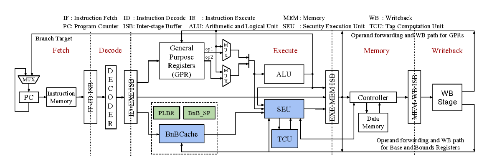
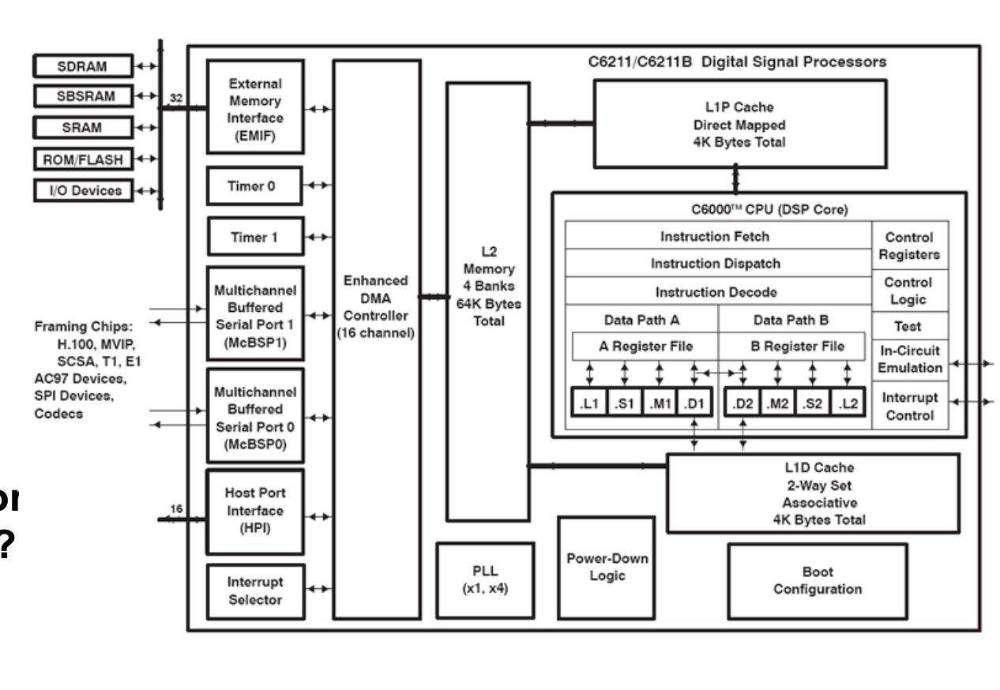
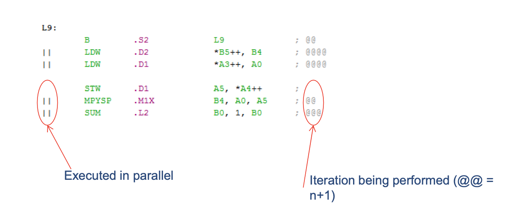
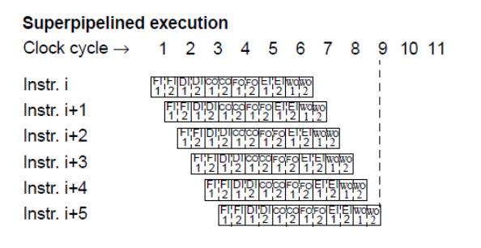
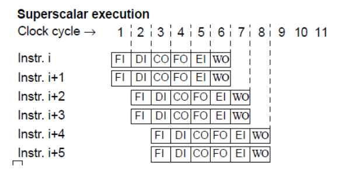
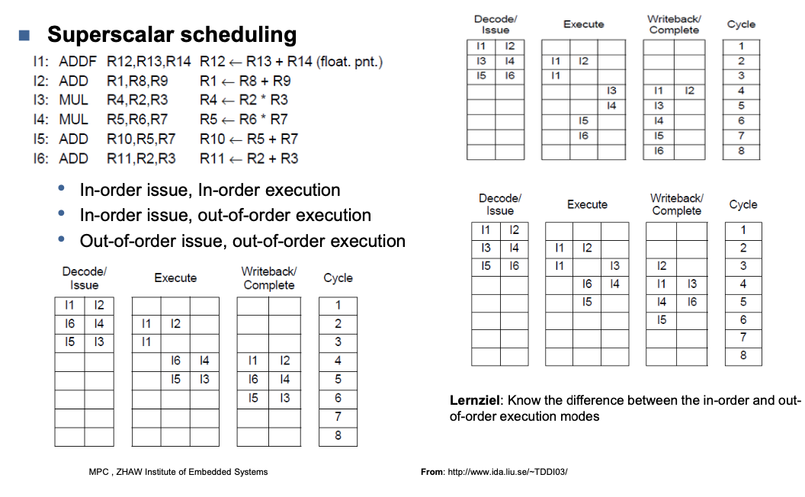
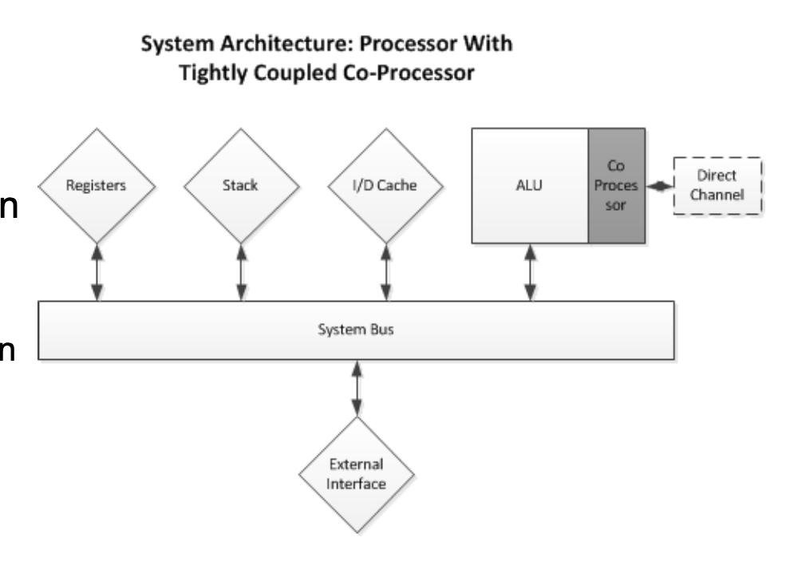
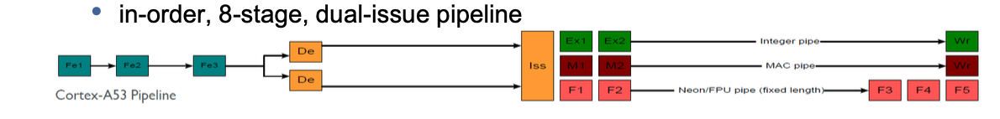
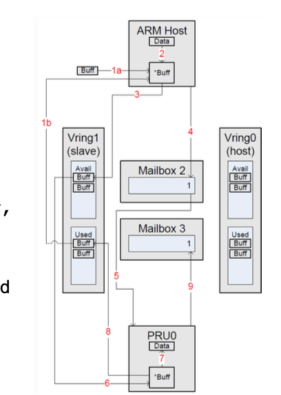

# CPU Architectures


## GP - CPU Architectures




## Parallelizing CPU architectures

- Multicore
- Multiple FUs -> ALUs, Multipliers
	- Data parallelism
- Multiple pipelines
	- Instruction parallelism
- Multiple Heterogeneous PEs -> DSP, GPU ...

## DSP Architectures (Digital Signal Processing)

- Very application specific
- Offers mac (.M)
- Data access (.D)
- GP-ALU (.L)
- Shifter / ALU (.S)



## Software Pipelining

- Technique to reduce pipeline stalls from instruction
- Together with VLIW get very tight loop kernels



# Pipeline Architectures

## CISC

- Each construciton seperate
	- move mem, reg
	- move reg, reg
- Microcode decodes instruction and performs operation


## RISC

- Store and load
	- lots of instructions required
	- hardware architecture, inc. pipelining makes execution fast
	- compiler friendly

## Superpipelining

- increase the number of instructions in the pipeline
- instructions can be issued faster




## Superscalar

- Increase the number of pipelines
- Several instructions issued in a cycle
- scheduling becomes an issue



### Scheduling



## Co Processors



- Processor recognises instructions as its own
- Processor does not recognise instruction it passes it on to connected Co-Pros
	- Either recognised or not recognised
	- If not then unknown instruction exception
	- If then processed by Co-Pro
- Co-pros usually have separate clocks
- Often own channels to memory/cache (NEON)

**-> Independent/parallel execution possible**


### ARM Cortex-A53 (v8 diagram)



### NEON (v7 description)
- Has instruction queue (16 deep) and data queue (8 entries)
- A53 regards instruction as complete (performs checking and fetches)
- NEON must decode and process instruction
- If instruction/data queue full then A53 stalls


### Co-processors face uncertain future

- (Co-Pro) Instruction decoders expensive
- (Co-Pro) Only really useful for generic operations
- (Co-Pro) Video co-processors exis(ted) but standards advance so quickly
- (CPU) Tight integration also costs G-CPU silicon
- (Toolset) Added compiler maintenance because of architecture specific instruction sets

## (SMT) Simultaneous Multi Threading 

- Intel calls this hyperthreading
- Supporting cores execute two threads
	-> 4 cores -> 8 threads
- Superscalar architecture necessary
- Assumption is that CPU resources (ALU ...) are not always being used
	- With two threads in parallel better chance of available resources being used
- BIOS and OS must support this feature
	- Core looks like two (thread capable) cores to OS
	- Need to lock process on core to avoid hyperthreading when it is turned on
- Speedup for some applications, reported by Intel, ~30%
	- Improvement more likely dependent on externals like cache
stalls than on FU availability
- Security issues abound

## (AMP) Asymmetric Multiprocessing

### AMP - Scenarios
- AMP with different Instruction Set Architecture (ISA)
	- Typically specialisation
– PRU, GPU, DSP ... • AMP with same ISA
	- Task driven, one processor for comms, one for I/O ...
	- Master-slave (typical) or peer-to-peer driven
- AMP with same ISA clocked at different rates
- AMP with same ISA, different architectures (64/32-bit)
	- F.i. big.LITTLE
- AMP with different or no OS

### openAMP

- rpmsg message passing service
- Every device is a communication channel with a remote processor
	- Devices are called channels
- Each has a source/destination address

```c
// send
int rpmsg_send(struct rpmsg_channel *rpdev, void *data, int len);

// receive
struct rpmsg_endpoint *rpmsg_create_ept(struct rpmsg_device *rpdev, rpmsg_rx_cb_t cb, void *priv, struct rpmsg_channel_info chinfo);
```

