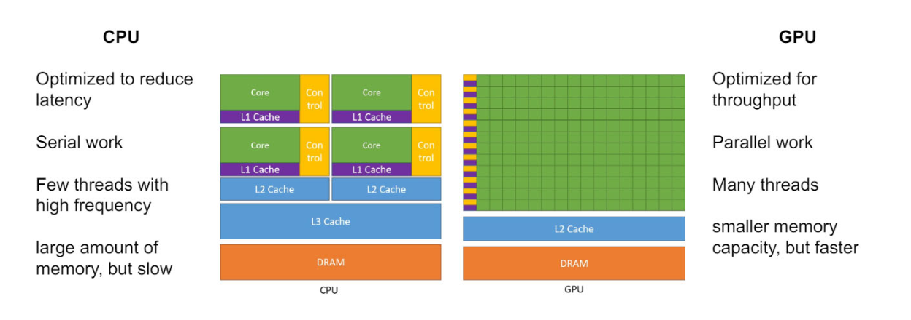
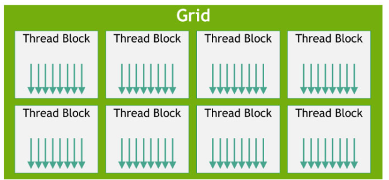

# GPU Architectures

## SM (Streaming Mutiprocessor)

- Contains many Cores

## NVIDIA Fermi Architecture
- 32-Compute Unified Device Architecture cores
- 4 SFUs
- 16 L/S units

- A GPU has threads (of execution)

## Organization

