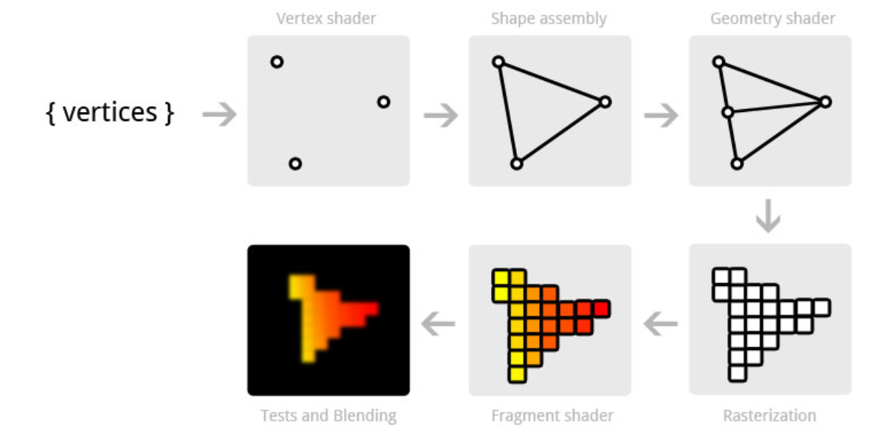
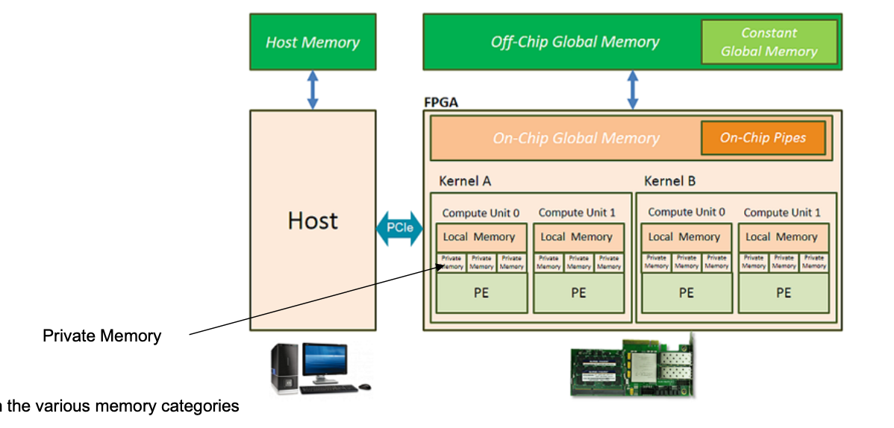

# GPU Architectures

## SM (Streaming Mutiprocessor)

- Contains many Cores

## NVIDIA Fermi Architecture
- 32-Compute Unified Device Architecture cores
- 4 SFUs
- 16 L/S units

- A GPU has threads (of execution)


## Rendering Pipeline

- 3D Models are calculated on the CPU in world coordinates
- Vertices Shader converts these into a 2D model (local coordinates), applices textures
- Geometry shader: optional additional manipulator
- Fragment shader shades the individual pixels





## Organization


### Summary: GPU (Graphics Processing Unit) Concepts from the Document

**Introduction to GPU Architecture**
- GPUs are specialized hardware designed for parallel processing. They excel at handling multiple operations simultaneously, making them ideal for tasks such as graphics rendering, scientific simulations, and machine learning.

**Key Components and Functions**
1. **Processing Elements:**
   - GPUs consist of numerous smaller cores or processing elements that work together to perform computations.
   - These cores are designed for high-throughput computations, allowing the GPU to handle a large number of parallel tasks efficiently.

2. **Task Scheduling:**
   - GPUs use a unique scheduling system to distribute tasks among the available cores.
   - Task scheduling in GPU architecture involves distributing tasks among multiple GPU cores based on workload and resource availability.
   - The scheduling is typically managed by the GPU driver and runtime environment, ensuring optimal use of the available cores.

3. **Command Queue:**
   - A command queue in OpenCL (Open Computing Language) is a crucial component for managing the execution order of commands.
   - The command queue allows for asynchronous execution, enabling multiple tasks to be processed concurrently.
   - It also manages resource allocation and ensures that tasks are executed in the correct order.

**Programming Models:**
1. **OpenCL:**
   - OpenCL is a framework for writing programs that execute across heterogeneous platforms, including CPUs, GPUs, and other processors.
   - It provides a standardized interface for developing parallel programs, allowing developers to harness the power of GPUs.
   - OpenCL programs consist of kernels, which are functions executed on the GPU, and the host code, which runs on the CPU and manages kernel execution.

2. **Single Instruction, Multiple Data (SIMD):**
   - SIMD is a parallel computing architecture where a single instruction operates on multiple data points simultaneously.
   - GPUs leverage SIMD to process large datasets efficiently, as the same operation can be applied to many data points in parallel.
   - This approach is highly effective for tasks like image processing, where the same operation needs to be performed on each pixel.

3. **Single Program, Multiple Data (SPMD):**
   - SPMD is a parallel programming model where multiple processors execute the same program but operate on different data.
   - In the context of GPUs, this means that each core runs the same kernel but processes different chunks of data.
   - This model simplifies the programming process and ensures scalability across a large number of cores.

**Synchronization and Data Sharing:**
1. **Synchronization:**
   - Synchronization in GPU programming is essential to ensure that tasks are completed in the correct order and data integrity is maintained.
   - Techniques like barriers and atomic operations are used to synchronize threads within a kernel.

2. **Data Sharing:**
   - Efficient data sharing mechanisms are crucial for performance in parallel processing.
   - GPUs provide shared memory spaces accessible by all threads within a block, enabling fast data exchange.
   - Developers must carefully manage data access patterns to minimize conflicts and maximize throughput.

**Performance Considerations:**
1. **Granularity:**
   - The granularity of tasks—how finely they are divided—affects the performance of GPU programs.
   - Fine-grained tasks can exploit more parallelism but may incur higher overhead due to increased synchronization and data management.

2. **Load Balancing:**
   - Ensuring even distribution of work across all GPU cores is essential for optimal performance.
   - Load balancing techniques help avoid scenarios where some cores are idle while others are overloaded.

3. **Memory Hierarchies:**
   - Understanding the GPU memory hierarchy (registers, shared memory, global memory) is crucial for optimizing performance.
   - Efficient use of fast, low-latency memory (like registers and shared memory) can significantly boost performance.

**Use Cases and Applications:**
- **Graphics Rendering:**
  - GPUs were initially designed for rendering graphics, providing the computational power needed for high-resolution, real-time rendering.
  
- **Scientific Computing:**
  - GPUs are widely used in scientific computing for simulations, modeling, and data analysis due to their ability to handle large-scale parallel computations.

- **Machine Learning:**
  - The parallel processing capabilities of GPUs make them ideal for training machine learning models, particularly deep neural networks.

**Conclusion:**
- GPUs play a critical role in modern computing by providing the parallel processing power necessary for a wide range of applications.
- Understanding the architecture, programming models, synchronization mechanisms, and performance considerations of GPUs is essential for leveraging their full potential in computational tasks.

# Memory Categories




# OpenCL

```c
__kernel void add_numbers(__global float4* data, 
      __local float* local_result, __global float* group_result) {

   float sum;
   float4 input1, input2, sum_vector; // array of 4 floats which support vectorization
   uint global_addr, local_addr;

   global_addr = get_global_id(0) * 2;
   input1 = data[global_addr];
   input2 = data[global_addr+1];
   sum_vector = input1 + input2; // perform four floating-point additions simultaneously

   local_addr = get_local_id(0);
   local_result[local_addr] = sum_vector.s0 + sum_vector.s1 + 
                              sum_vector.s2 + sum_vector.s3; 
   barrier(CLK_LOCAL_MEM_FENCE);

   if(get_local_id(0) == 0) {
      sum = 0.0f;
      for(int i=0; i<get_local_size(0); i++) {
         sum += local_result[i];
      }
      group_result[get_group_id(0)] = sum;
   }
}
```