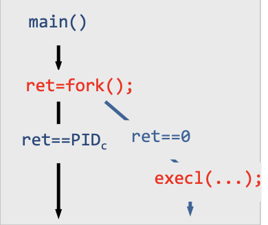

# Patterns

Multiple patterns may be used concurrently.

## How to find concurrency?

1. Finding a general solution and applying that pattern
2. Perform a dependency analysis
3. Either progress to algorithm-structure or return to finding a general solution

### Finding Concurrency

- Task Decomposition pattern
- Dependency analysis pattern

### Algorithm structure

- Task parallelism pattern

### Supporting Structure

- Fork / Join pattern

### Implemenation mechanism

- Processes & Threads

## State Pattern

- Allows an object to alter its behavior when its internal state changes

## Task Decomposition Pattern

- Decomposes a problem into concurrently executable **tasks**

1. Define the **solution space** of a task, as independent as possible
2. Define the features of said task

### Possible solutions

- **Functional Decomposition**: When splitting the program based on the function
- **Loop Splitting**: Distinct iterations of a loop

### Control Flow Graph

The control flow graph displays all possible execution paths of a program

-> Each buble represents a **identifiable task** 

## Dependency analysis pattern

### Group Task Pattern

- How to group tasks that make up a problem to simplify analysing dependencies

### Order Task Pattern

- How must the groups of tasks be ordered to satisfy constrains

### Data Sharing Pattern

- How is data shared amongst tasks

#### Solution

Shared Data can be:

- read only
- effectively-local
- read write
	- accumulate
	- multiple-read single-write

## Task Parallelism pattern

### Dependencies

- Order Dependencies must be encored
- Data dependencies
	- Removable dependencies - can be removed by code / loop transformation
	- seperable dependencies - data strouctrues could be replicated (replicated data)

### Schedule

- How are tasks assigned to UEs and how are they scheduled for execution?

#### Static Scheulde

- Defined a priori
- low management effort but low numebers of tasks

#### Dynamic schedule

Higher management but for unknown or unpredictable task load

- Define a task queue and when UE completes is current task,  it gets a new one from the queue

-> UEs with tasks completed faster will take more from the queue

**Work-Stealing**: if UE has nothign to do, it looks to the queue of otehr UEs and takes a task to do (adds significant complexity)

## Fork / Join Pattern

- Implies the cloning of section of code into another (structurally - but not necessarily in terms of data) independent task
- teh fork-join pattern is **NOT** an abstraction of the POSIX fork, if anything vice-versa

### Use-cases

- recursive structure, such as trees - lend themselves to fork-join
- irregular sets of connected tasks
- where diffeent functions are mapped onto different tasks

## Data Decomposition

- TODO

# General Solutions

- Array based computations
- Recursive data structures

# Tasks

## Distinct

- independently of each other
- do not rely on each other's results & resources during their execution

## Dependent

- relies on the results of another task

# Processes

- Unit of resource ownership
- Unit of scheduling
- POSIX defined

## Definition

- has its own main
- owns resources (memory, file handles, ...)
- is assumed to have exclusive access to all computing and hardware resources 100% of the time
- may be managed by an operating system
- in a multi-process OS, the OS will schedule the processes accoring to some policy
- the memory protection unit (HW) will protecte the integrity of the process' memory from other processes

# POSIX Processes

## Portable Operating System Interface (POSIX)

- Behavioural specification
- defines how processes and threads are created and terminated
- operating systems may (or may not) suppport POSIX

- Process is created through a fork
- fork clones (total copy) the calling process to child 
- child inherits copies of resources
	- child/parent variables are handled seperateely (copy on write)
- parent and child run independently of each other
	- os scheduled seperately by the OS

# POSIX Threads

- Under POSIX, created within a process
- Operates in the context of a process
- Can access all process reosurce including memory
- Kernel management threads -> kernel knows threads exist and schedules them
	- default-linux-behaviour
- user-threads -> threading in user space
	- kernel does not know of their existence
	- user-threads library schedules, not OS scheduler, schedules threads

# UE - Units of Execution

- Creation and destruction of threads are costly
- reuse them as much as possible
