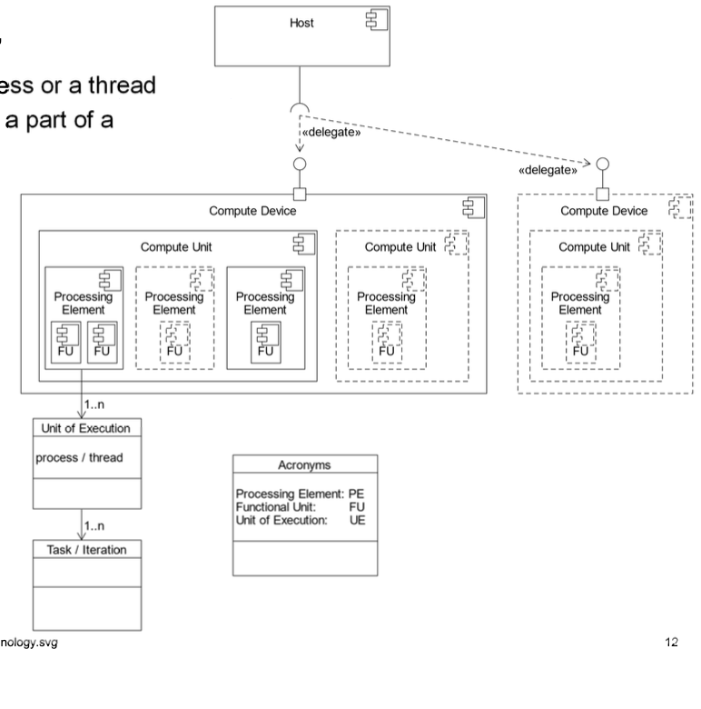
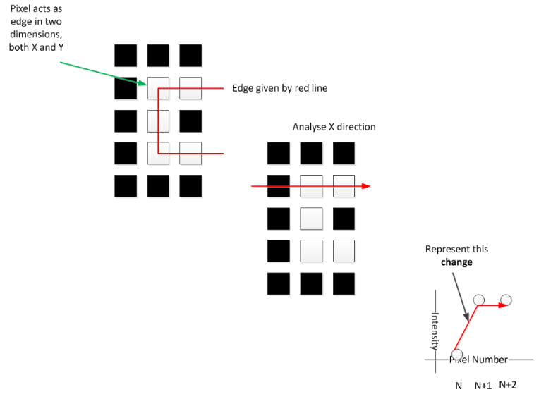
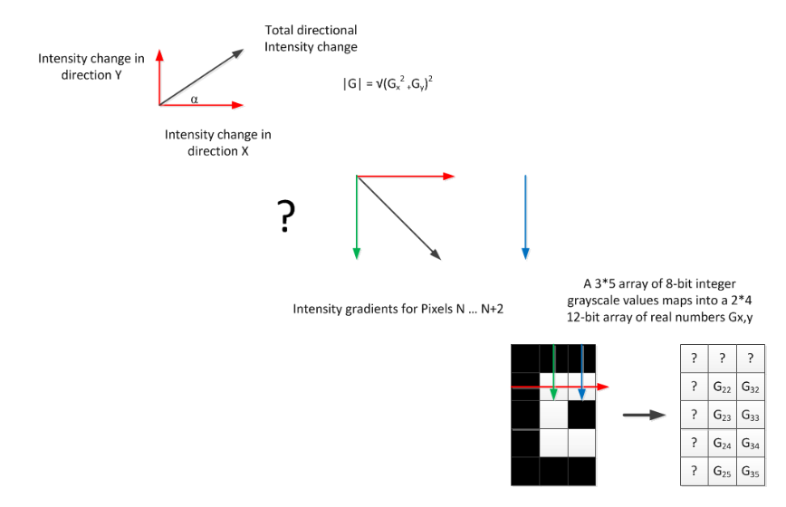
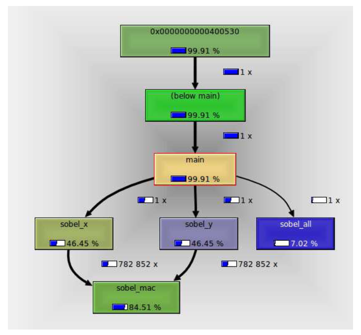

# MPC

## Task

- A task

## Simple Edge Detection

A lot of architectures **do not** have a Floating Point Operating Unit.

The Sx and Sy are multiplied by the surrounding **current** pixel.

## Task Decomposition

Tasks that are independent can be made parallel easily. If they are tightly connected, a sync is required.

1. Reading image
2. Grayscaling
3. Loop Splitting
	- Sobel.X
	- Sobel.Y
4. Merge Result
5. Write Image

### Solution Space

Defines the space in which a set of soultions are likely to be found.

- Find as many identifiable tasks as possible
- Certainly enough tasks to keep the number of available cores busy
- Actions that are (as) independent (as possible)
- Actions that are distinct

## Code In Graphs
### Control Flow Graph (CFG)

- Displays all possible execution paths of a program
- Important represantation for compilers, optimisers and for general usage

 

### Call Graph

- Displays actual execution paths of a program
- Important representation for profiler outputs and optimising work

## Dependency Analysis

### Group Tasks Patterns