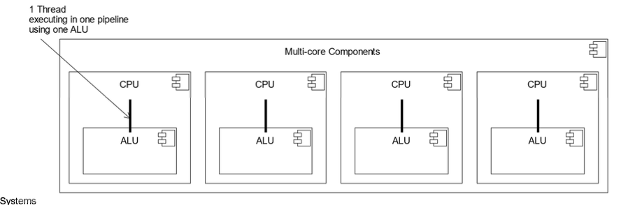
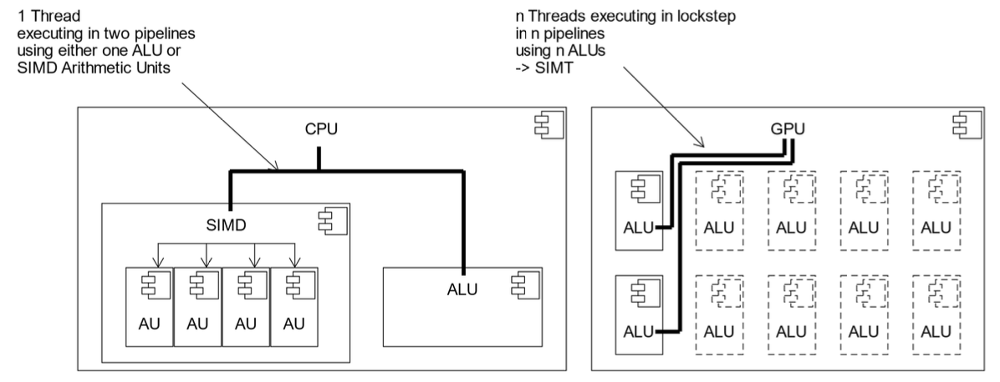
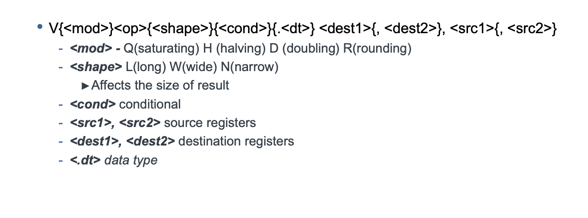

# SIMD - Single Instruction, Multiple Data

## Architectures

- Single Instruction Single Data (SISD)
- Single Instruction Multiple Data Streams (SIMD)
- Multiple Instructions Single Data Stream (MISD)
- Multiple Instructions Multiple Data Streams (MIMD)

### Single Instruction Single Data (SISD)

- Standard general-purpose single-core CPU operation
- Generally associated with a single Functional Unit (ALU)

### Single Instruction Multiple Data (SIMD)

- A single instruction works on multiple data streams
- Associated with multiple Functional Units (FU)
- Abstracted to Single Instruction Multiple Threads (Nvidia)
- Further abstracted to Single Program Multiple Data (pattern)

### Single Program Multiple Data (SPMD)

Running the same programm on multiple UEs

## (Multiply-accumulate) MAC Functional Units

- Efficiency in Arithmetic Operations
- Digital Signal Processing (DSP)
- Machine Learning and AI
- Scientific Computing

-> Many algorithms multiply and then accumulate

## SIMD Vectorisation Operation

# NEON Intrinsics

- allows for efficient parallel processing of data, which can significantly enhance performance for certain types of computations.

[https://developer.arm.com/architectures/instruction-sets/intrinsics/#q=](https://developer.arm.com/architectures/instruction-sets/intrinsics/#q=)

