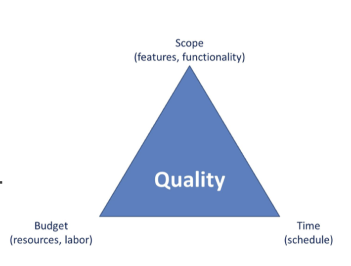
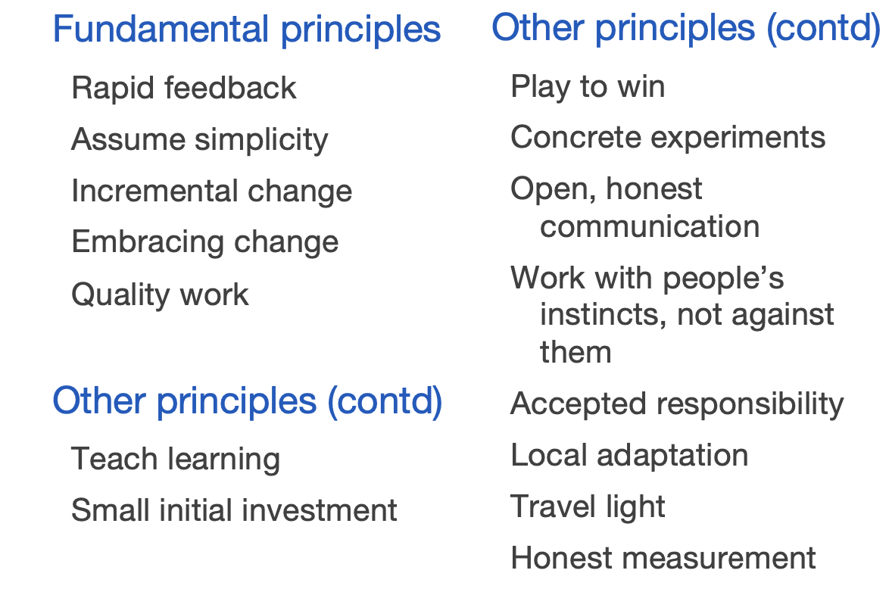

# exTreme Programming (XP)

## Risks in development projects

**The role of XP is to give us principles and practives in oder to deal with these risks!**

- Schedule slips
- Project canceled
- System does not evolve gracefully (defect rate increses)
- Defect rate
- Business misunderstood
- Business changes
- False feature rich
- Staff turnover (knowhow gets lost by employees leaving)

## Variables

- Time
- Resources
- Quality
- Scope

- External forces (customers, managers) can set the values for 3 of the variables
- The development team sets the value for the 4th one

- It is also possible, to develop cheap software, where automated tests are not of importance

## Values
### Communication

- **Everyone is part of the team** and we communicate **face to face** daily.
- We will **work together on everything** from requirements to code.
- We will create the best solution to our problem that we can **together**.

### Simplicity

- We will do what is needed and asked for, but no more.
- This will **maximize the value created** for the investment made to date.
- We will take small simple steps to our goal and mitigate failures as they happen.
- We will create something we are proud of and maintain it long term for **reasonable costs**.

### Feedback

- We will take every iteration **commitment** seriously by delivering **working software**.
- We **demonstrate** our software early and often then listen carefully and make any changes needed.
- We will talk about the project and **adapt our process** to it, not the other way around.

### Courage

- We will **tell the truth about progress** and estimates.
- We **don't document excuses** for failure because we plan to
succeed.
- We don't fear anything because **no one ever works alone**.
- We will **adapt to changes** when ever they happen

### Respect

- Everyone gives and feels the respect they deserve as a valued team member.
- Everyone contributes value even if it's simply enthusiasm.
- Developers respect the expertise of the customers and vice versa.
- Management respects our right to accept responsibility and receive authority over our own work.

## Basic Principles

## Practices

### Planing Game

- Balance between **busines** and **technical** considerations
- **Business** people decide about:
	- Scope
	- Priority
	- Composition of releases
	- Dates of releases
- **Technical** people decide about:
	- Estimates
	- Consequences
	- Process
	- Detailed Scheduling

### Small Releases

- Every release should be as small as possible, containing the **most valuable business requirements**
- The release has to make sense as a whole (no half-working features).
- Better to release once a month than twice a year.

### Metaphor

- Everybody on the team needs to have a **“common understanding”** for the system.
- Everybody on the team needs to have a **“shared vocabulary”**.
- This applies to **technical** and **non-technical** people.
- What are the basic elements of the system and what are their relationships?

### Simple Design

- The **right design** for a software system is one that:
	- Runs all tests.
	- Has no duplicated logic.
	- Has the fewest possible classes and methods.
	- “Put in what need when you need it”.
	- **Emergent, growing design**; no big design upfront (through refactoring)

### Testing

- Any program feature without an **automated test** simply doesn’t exist.
- The tests become part of the system.
- The tests allow the system to **accept change**.
- **Development cycle**:
	- Listen (requirements)
	- Test (write first)
	- Code (simplest)
	- Design (refactor)

### Refactoring

- When implementing a feature, ask yourself if there is a way to improve the existing source code, so that implementing the feature is easier.
- Automated tests provide a safety-net for refactoring without fear.

### Pair Programming

- All production code is written by **two people** looking at **one screen**, with one keyboard and one mouse.
- **Two roles.** The programmer on the keyboard focuses on the current method. The other programmer thinks about the broader context (refactoring, etc.)
- **Pairs change frequently.**

### Collective Ownership

- **Anybody** who sees an **opportunity** to **add value** to **any portion** of the code is required to do so at any time. TTL.
- Everybody **takes responsibility** for the whole of the system. Not everyone knows every part equally well, but everyone knows something about every part.

### Continous integration

- Code is integrated and tested **at least once a day** (sometimes more).
- **Build process must me automated**, on a dedicated machine.
- Automated **tests** are run and make it possible to identify problems early.

### 40 hours week

- **Sustainable** development. Effort should be **spread out** evenly.
- Extended periods of overtime have a negative impact on productivity.
- Goal: be **fresh** every morning, be tired and **satisfied** every evening.
- Not being in front of a computer does not mean forgetting about the system... taking a step back often leads to “Aha!” moments.

### On-site customer

- A real customer must be physically with the team, available to answer their questions.
- Real customer = user who will use the system.
- The real customer does not work on the project 100% of his time, but needs to be “there” to answer questions rapidly.
- The real customer also help with prioritization.

### Codign standards

- **Collective ownership** + **constant refactoring** means that coding practices must be unified in the team.

## Primary Practices

- Sit together
- whole team
- informative workspace
- energized work
- pair programming
- stories
- weekly cycle
- quarterly cycle
- slack
- ten-minute build
- continous integration
- test-first programming
- incremental design

## Corollary practices

- Real customer involment
- incremental deployment
- team continuity
- shrinking teams
- root-cause analysis
- shared code
- code adn tests
- single code base
- daily deployment
- negotiated scope contract
- pay-per-use
