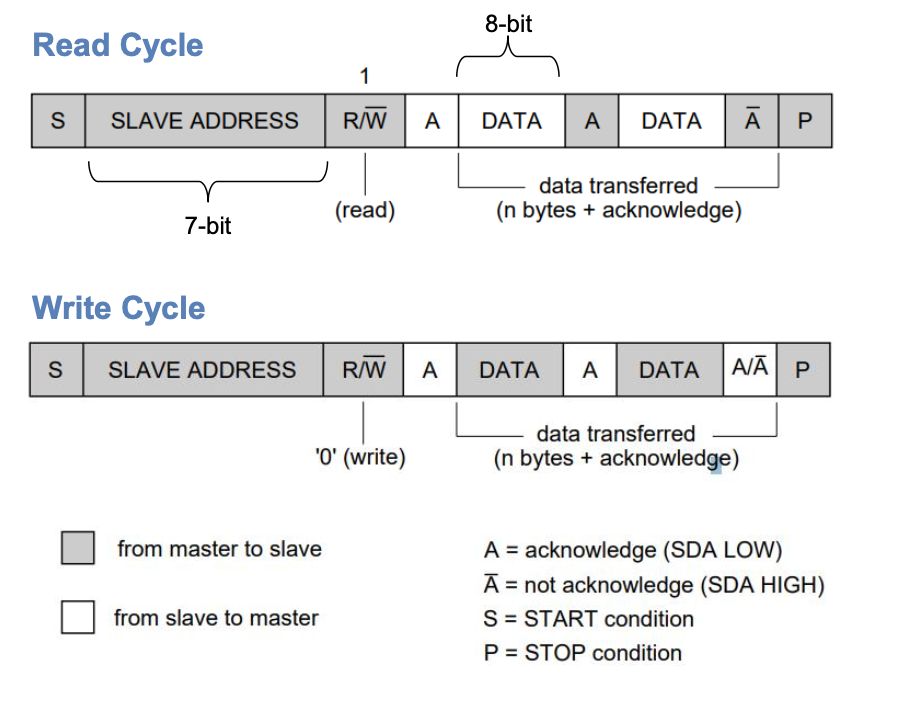
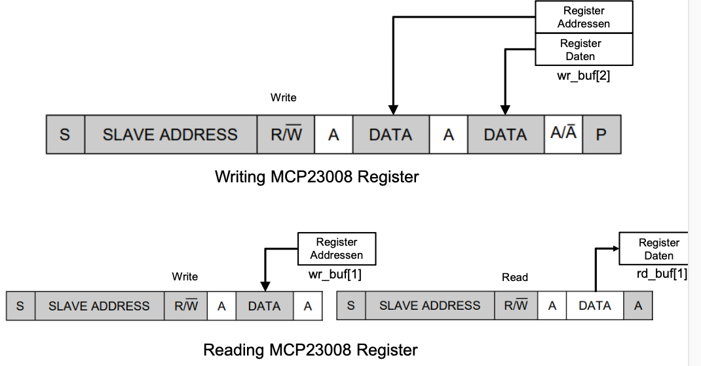

# GPIO

A GPIO may have multiple functions. The active function can be selected using the GPFSEL register.

**Base Address**>: 0x7e20'0000

Can be found in the PDF on section 5.2 (Register View)

## Register

| Register | Anwendung | Bits |
|----------|-----------|------|
| GPFSEL | Function selection for GPIO | 3 |
| GPSET | Set Value for GPIO | 1 |
| GPCLR | Clear Value for GPIO (Set to 0x00) | 1 |
| GPLEV | Read Pin Level | 1 |


## Access


Kommandozeilen Befehl um die GPIOChip Nummern für Zugriff über pseudo Filesystem 

```bash
ls gpiochip*/device/driver
```


## Pseudo Filesystem

GPIO can be accessed using the pseudo file system mapped at "/sys/class/gpio"

- Requires driver for GPIO
- Portable to other HW, works everywere
- Less hassle with addressses

### Enable GPIO

```shell
echo <gpio-pin> > /sys/class/gpio/export
```

### Set Direction of GPIO

| Direction | Value to Write |
|-----------|----------------|
| Read pin | in |
| set pin | out |

XX => GPIO-PIN-Number

```shell
echo "direction" >> /sys/class/gpio/gpioXX/direction
```

### Value of GPIO

| State | Value to Write |
|-----------|----------------|
| HIGH | 1 |
| LOW | 0 |

#### Set Value

```shell
echo "1" >> /sys/class/gpio/gpioXX/value
```


#### Read Value

```shell
cat /sys/class/gpio/gpioXX/value
```


### C-Code

#### Export GPIO 
```c
FILE *fp;
fp = fopen("/sys/class/gpio/export", "w");
if (fp == NULL) {
	printf("Error opening file in gpio_init %s\n", str);
	return 1;
}
fprintf(fp, "%i", gpio);
fflush(fp);
fclose(fp);
```

#### Set Value

```c
void fs_gpio_set (int gpio, int val)
{
	FILE *fp;
	char str[100];
	sprintf(str, "/sys/class/gpio/gpio%i/value", gpio);
	fp = fopen(str, "w");
	if (fp== NULL) {
		printf("Error opening file in gpio_set %s\n", str);
		return -1;
	}
	fprintf(fp, "%i", val);
	fflush(fp);
	fclose(fp);
}
```


#### Read Value

```c
int fs_gpio_get (int gpio)
{
	FILE *fp;
	char str[100];
	int ret;
	sprintf(str, "/sys/class/gpio/gpio%i/value", gpio);
	fp = fopen(str, "r");
	if (fp == NULL) {
		printf("Error opening file in gpio_read %s\n", str);
		return -1;
	}
	fread(str, 101, 1, fp);
	sscanf(str, "%i", &ret);
	fclose(fp);
	return ret;
}
```


## Memory Mapped

When using Memory Mapped / DMA (Direct Memory Access), the gpio location must be translated to the memory address. 

<span style="color: red; font-weight: bold;">The Physical Address is 35bit!</span>

```c
void *virtual_gpio_base; //define global pointer
int mmap_virtual_base()
{
	int m_mfd;
	if ((m_mfd = open("/dev/mem", O_RDWR)) < 0)
	{
		printf("FAIL by open /dev/mem\n");
		return m_mfd;
	}

	virtual_gpio_base = (void*) mmap(NULL, sysconf(_SC_PAGE_SIZE),
	PROT_READ|PROT_WRITE, MAP_SHARED, m_mfd, GPIO_BASE_ADDR);
	close(m_mfd);
	
	if (virtual_gpio_base == MAP_FAILED) {
		return errno;
	}
	return 0;
}
```


### Setting and clearing of single gpio pins

```c
#define GPIO_SET0 (0x0000001c) // GPIOSET0 offset
#define GPIO_CLR0 (0x00000028) // GPIOCLR0 offset
void *virtual_gpio_base; //define global pointer
static void mmap_gpio_set(int gpio, int value)
{
	uint32_t *gpio_reg;
	if (value == 1){
		gpio_reg = (uint32_t *) (virtual_gpio_base + GPIO_SET0);
	}
	else {
		gpio_reg = (uint32_t *) (virtual_gpio_base + GPIO_CLR0);
	}
	*gpio_reg = (0x1 << gpio);
	
}
```

## I2C

Read / Write Cycle




## Writing / Reading Data



- For more details checkout [CT2 I2C](https://janishuser.github.io/ZHAW-BSC-Informatik/FS24/CT2/UART_I2C.html?highlight=i2c#i2c)


- Only one driver can open the bus


```c
#include <linux/i2c-dev.h>
#include <sys/ioctl.h>

int fd;
char *filename = "/dev/i2c-1";

if ((fd = open(filename, O_RDWR)) < 0) {
	/* ERROR HANDLING: you can check errno to see what went wrong */
	perror("Failed to open the i2c bus");
	exit(1);
}

```

```c
// Sets up the I2C controller with I2C-bus mode and I2C slave address
int addr = 0x20;
if ( ioctl(fd, I2C_SLAVE, addr ) < 0) {
	printf("Failed to acquire I2C bus access and/or talk to slave.\n");
	exit(1);
}
```

```c
// WRITE
uint8_t wr_buf[2];
wr_buf[0] = register_address;
wr_buf[1] = register_data;
if ( write(fd, wr_buf, 2) != 2 ) {
	printf("Failed to write to the i2c bus.\n");
}
```


```c
//READ
uint8_t data = 0;
uint8_t wr_buf[1];
uint8_t rd_buf[1];

wr_buf[0] = register_addr;
if ( write(fd, wr_buf, 1) != 1 ) {
	printf("Failed to write to the i2c bus.\n");
}

if ( read(fd, rd_buf, 1) != 1 ) {
	printf("Failed to read from the i2c bus.\n");
} else {
	data = rd_buf[0];
}
```