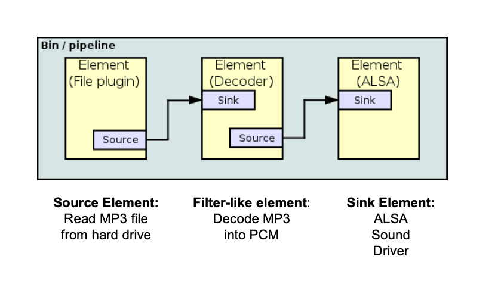
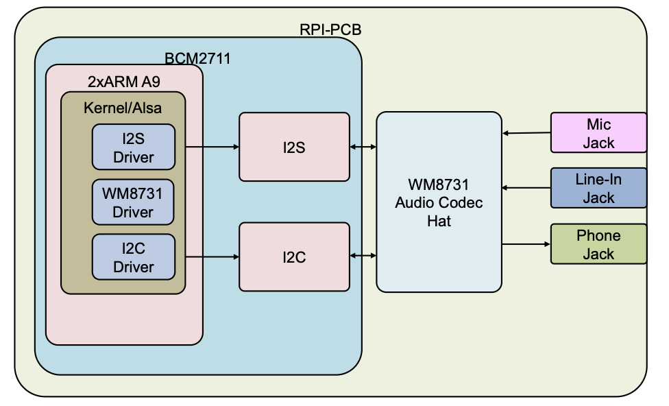

# Gstreamer 

Gstreamer uses a Bin / Pipeline architecture, where data from a source is pushed into a sink



The commands can be merged together using the pipe symbol

```shell
gst-launch-1.0 videotestsrc ! videoconvert ! autovideosink
```

[Plugin-Documentation can be found here](https://gstreamer.freedesktop.org/documentation/plugins_doc.html)

[Or here](https://github.com/matthew1000/gstreamer-cheat-sheet/blob/master/README.md)

## C Pipeline using gst.h

```c
/* GStreamer
 * MC2-Lab6-Aufg. 1 - Loesung
 * Written by Hans-Joachim Gelke
 * You should have received a copy of the GNU Library General Public
 * License along with this library; if not, write to the
 * Free Software Foundation, Inc., 51 Franklin St, Fifth Floor,
 * Boston, MA 02110-1301, USA.
 */

#include <gst/gst.h>
#include <stdio.h>
#include <stdlib.h>
#include <string.h>

int main(int argc, char* argv[]) {
    GstElement* bin;
    GstElement* src;
    GstElement* parser;
    GstElement* resample;
    GstElement* conv2;
    GstElement* sink;
    GMainLoop* loop;

    gst_init(&argc, &argv);

    bin = gst_pipeline_new("bin");

    // Quelle: WAV-Datei über filesrc und wavparse
    src = gst_element_factory_make("filesrc", "src");
    g_object_set(G_OBJECT(src), "location", "./sound_files/coconut.wav", NULL);

    parser = gst_element_factory_make("wavparse", "parser");
    resample = gst_element_factory_make("audioresample", "resample");

    conv2 = gst_element_factory_make("audioconvert", "inst_audioconvert2");

    sink = gst_element_factory_make("alsasink", "sink");
    g_object_set(G_OBJECT(sink), "device", "hw:1,0", NULL);

    gst_bin_add_many(GST_BIN(bin), src, parser, resample, conv2, sink, NULL);

    if(!gst_element_link_many(src, parser, resample, conv2, sink, NULL)) {
        g_printerr("Elemente konnten nicht verlinkt werden.\n");
        gst_object_unref(bin);
        return -1;
    }

    gst_element_set_state(bin, GST_STATE_PLAYING);

    /* we need to run a GLib main loop to get the messages */
    loop = g_main_loop_new(NULL, FALSE);

    /* Runs a main loop until g_main_loop_quit() is called on the loop */
    g_print("Running_x_...\n");
    g_main_loop_run(loop);

    /* Out of the main loop, clean up nicely */
    g_print("Returned, stopping playback\n");
    gst_element_set_state(bin, GST_STATE_NULL);

    g_print("Deleting pipeline\n");
    gst_object_unref(bin);

    return 0;
}
```

### C using gst_launch

```c
/* GStreamer
 * MC2-Lab6-Aufg. 1 - Loesung
 * Written by Hans-Joachim Gelke
 * You should have received a copy of the GNU Library General Public
 * License along with this library; if not, write to the
 * Free Software Foundation, Inc., 51 Franklin St, Fifth Floor,
 * Boston, MA 02110-1301, USA.
 */

#include <gst/gst.h>
#include <stdio.h>
#include <stdlib.h>
#include <string.h>

int main(int argc, char* argv[]) {
    GstElement* pipeline;
    GstBus* bus;
    GstMessage* msg;

    gst_init(&argc, &argv);

    // Definiere die Pipeline als String
    gchar* pipeline_desc =
        "filesrc location=./sound_files/music.mp3 ! mpegaudioparse ! "
        "mpg123audiodec ! "
        "audioconvert ! audioresample ! autoaudiosink";

    // Erstelle die Pipeline mit gst_parse_launch
    GError* error = NULL;
    pipeline = gst_parse_launch(pipeline_desc, &error);

    if(!pipeline) {
        g_printerr("Fehler beim Erstellen der Pipeline: %s\n", error->message);
        g_clear_error(&error);
        return -1;
    }

    // Starte die Wiedergabe
    gst_element_set_state(pipeline, GST_STATE_PLAYING);

    // Warte auf EOS (End of Stream) oder Fehler
    bus = gst_element_get_bus(pipeline);
    msg = gst_bus_timed_pop_filtered(bus, GST_CLOCK_TIME_NONE,
                                     GST_MESSAGE_ERROR | GST_MESSAGE_EOS);

    if(msg != NULL) {
        gst_message_unref(msg);
    }

    gst_object_unref(bus);

    // Stoppe die Pipeline und gebe die Ressourcen frei
    gst_element_set_state(pipeline, GST_STATE_NULL);
    gst_object_unref(pipeline);

    return 0;
}
```


## Advanced Linux Sound Architecture (ASLA)

- Automatic configuration of sound hardware and easy handling of multiple sound devices in one system
- Released under GPL and LGPL
- Written by Jaroslav Kysela, in Linux Kernel since v 2.5
- Replaced Open Sound System (OSS) in v 2.6
- Official ALSA Web Site: http://www.alsa-project.org



## Video for Linux
```shell
v4l2-ctl --list-devices
```


