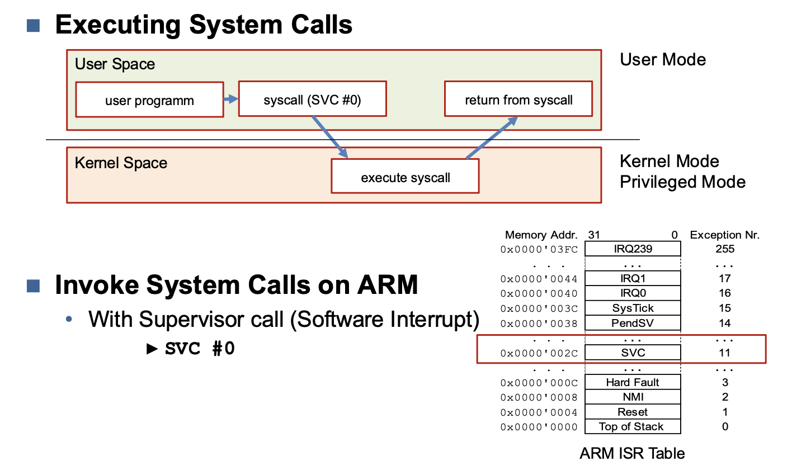

# Readme

| Begriff | Bedeutung | Notwendigkeit |
|---------|-----------|---------------|
| MMU | Memory Management Unit | Laufen lassen von mehreren Anwendungen |
| BSP | Board Support Package | Benötigt, um auf das Board zuzugreifen |
| GPL | Gnu Public License |
| MBR | Master Boot Record | Minimale Boot-Informationen, benötigt zum booten |
| TTY | Teletype | |
| NFS | Network File System |

# Toolchain

**Cross Compilation toolchain**

- Compiler that runs on the development machine, but generates code for the target
- Development machine is much faster than target

**C library**

- Interface between the kernel and the user space applications

**Kernel & Device Drivers**

- Contains the process and memory management, network stack, device drivers and provides services to user space applications

**Bootloader**

- Started by the hardware, responsible for basic initialization, loading and executing the kernel

## Recipes

A Bitbake recipe is a set of instructions that the Bitbake build engine takes as input to generate packages. The .bb extension is used for recipe files in the Yocto Project. Inside the Poky directory, many meta-layers contain recipe files, each associated with a particular software package.

Yocto recipe provides the following information to Bitbake.

Bitbake reads the recipe files and executes tasks defined in the recipe files and classes (.bbclass files) to generate the package.

# Linux Root Filesystem

# Kernel Architectures

- Monolythic Kernels are easier to program and debug

## Monolitic Kernel

- Single executable file
	- All Drivers are part of the Kernel
	- Adding Driver to existing kernel:
-> Recompile complete Kernel

## Modular Kernel

- A Monolithic Kernel with an interface for Kernel Modules
- Modular Kernels provide Module Interface
- Adding a Driver as a Module at run-time
-> Without Recompiling Kernel

## System Calls

**Kernel Main Roles**
- Manage all the hardware resources
	- CPU
	- Memory
	- I/O
- Manage task scheduling

**System Calls**
- Main interface between kernel and user space
- About 300 system calls for min kernel services
	- file and device operations
	- networking
	- inter-process communication (IPC)
	- process management
	- memory mapping
	- timers
	- threads
	- synchronization primitives
	- etc
- system calls wrapped by the C-library (no direct access)

#### Kernel Mode (Priviledged Mode)

- Complete and unrestricted access to underlyng hardware
- Can execute any CPU instruction and access any memory address
- Kernel mode is reserved for the lowest-level most trusted functions of the operating system
- crashes in kernel mode also crash the system

### User Mode
- No ability to directly access hardware or reference memory
- access to hardware or memory delgated through system calls
- crashes in user mode are recoverable
- most of the code should be executed in user mode

**Executing system calls**

