# Scheduling

## Process Tree

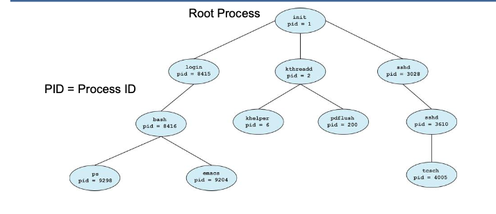

- OS starts with a single root proces
- Root process starts further processes in the OS (e.g. login, sshd, b-shell, etc)
- these processes can create further processes

## Process

- A process is a program during execution
- A process runs if it were the only program running
- In fact only one process per CPU is running at any time
- MAkes it seem like all processes are running at the same time
- On multicore systems, processes may be distributed over multiple cores
- Each process has got its own reserved address space
- inter process communication takes special mechanism

### Single threaded process (default)

- Besides processes there are also threads. Threads are the little sisters of processes.
- A process has at least one thread
- A process has several management components (Code segment, executable, read-only, Data, stack, shared memory, PID, priorities, users)
- Stack segment with local variables
- Process have this overhead
- Communication between processes is expensive
- That’s the motivation for several threads within one process

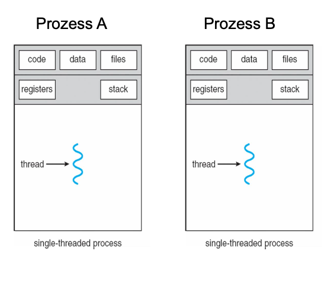

### Multithreaded processes

Like processes, threads are an independent sequence of commands that execute a specific function
- A process can have many threads (but has at least one)
- Threads of one process are sharing the memory space of their process
- Each thread however gets its own stack and local variables
- Inter thread communication is simpler than inter process communication since threads are sharing the same memory space
- Unlike in the case of processes, there is however no protection of one threads memory space against manipulation from another thread

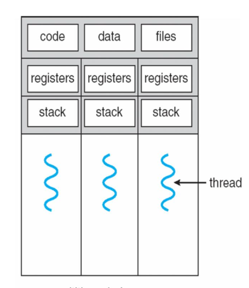

## Task Scheduling

- Tasks mostly have variable timeslots and different priorities
- Which task runss next and how long is a decision of the task **scheduler**

## Scheduling Policies

- Preemption means, a task is interrupted in favour of another task

| Algorithm | Name | Real Time |
|-----------|------|-----------|
| Completely Fair Scheduler | SCHED_OTHER (SCHED_NORMAL) | No |
| Preemptive Scheduling | SCHED_FIFO | Yes |
| Round Robin Scheduling | SCHD_RR | Yes |
| Batch Scheduling (may not preemt SCHED_OTHER) | SCHED_BATCH | No |
| Executed when no other task | SCHED_IDLE | No |

### Completely Fair Scheduler (CFS)

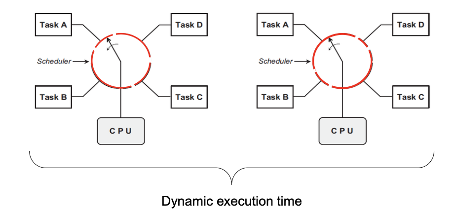

- Each process should get a fair share of the processor
- If a process falls out of balance, it gets more time for execution next time
- An "ideal scheduler" distributes the computing power equally among all processes

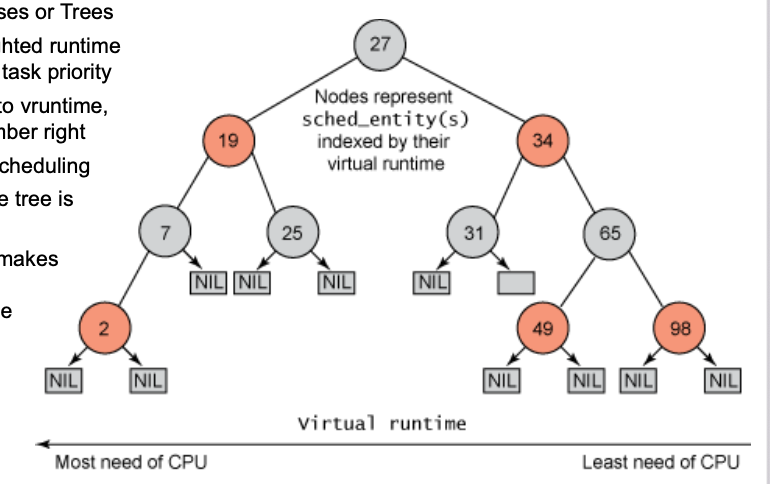

- Circles represent Processes or Trees Numbers circles are weighted runtime (vruntime) – weighted by task priority
- Tree is sorted according to vruntime, low number left, high number right
- Left tasks get priority in scheduling
- After each scheduling, the tree is updated
- The balancing algorithm makes sure all tasks get a fair amount of processing time
- CFS is not suitable for real-time because run time is unpredictable

## Task States

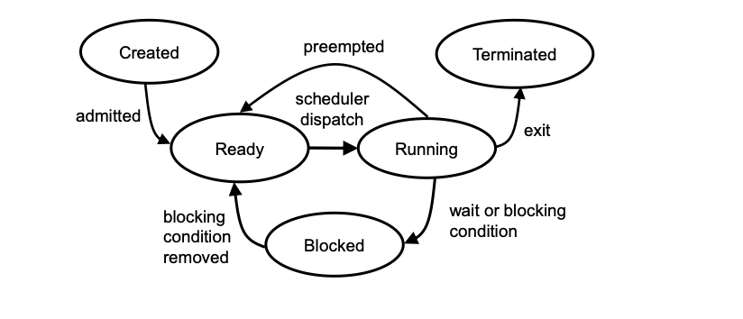

| State | Description |
|-------|-------------|
| Running | Program in thread is executed | 
| Blocking | Program in the thread is stopped – a blocking condition is preventing its further execution |
| Ready | Running condition of the thread is given, the thread waits in a queue for its turn.
| Preempted |  A higher priority thread interrupts the running thread. Since the condition of the thread is still given, the thread goes into Ready.
| Created | The thread is initialized and waits until its run conditions are met. Then it goes into Ready and waits in the queue for execution. |
| Terminated | the task is set inactive |

## FIFO

### All having the same priority

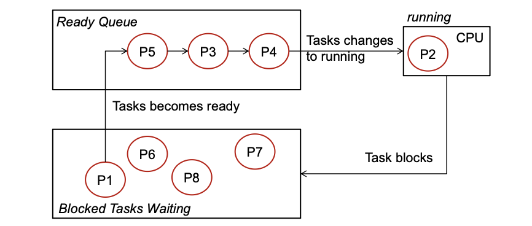

- Tasks in the „Blocked“ container wait until the condition to get active is fulfilled
- The first task in the „Ready Queue“ assumes running state as soon as the currently running task has completed or encounters a block condition
- Running tasks continue until they terminate or encounter a blocking condition

### Different priorities (Priority QUEUE)

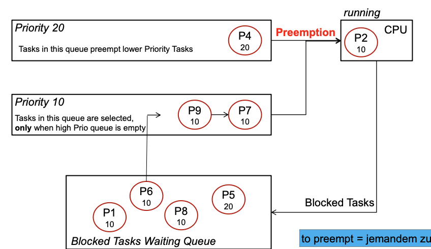

- Ready queues of different priority
- Higher priority task can be preempting

## Round Robin (RR)

- Each task has a fixed time slice (sched_rr_timeslice_ms)
- Task runs for a configured timeslice or until it is blocked

**How long should the time slice q be**

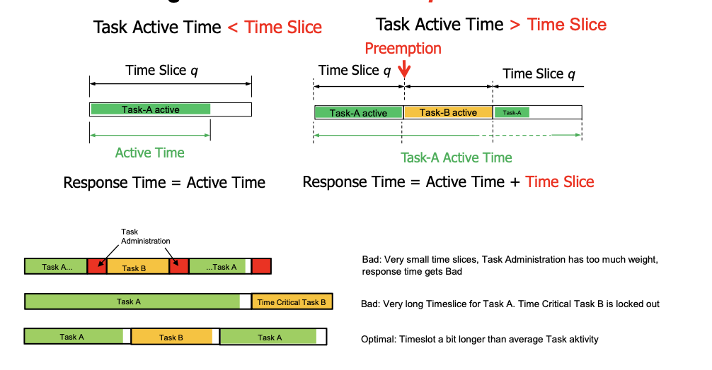

### Equal Priorities

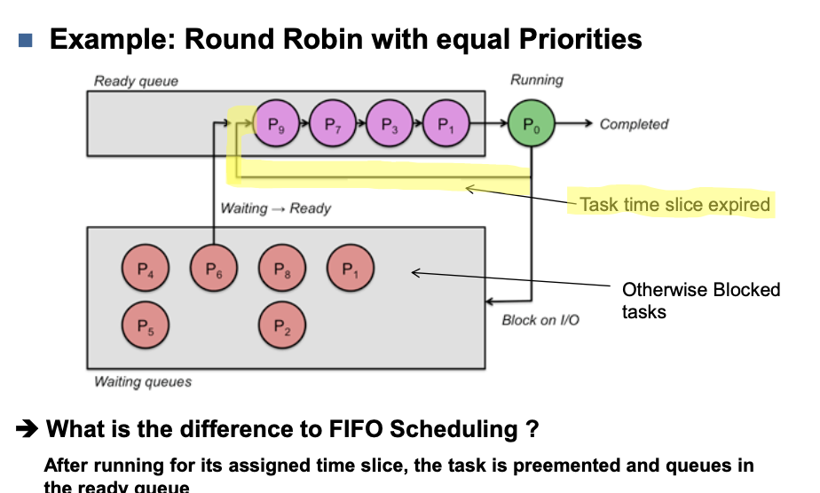

### Different priorities

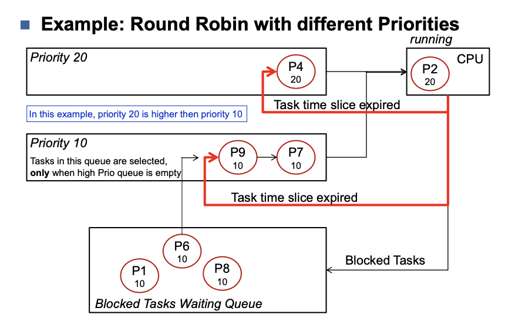

## Priority Ranges

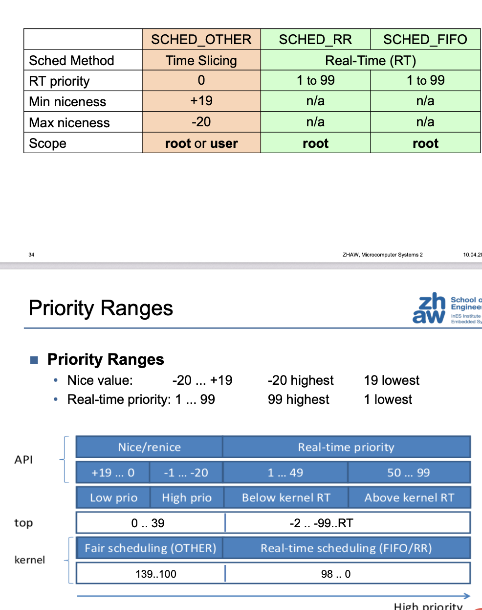

## Condition Variables
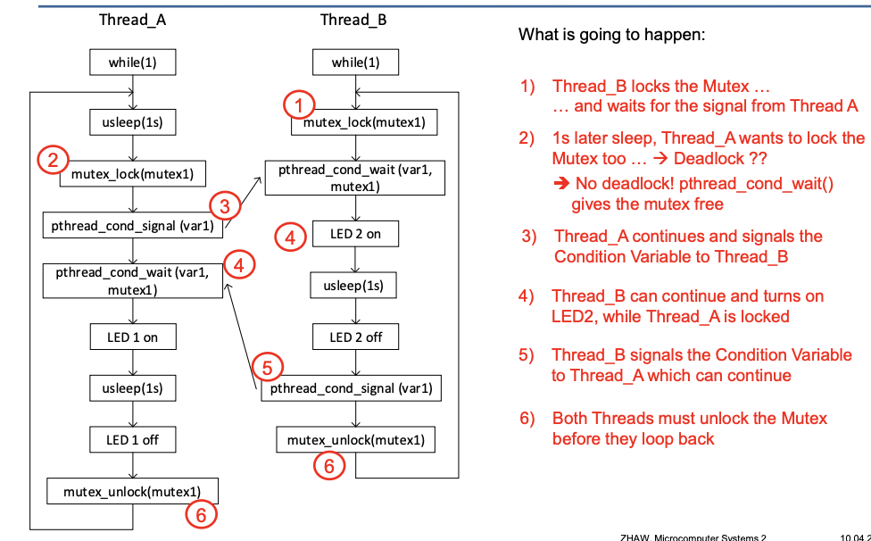

## Semaphores

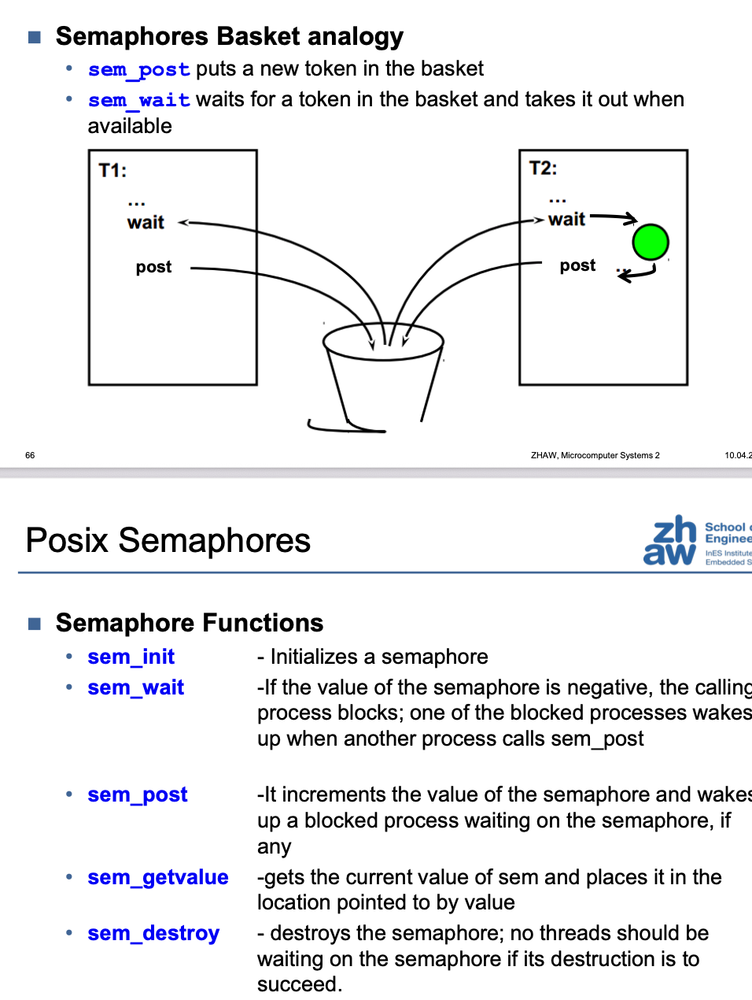

### Semaphore Functions

| Funktion | Beschreibung |
|----------|--------------|
| sem_init | Initializes a semaphore |
| sem_wait | If the value of the semaphore is negative, the calling process blocks; one of the blocked processes wakes up when another process calls sem_post |
| sem_post | It increments the value of the semaphore and wakes up a blocked process waiting on the semaphore, if any |
| sem_getvalue | gets the current value of sem and places it in the location pointed to by value |
| sem_destroy | destroys the semaphore; no threads should be waiting on the semaphore if its destruction is to succeed. |

