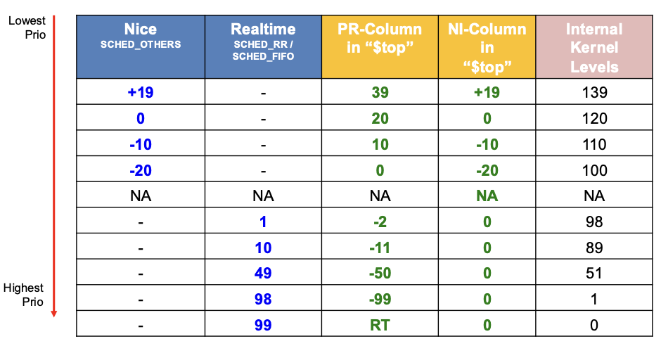

# Threading

## Linux Realtime

- used in Audio processing
- used in Automotive (savety features)


## Priority Ranges




**Linux Multithreading Summary**

---

### 1. Thread Fundamentals

* **1:1 Model via NPTL**
  Modern Linux uses the Native POSIX Thread Library (NPTL), which implements a one-to-one mapping between user-level pthreads and kernel threads. Each `pthread_create()` call ultimately invokes the `clone()` syscall with flags like `CLONE_VM`, `CLONE_FS`, `CLONE_FILES`, and `CLONE_SIGHAND` so that threads share address space, file descriptors, and signal handlers.
* **Creation & Management**

  ```c
  pthread_t tid;
  pthread_create(&tid, NULL, thread_fn, arg);
  ```

  Under the hood this sets up a new task\_struct in the kernel. Thread attributes (stack size, detach state) can be tuned via `pthread_attr_t`. Threads may be joined (`pthread_join`) or detached (`pthread_detach`) depending on whether their return value must be collected.

---

### 2. Synchronization Primitives

* **Mutexes** (`pthread_mutex_t`)
  Provide mutual exclusion with optional recursive or error-checking modes. Often implemented atop the **futex** syscall for efficient sleep/wake on contention.
* **Semaphores** (`sem_t`)
  POSIX semaphores (`sem_init`, `sem_wait`, `sem_post`) allow signaling between threads, useful for producer-consumer patterns.
* **Condition Variables** (`pthread_cond_t`)
  Must be paired with a mutex; threads wait (`pthread_cond_wait`) until another thread signals (`pthread_cond_signal`/`broadcast`).
* **Spinlocks** (`pthread_spinlock_t`)
  Busy-wait locks that avoid context switches on short critical sections; best on multi-core when lock hold time is minimal.
* **Barriers** (`pthread_barrier_t`)
  Synchronize N threads at a rendezvous point; each thread calls `pthread_barrier_wait` and all proceed once the count is reached.
* **Read–Write Locks** (`pthread_rwlock_t`)
  Allow multiple concurrent readers or one writer; ideal when reads vastly outnumber writes.
* **Atomic Operations**
  C11 `<stdatomic.h>` or GCC built-ins (`__atomic_fetch_add`, etc.) support lock-free updates of single variables.

---

### 3. Scheduling & Niceness

* **SCHED\_OTHER (CFS)**
  The default “nice”-based class. Nice values range from –20 (highest priority) to +19 (lowest). Lower nice ⇒ longer CPU slices under the Completely Fair Scheduler (CFS).
* **Real-Time Policies**

  * **SCHED\_FIFO**: first-in, first-out queue; threads run until they block or voluntarily yield.
  * **SCHED\_RR**: round-robin with time quanta; threads share the CPU in fixed slices.
    Both use static priorities from 1 (lowest) to 99 (highest); root privileges are required to raise these.
* **Best Practices**

  * Use real-time only for genuinely time-critical tasks (e.g., audio processing, control loops).
  * Avoid starving normal threads: don’t leave high-priority RT threads runnable indefinitely.
  * Tune nice values for background or batch threads rather than juggling RT priorities.

---

### 4. Use-Cases, Performance & Pitfalls

* **Key Use-Cases**

  * **Thread Pools** for handling many short tasks (e.g., web servers).
  * **Parallel Compute** where data can be partitioned (e.g., matrix operations).
  * **I/O Overlap** by dispatching blocking I/O to worker threads.
* **Performance Considerations**

  * **Context-Switch Cost**: minimize lock contention and thread count to avoid thrashing.
  * **Cache Effects**: false sharing can kill throughput—align per-thread data to cache lines.
  * **Lock Choice**: spinlocks are great for sub-microsecond holds; mutexes better for longer waits.
* **Common Pitfalls**

  * **Deadlocks & Livelocks**: enforce lock ordering, use timed waits to detect stuck threads.
  * **Priority Inversion**: low-priority threads holding locks needed by higher-priority ones—mitigate via priority inheritance.
  * **Over-Threading**: more threads than CPU cores + I/O can degrade performance; measure and tune.

---

With these fundamentals, you’ll understand how to create and manage threads in Linux, synchronize them efficiently, and tune their scheduling behavior for robust, high-performance applications.
