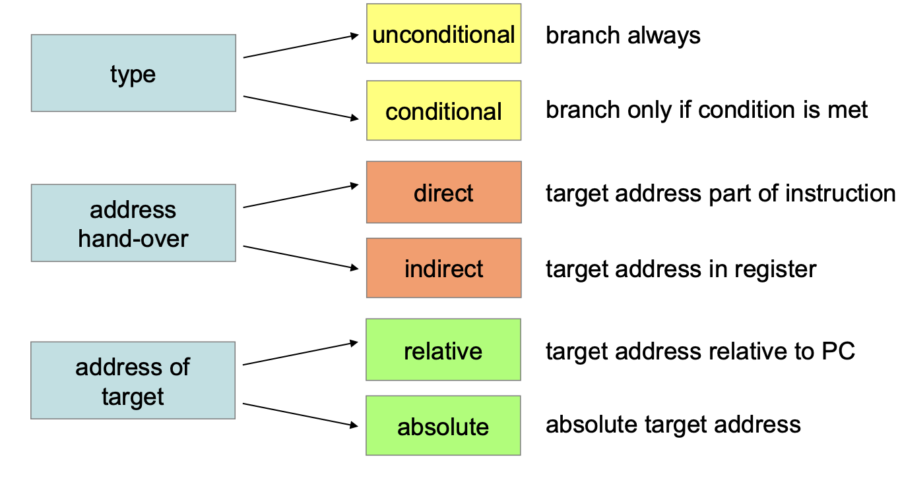

# Branching

Branches sind abzweigungen des aktuellen Programmes.




## B (immediate)

- unconditional
- direct
- relative (to PC)
- imm11:0
- Offsets from -2048d to !2046d

```assembler
B <label>				; PC = PC + imm11:0
```

## BX (Register offset)

Springe zu einem Register offset

- Branch and exchange
- Register Rm holds target address
- Undonditional
- Indirect
- Absolute
- 32 Bit addresse in Register

```assembler
BX <Rm>					; PC = Rm
```

```assembler
			LDR 	R0, =jmpaddr
			BX		R0
			NOP
			NOP

jmpaddr		ADDS 	R0, R0, #0x13
			NOP
```

## Conditional Branches

```assembler
B<c> <label>
```

### CMP - Minus

```assembler
CMP <Rn>, <Rm>		; Rn - Rm -> N,Z,C,V
```

### CMN - Adds

```assembler
CMN <Rn>, <Rm>		; Rn + Rm -> N,Z,C,V
```

### Compare and Test

### CMN - Adds

```assembler
TST <Rn>, <Rm>		; Rn & Rm -> N,Z
```

```assembler
			CMP 	R0, R1 
			BHI		go_on		; R0 > R1?
			MOVS	R2, R1		; otherwise
go_on
			MOVS 	R3, #5
```


| Symbol | Condition | Flag |
|--------|-----------|------|
| EQ | Equal | Z == 1 |
| NE | Not equal | Z = 0 |
| CS | Carry Set | C == 1 |
| CC | Carry clear | C == 0 |
| MI | Minus / Negative | N == 1 |
| PL | Plus/positive or zero | N == 0 |
| VS | Overflow | V == 1 |
| VC | No overflow | V == 0 | 

### Arithmetic - unsigned

- higher and lower

| Symbol | Condition | Flag |
|--------|-----------|------|
| EQ | Equal | Z == 1 |
| NE | Not equal | Z = 0 |
| HS (=CS) | unsigned higher or same | C == 1 |
| LO (=CC) | Unsigned lower | C == 0 |
| HI | Unsigned higher | C == 1 and Z == 0 |
| LS | Unsigned lower or same | C ==0 or Z == 1|


### Arithmetic - signed

- higher and lower

| Symbol | Condition | Flag |
|--------|-----------|------|
| EQ | Equal | Z == 1 |
| NE | Not equal | Z = 0 |
| MI | Minus/negative | N == 1|
| PL | Plus/positive or zero | N == 0 |
| VS | Overflow | V == 1 |
| VC | No overflow | V == 0 |
| GE | Signed greater than or equal | N == V |
| LT | Signed less than | N != V |
| GT | Signed greater than | Z == 0 and N == V |
| LE | singed less than or equal | Z == 1 or N != V |


## Comparison

```assembler

CMP{cond} Rn, Operand2      ; Rn - Operand2

CMN{cond} Rn, Operand2      ; Rn + Operand2

BEQ		equal			; (Rn-Operand2 == 0) 	equal 		(zero flag set)
BNE		not_equal		; (Rn-Operand2 != 0)	not equal	(zero flag not set)


equal
not_equal
higher
```


## Flag testing

```assembler
; test shifted register (if bit is set)
TST<c> <Rn>,#<const>        ; Rn & Const

BHI		higher			; (Rn & Const == Const)
BLO		lower			; (Rn & Const == 0)			zero flag set
```

## USAGE


In assembly language, particularly in ARM architecture, the instructions `BX`, `BLX`, `BL`, and `B` are used for various types of branch operations. Each one has a specific purpose:

1. **BX (Branch and Exchange):**
   - **Purpose:** Used to branch to an address contained in a register. It also has the ability to switch between ARM and Thumb instruction sets by changing the state of the T bit in the CPSR (Current Program Status Register), if the least significant bit of the address is set.
   - **Use Case:** Typically used for returning from a subroutine or when branching to a function address stored in a register, especially when switching between ARM and Thumb modes.

2. **BLX (Branch with Link and Exchange):**
   - **Purpose:** Similar to `BX`, but also stores the return address in the link register (LR). It's used for function calls where you might switch between ARM and Thumb modes.
   - **Use Case:** When calling a subroutine whose address is in a register and there's a need to return to the caller. It's particularly useful when the instruction set state (ARM/Thumb) of the target is different from the current state.

3. **BL (Branch with Link):**
   - **Purpose:** Used for standard subroutine or function calls. It stores the return address in the LR but does not have the ability to switch between ARM and Thumb modes.
   - **Use Case:** When calling a subroutine at a known address within the current instruction set state. After the subroutine completes, control returns to the instruction following the `BL`.

4. **B (Branch):**
   - **Purpose:** Used for unconditional jumps to a specified address. It doesn’t save the return address, so it’s typically not used for subroutine calls, but for jumping within or out of a code block.
   - **Use Case:** Commonly used for jumps in loops, conditionals, or to branch to different parts of a program. Not used for function calls since it doesn't link back to the calling location.

In summary:
- Use `BX` when you need to branch to an address in a register and potentially switch between ARM and Thumb modes.
- Use `BLX` for function calls with an address in a register, especially when changing between ARM and Thumb modes.
- Use `BL` for standard function calls within the same instruction set state.
- Use `B` for unconditional jumps within your code, not typically for calling functions.