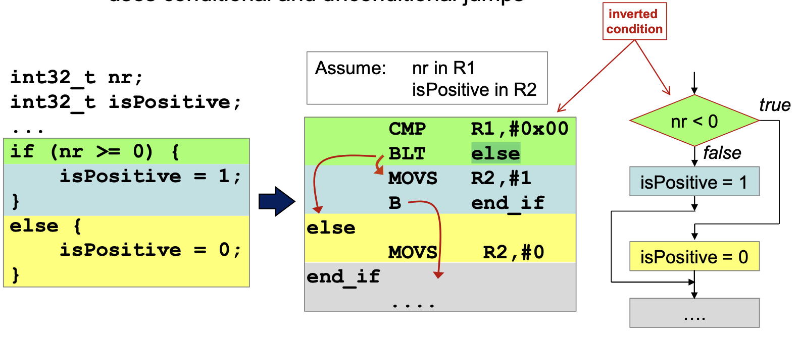
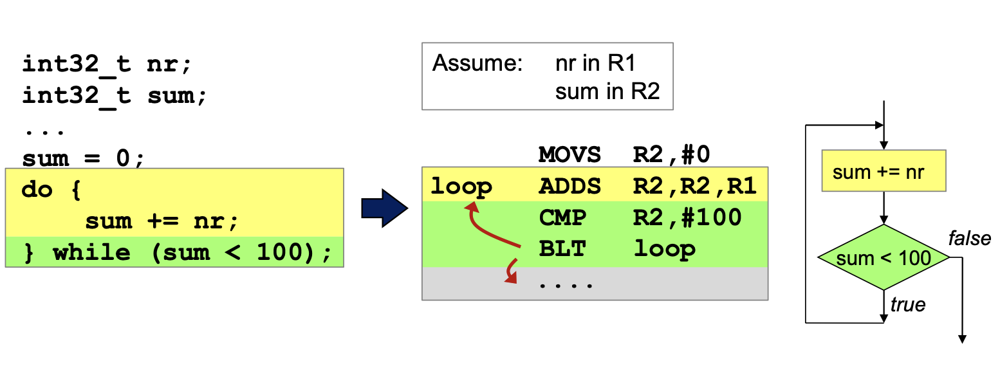
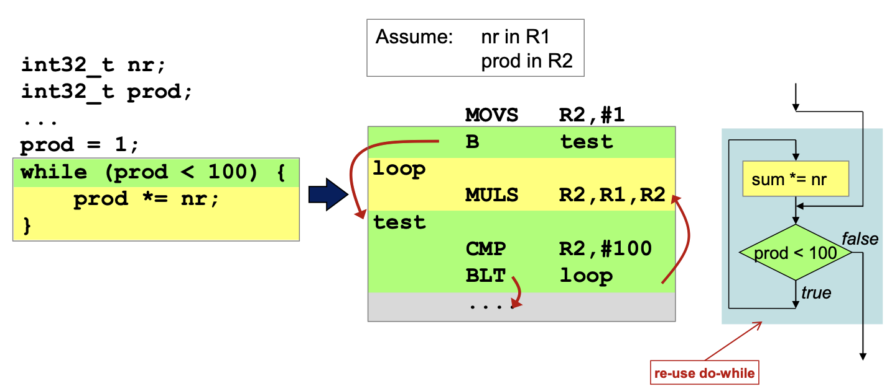
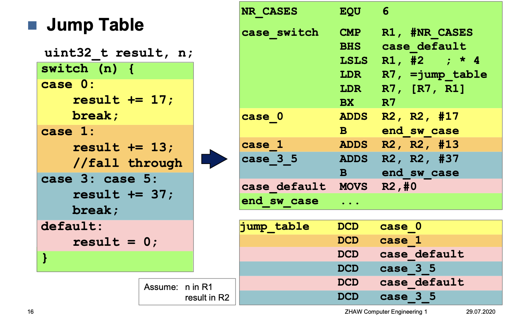

# Control structures

## If - then - else



```c
int32_t nr;
int32_t isPositive;

if (nr >= 0) {
	isPositive = 1;
} else {
	isPositive = 0;
}
```


```assembler
		CMP		R1, #0x00
		BLT		else
		MOVS	R2, #1
		B		end_if
else
		MOVS	R2, #0
end_if
```


## Do - While Loop



```c
int32_t nr;
int32_t sum;

sum = 0;

do {
	sum += nr;
} while (sum < 100);
``` 

```assembler
		MOVS	R2, #0
loop	ADDS	R2, R2, R1
		CMP 	R2, #100
		BLT 	loop
```

## While Loop



```c
int32_t nr;
int32_t prod;

prod = 1;
while (prod < 100) {
	prod *= nr;
}
``` 

```assembler
		MOVS	R2, #1
		B		test
loop
		MULS	R2, R1, R2
test	
		CMP		R2, #100
		BLT		loop
```

## For

Are convertert into while loops

```c
for (init-expr; test-expr; update-expr) {
	body-block;
}
```

```c
init-expr;
while (text-expr) {
	body-block;
	update-expr;
}
```


## Switch statements


```c
switch (n) {
	case 0:
		result += 17;
		break;
	case 1:
		result += 13;
		// fall trough
	case 3:
	case 5:
		result += 37;
		break;
	default:
		result = 0;
}
```

```asssembler

NR_CASES		EQU		6
case_switch		CMP		R1, #NR_CASES
				BHS		case_default
				LSLS	R1, #2			; * 4
				LDR		R7, =jump_table
				LDR		R7, [R7, R1]
				BX		R7

case_0			ADDS	R2, R2, #17
				B 		end_sw_case
case_1			ADDS	R2, R2, #13
case_3_5		ADDS	R2, R2, #37
				B end_sw_case
case_default	MOVS	R2, #0
end_sw_case

jump_table		DCD		case_0
				DCD		case_1
				DCD 	case_default
				DCD		case_3_5
				DCD		case_default
				DCD		case_3_5
```

### Jump Tables

