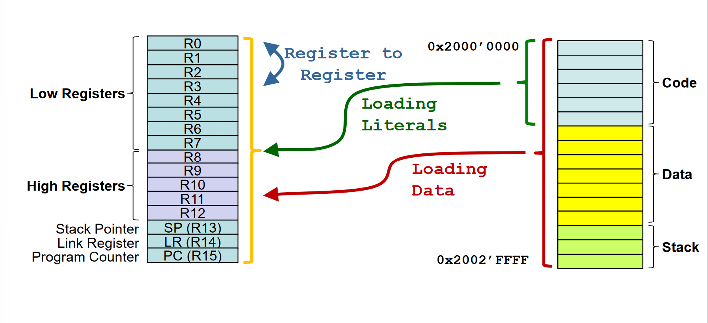
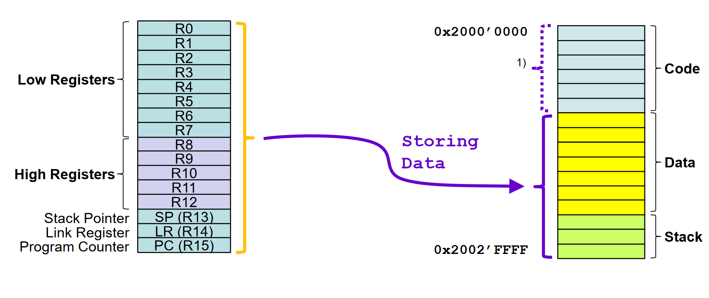

# Data Transfer


## Transfer Types






# Wertebereiche

## Signed

Hat das erste Bit der binären Zahl den Wert 1, so muss folgendes angewendet werden:

1. Vorderstes Bit entfernen
2. Bits invertieren
3. 1 dazu addieren

```
1111

1. 111
2. 000
3. 001

-> 1
```

## Unsigned

Binäre Zahl wird ganz normal interpretiert