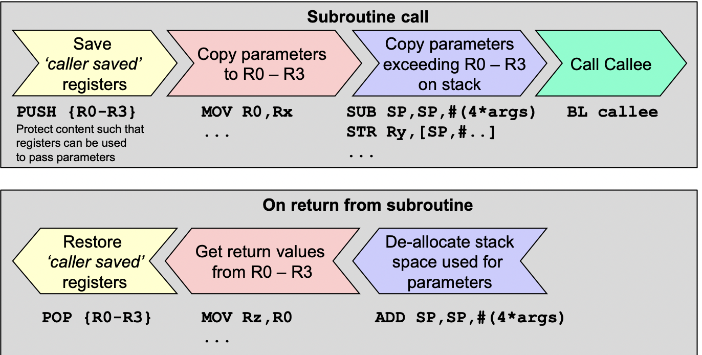
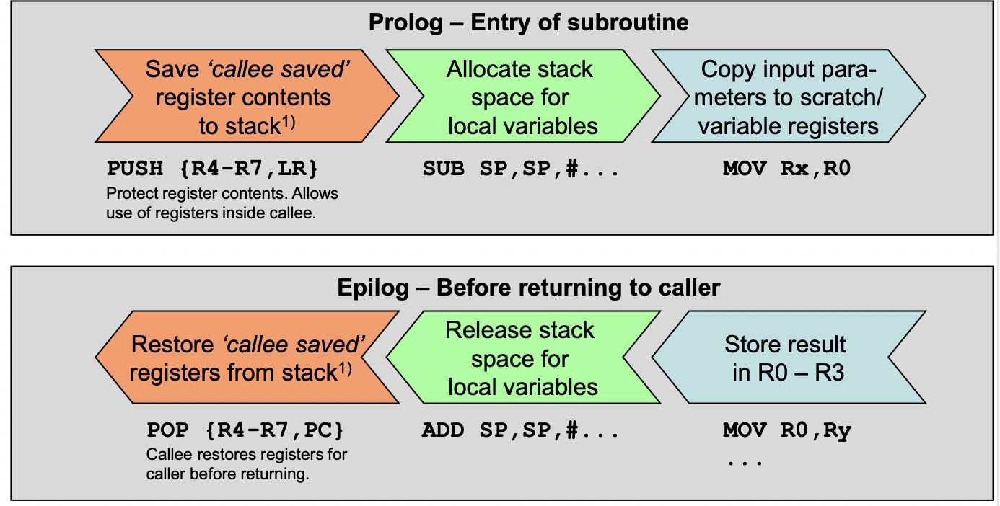
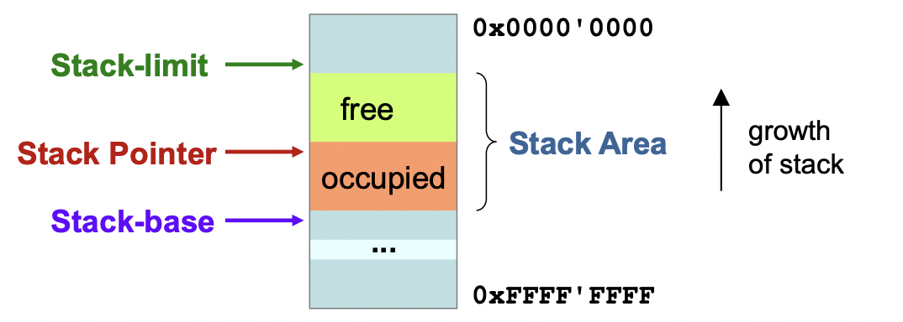
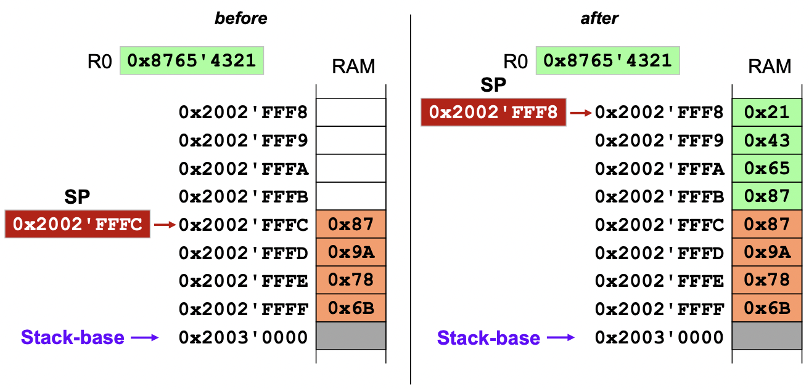
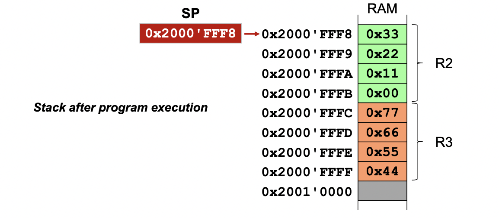
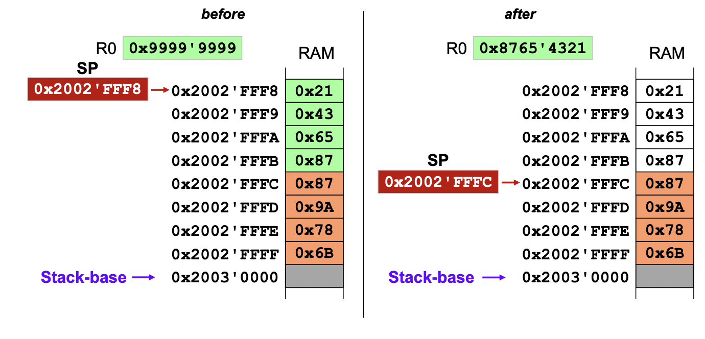

# Subroutines

```assembler
MulBy3		MOV 	R4, R0
			LSLS	R0, #1
			ADD		R0, R4
			BX		LR				; return
```


## BL (label)

- store current PC in LR
- Branch to \<label\>
	- PC = PC +/- offset
	- offset range -16'777'216 to 16'777'214

```assembler
BL <label>
```

## BLX (register)

- Store current PC in LR
- Address of subroutine in register
- Branch
	- PC = register
	- Branch address from 0 to 232

```assembler
BLX	<Rm>
```

## Nested subroutines

```assembler
ADDR_LED_31_0 		EQU 	0x60000100
LED_PATTERN			EQU 	0xA55A5AA5

subrExample 		PUSH 	{R4,R5,LR}

					; write pattern to LEDs
					LDR 	R4,=ADDR_LED_31_0
					LDR		R5,=LED_PATTERN
					STR 	R5,[R4]
					
					BL 		write7seg
					
					POP 	{R4,R5,PC}
```

## Parameter Passing

### Register

Register can be used to pass values or references (addresses) to a funciton

#### Pass by value

- Values are in agreed registers
AREA exData,DATA,...

AREA exCode,CODE,...
```assembler
		MOVS	R1, 0x03
		BL double
		MOVS	..., R0

double
		LSLS	R0, R1, #1
		BX LR
```

#### Pass by reference

```assembler
TLENGTH 	EQU 	16

AREA exData,DATA,...
p1Table 	SPACE 	TLENGTH

AREA exCode,CODE,...

		LDR		R0,=p1Table
		BL 		doubleTableValues
		MOVS 	R1,#TLENGTH


doubleTableValues
		MOVS 	R2,#0
loop 	LDRB 	R4,[R0,R2]
		LSLS 	R4,R4,#1
		STRB 	R4,[R0,R2]
		ADDS 	R2,#1
		CMP 	R2,R1
		BLO 	loop
		BX 		LR
```

### Pass trough global variables

- Error prone, unmaintanable

```assembler
AREA exData,DATA,...
param1 	SPACE 	1
result 	SPACE 	1
AREA exCode,CODE,...
...
		LDR 	R4,=param1
		MOVS 	R5,#0x03
		STRB 	R5,[R4]
		BL 		double_g
		LDR 	R4,=result
		LDRB 	...,[R4]
...
double_g
		LDR 	R4,=param1
		LDRB 	R1,[R4]
		LSLS 	R0,R1,#1
		LDR 	R4,=result
		STRB 	R0,[R4]
		BX 		LR
```

### Subroutine Call 

#### Caller Side



#### Callee Side



# Stack

The Stack pointer is available on R13, or SP. It is **word-aligned (4 byte)** and is **full descending** (grows from higher to lower addresses)



**THE NUMBER OF PUSHES MUST BE EQUAL TO THE NUMBER OF POPS**

## Initialization

1. Processor fetches initial value of SP (Stack-base) at reset (from address 0x0000'0000)


## Pushing to the stack

pushes to the stack (from right to left)




```assembler
			PUSH	{ R0 }		; PUSH R0 
			PUSH	{ R2, R3 }	; PUSH R2 R3
```





## Popping the stack

Pops from the stack (from left to right)



```assembler
			POP		{ R0 }		; pop R0 
			POP		{ R0, R1 }	; POP R0 R1
```


## Peek Accessing the stack

```assembler
			LDR		<Rt>, [SP, #<imm>]
```

## Storing onto the stack

## Peek Accessing the stack

```assembler
			STR		<Rt>, [SP, #<imm>]
```

