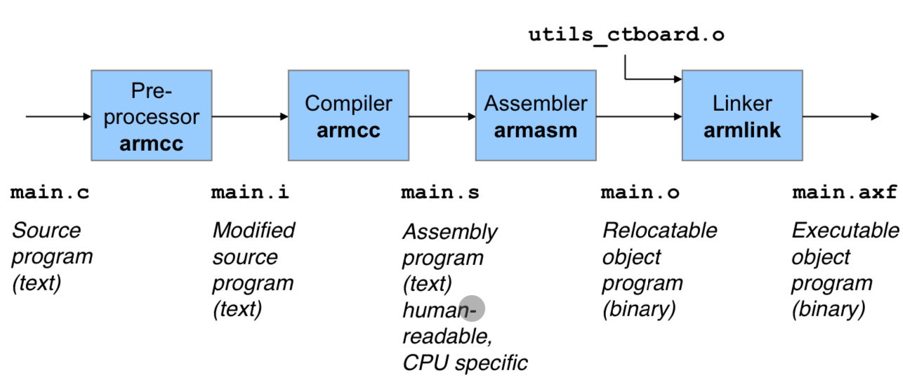

# Compiler

## Reihenfolge der Tools

## Preprocessor
- Text Processing
- Einfügen von #include files
- Ersetzen von Macros

## Compiler
- Übersetzt CPU unabhängigem Code CPU in CPU spezifischen Code