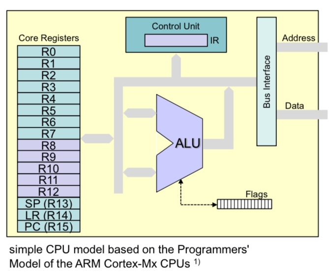
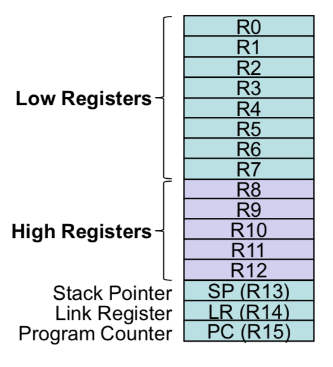
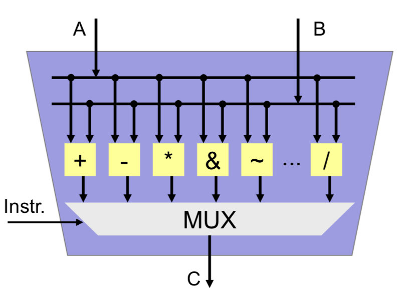
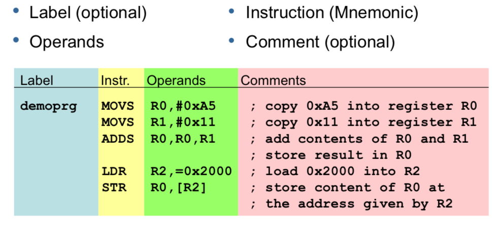

# Cortex Architektur

Die Cortex Architektur ist auch als ARM Architektur bekannt. Diese ist in den meisten Embedded Prozessoren, in letzter Zeit aber auch in Mobile, sowie Desktop (Apple Silicon) vertreten.

## CPU Modell

Die CPU besteht aus einzelnen Komponenten. Diese sind in folgende:
- Core Registers
- 32 Bit ALU (Arithmetic Logic Unit)
- Flags (APSR)
- Control Unit with IR (Instruction Registers)
- Bus Interface

### 16 Core Registers

- Jedes Register ist 32 Bit breit
- 13 General Purpose Register
    - Low Registers R0 - R7
    - High Registers R8 - R12
    - Used for temporary storage of data and addresses
- Program Counter (R15)
    - Addresss der **nächsten** Instruktion
- Stack Pointer (R13)
    - Last-In First-Out für temporäre Datenspeicherung
- Link Register (R14)
    - Enthält die Adresse zu der zurückgesprungen wird, wenn eine Routine fertig ist.

In den meisten Fällen werden nur die unteren Low Registers (Byte verwendet). Würde die Standardeinheit jetzt 16 oder gar 32 Bit sein, dann müssen die High Registers **zusätzlich** noch gelesen werden. 

### ALU (Arithmetic Logic Unit)

- 32 bit wide data processing unit
    - Inputs A and B
    - Results in C
- Integer Arithmetic
    - Addition / Subtraction
    - Multiplication / Division
    - Sign extension
- logic operations
    - AND
    - NOT
    - OR
    - XOR
- shift /rotate
    - left
    - right

### Flags (APSR)

Bits werden von der CPU anhand des Resultats der ALU gesetzt

| Wert | Bedeutung |
|--|--|
| N | Negative |
| Z | Zero |
| C | Carry |
| V | Overflow |

### Control Unit

- Instruction Register (IR)
    - Machine code (opcode) of instruction that is **currently** being executed
- Controls execution flow based on instruction on IR
- Generates control signals for all other CPU components

### Bus Interface

- Interface zwischen interner CPU und externen Bus Systemen
- Beinhlatet register um addressen zu speichern

## Instruction Set Architecture (ISA)

**Instruction Set**
- Verfügbare Anweisungen

**Processing Width**
- Bitbreite (8/16/32 Bit)

**Register Set**
- Wie viele Register gibt es?
- Wie gross sind die Register?

**Addressodell**
- Wie kann auf Speicher zugegriffen werden?
- Wie kann auf IO zugegriffen werden?

### Arbeitsweise

Prozessoren interpretieren binären Code als Instruktionen.

### Styleguide

